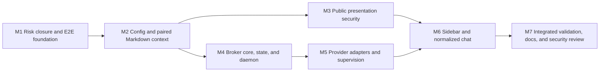

# Local Agent Sidebar Plan

## Outcome

A self-hosted agent-whiteboard server can opt Markdown viewers into a right-side drawer where readers discuss the current page and its creator-supplied context with their own locally installed Pi or Codex agent. The browser talks directly to an origin-authorizing broker bound only to `127.0.0.1`; the publishing server never receives reader conversations or provider credentials.

This release also closes the same-origin active-content path that would otherwise let standalone HTML reach the broker: all existing and new HTML boards move behind an application-controlled wrapper and an opaque-origin sandbox.

## Requirements

### R1 — Scope and enablement

- The drawer is Chrome-only in the first release and appears only on Markdown viewers.
- Servers opt in with:

  ```yaml
  viewer:
    local_agent:
      enabled: true
  ```

- When disabled, the viewer has no drawer and makes no localhost request.
- Enabled pages make one minimal broker status request on page load. They do not retry in the background after failure.
- The foreground broker works on macOS and Linux. Managed daemon installation is macOS-only.
- The supported providers are Pi RPC and Codex app-server. No remote relay or browser extension is introduced.

### R2 — General configuration and CLI

- The default configuration is `~/.agent-whiteboard/config.yaml`; global `--config <path>` overrides it for every command.
- Resolution order is CLI flags, environment variables, YAML, then built-in defaults.
- YAML is versioned and parsed strictly, including rejection of unknown fields and duplicate keys.
- The application-wide schema includes existing client/server settings plus:

  ```yaml
  version: 1

  viewer:
    local_agent:
      enabled: true

  agent:
    port: 8568
    trusted_origins:
      - https://whiteboard.example
    provider_idle_timeout: 60m
    shutdown_timeout: 10s
    default_access: content-only
  ```

- The broker host is hard-coded to `127.0.0.1`; no configuration source may change it.
- The browser port defaults to `8568`, is editable in the drawer, validates the range 1–65535, and is stored in `localStorage`. The browser never scans ports or permits another host.
- Trust management is atomic and exact-origin only:

  ```sh
  agent-whiteboard agent trust add https://whiteboard.example
  agent-whiteboard agent trust remove https://whiteboard.example
  agent-whiteboard agent trust list
  ```

- Broker lifecycle commands are:

  ```sh
  agent-whiteboard agent serve
  agent-whiteboard agent serve --daemon
  agent-whiteboard agent daemon status
  agent-whiteboard agent daemon restart
  agent-whiteboard agent daemon stop
  agent-whiteboard agent daemon uninstall
  ```

- On macOS, `serve --daemon` installs or updates a per-user LaunchAgent that starts after login, continues while the screen is locked, runs as the user, and records absolute binary/config/provider paths. `stop` unloads but leaves the plist installed; `uninstall` removes it.
- Linux daemon operations fail with an explicit unsupported-platform error.

### R3 — Creator context and Markdown API

- Markdown create and update require two non-empty UTF-8 multipart files named `file` and `context`.
- Creator context is Markdown summarizing goals, decisions, assumptions, and open questions. Documentation and the publishing skill prohibit hidden reasoning, credentials, unrelated personal data, and raw tool output.
- Context has an independent configurable size limit with a 1 MiB default.
- Update validates and replaces Markdown and context atomically; preserving or updating only one artifact is not allowed.
- Markdown and context are stored separately but share creation, expiration, replacement cleanup, and deletion lifecycle.
- Metadata publication is the commit point so no reader can observe mixed generations.
- Legacy Markdown without context remains readable. Its first update must provide current Markdown and a new context.
- Machine retrieval is:

  ```http
  GET /api/v1/whiteboards/markdown/{id}
  ```

  returning `resource`, `markdown`, and `context` fields.
- CLI retrieval is:

  ```sh
  agent-whiteboard --json get markdown CAPABILITY_ID
  ```

- Public Go APIs, CLI output, documentation, examples, and the agent skill stay synchronized with this contract.

### R4 — Standalone HTML and Markdown presentation security

- Every existing and new standalone HTML public URL returns an application-controlled wrapper containing the submitted document in an iframe.
- The iframe has `sandbox="allow-scripts"` without `allow-same-origin`; network connections, forms, parent access, storage, popups, downloads, framing, and top-level navigation remain unavailable.
- The inner response enforces restrictive HTTP CSP, including `connect-src 'none'`, while preserving inline standalone behavior permitted by the sandbox.
- Standalone HTML never receives the agent drawer.
- Markdown responses deny framing with both `Content-Security-Policy: frame-ancestors 'none'` and `X-Frame-Options: DENY`.
- Markdown and assistant output use sanitized Markdown with raw HTML disabled.

### R5 — Local broker API and origin boundary

- The broker exposes a versioned API only on `127.0.0.1:{port}`.
- Primary endpoints are:

  ```text
  GET /api/v1/agent/status
  WS  /api/v1/agent/connect
  ```

- HTTP-streaming fallback provides equivalent versioned connect, message, event, and interrupt operations.
- Status accepts a syntactically valid browser HTTPS Origin and reveals only broker availability, local API version, and whether that exact Origin is trusted. Missing and `null` origins are rejected.
- Every non-status operation requires an exact allowlist match, validates Host and Origin on every request or handshake, and never treats Referer as authorization.
- CORS echoes one allowed origin, never `*`; HTTP mutations require JSON and a custom API-version header. Chrome Private Network Access preflights are handled explicitly.
- Raw Pi/Codex requests, payloads, credentials, paths, IDs, and internal protocol errors are never exposed to the browser.
- The WebSocket and fallback transports carry the same schema-validated commands and normalized events with bounded message/event sizes.
- Opening the drawer sends no page content. Connect establishes or resumes a conversation. The first reader message transmits page context.

### R6 — Provider behavior and content-only authority

- Authentication is exclusively provider-native. Agent-whiteboard never captures or persists credentials.
- Readiness distinguishes missing executable, authentication required, startup failure, no usable model, and unavailable content-only enforcement. The drawer provides provider-specific instructions and Try again without broker restart.
- New conversations use each provider's native configured default model. The resolved model is shown read-only; model changes affect only new conversations.
- There is no installed-version allow/deny range. Adapters tolerate unknown non-critical events, fail closed on unknown approval/permission kinds, and surface required-protocol incompatibility.
- Pi runs in RPC mode with built-in tools, extensions, skills, prompt templates, and project context/resources disabled. Each active Pi conversation owns one RPC process and resumes from its broker-managed session path.
- Codex uses one shared app-server process and multiplexed thread IDs. It receives a stable private workspace with filesystem denied except read access to that workspace, writes denied, network denied, and escalation denied.
- Unexpected tool or permission requests are rejected and rendered as blocked security events.
- A bounded implementation spike must prove Pi and Codex effective content-only policy against the real provider interfaces before the UI labels either provider content-only. Failure to prove a provider boundary stops that provider implementation and requires a revised approved design.

### R7 — Conversation identity and persistence

- A conversation key derives from exact origin, resource kind, capability ID, and provider. The browser never receives native session IDs.
- One current conversation exists per board/provider; Pi and Codex conversations are separate.
- Mapping files under `~/.agent-whiteboard/state/conversations/` contain bookkeeping only: board/provider identity, current broker ID, native session reference, timestamps, content digest, and archived references.
- Transcripts remain in Pi/Codex. Mapping files do not duplicate transcripts, page source, creator context, credentials, or model output.
- Stable private workspaces live under `~/.agent-whiteboard/state/workspaces/` and share conversation retention.
- Directories and files are owner-only and updates are atomic.
- New conversation archives the current native session and creates a fresh current session.
- Sidebar history lists archived conversations with timestamps, provider/model when known, and a short first-reader-message preview. Restore archives the current session before making the selected archive current.
- Conversations persist until explicitly deleted, even after remote whiteboard expiration or deletion.
- Delete removes both mapping and native provider session. If native deletion fails, mapping remains discoverable for retry.

### R8 — Context flow and limits

- Page context consists of exact Markdown source, required creator context, title, URL, and resource metadata, clearly delimited and labeled untrusted.
- Connect makes context pending but does not invoke the model. The first reader message forms one provider turn containing application instructions, creator context, current Markdown, and that message.
- The combined digest is SHA-256 over a versioned, length-prefixed byte encoding: the ASCII domain `agent-whiteboard-context-v1`, an eight-byte big-endian Markdown length, exact Markdown bytes, an eight-byte big-endian context length, and exact creator-context bytes.
- On page reload or later visit, an unchanged digest is not reinjected. A changed digest queues complete replacement Markdown and context before the next reader message and labels them as superseding prior document context.
- The stored digest advances only after the provider accepts the replacement with the reader turn.
- Normal provider compaction handles later conversation growth.
- Before first submission, the broker uses effective model context information and a documented safety margin. If complete initial context cannot fit—or a safe limit cannot be established—it fails clearly without truncation, chunking, or pre-summarization.

### R9 — Sidebar and normalized chat experience

- The drawer is collapsed initially, opens from an accessible top-right control, uses an overlay on narrow screens, and stores open/collapsed state in `localStorage`.
- `localStorage` contains only drawer state, localhost port, and last provider preference—never capabilities, native IDs, messages, context, or credentials.
- With no provider preference, a sole available provider is selected; if both are available the reader chooses; if neither is available installation guidance appears.
- The Connect panel explains provider, content-only access, shared Markdown/context, and whether a persistent conversation will resume.
- A collapsed context card exposes read-only Page Markdown and Creator summary tabs, current digest, and revision replacement status before or after connection.
- Primary timeline entries are user/assistant messages. Supporting normalized events include status, visible reasoning summaries, context updates, retry/compaction, blocked capability requests, errors, completion, and interruption.
- Routine activity is collapsed by default; errors and blocked requests stay expanded. Hidden chain-of-thought is never requested or rendered.
- Messages submitted during an active response enter one visible shared follow-up queue. They can be edited or removed before delivery.
- Stop interrupts only the active turn and preserves queued follow-ups.
- Multiple tabs attached to the same board/provider share history, stream, queue, and lifecycle actions. Stable IDs deduplicate reconnect replay.

### R10 — Provider process lifecycle and recovery

- Providers start lazily: one Pi RPC process per used Pi conversation and one Codex app-server for the first Codex connection.
- There is no application-level active-conversation cap.
- A process becomes idle only when it has no connected tab, active turn, or queued turn. The default idle timeout is 60 minutes.
- If all tabs disconnect, the active turn and all already-submitted queued follow-ups finish and persist before the idle timer starts.
- Shutdown requests native cancellation/shutdown, waits the configured 10-second default, terminates the child process group, and force-kills only if graceful termination fails.
- Daemon stop always triggers provider shutdown. Deleting a Pi conversation shuts down its dedicated process before deleting the session. Deleting a Codex conversation interrupts and deletes only that thread; the shared Codex app-server remains available for other conversations and follows its global idle policy.
- Unexpected provider exit receives one automatic restart/resume attempt. The active turn is marked interrupted and is never replayed automatically; the reader may deliberately Retry.

### R11 — Failure behavior

- The drawer distinguishes broker unavailable, wrong port, browser local-network permission denied, untrusted origin with exact trust command, incompatible local API, provider missing/authentication/no model/startup failures, content-only policy unavailable, oversized context, missing native session, provider crash/recovery failure, interrupted turn, and unavailable/malformed board revision.
- No failure silently creates a replacement conversation, broadens permissions, drops creator context, truncates input, or retries a model turn.
- Routine errors remain recoverable through targeted Try again, Restart, Retry, port editing, provider selection, or trust instructions without unnecessary daemon restart.

### R12 — Testing and documentation

- Behavioral changes receive unit tests and applicable real-component integration and Chrome E2E coverage.
- Mandatory provider E2E runs pinned real Pi and Codex CLIs against an isolated deterministic local model server; it requires no account, credential, public network, or model spending.
- Pi's isolated test HOME defines a local OpenAI-compatible model in `models.json` and selects it through native default settings with a dummy placeholder key.
- Codex's isolated `CODEX_HOME` defines a local Responses provider with `requires_openai_auth = false` and selects it as the native default.
- Fake provider executables are reserved for malformed protocol, startup death, ignored shutdown, and other fault injection not practical through real CLIs.
- Hosted-provider smoke tests are optional and never a CI requirement.
- Documentation covers setup, security boundary, migration, configuration, CLI/API contracts, reader workflow, failure recovery, and provider-native login.

## Design

### Approach

The feature separates four authorities:

1. The publishing server stores and serves capability-protected page artifacts but never participates in reader chat.
2. The application-controlled Markdown viewer obtains explicit reader consent and presents normalized events.
3. The loopback broker authorizes exact web origins, owns local mappings and process lifecycle, and mediates a narrow content-only protocol.
4. Pi/Codex retain native authentication, models, transcripts, and session semantics.

Standalone HTML becomes opaque-origin active content so trusting a publishing origin cannot accidentally trust arbitrary uploaded JavaScript at that origin.

### Components

#### General configuration

Owns strict YAML loading, defaults, precedence, path expansion, validation, and atomic trust edits. Existing CLI/environment behavior remains compatible unless YAML explicitly overrides it.

#### Markdown domain and storage

Owns source/context validation, atomic paired generations, retrieval, lifecycle, and legacy reads. The public Go facade and HTTP/CLI adapters expose the paired contract without leaking storage layout.

#### Public presentation

The Markdown shell embeds separate source/context data and optional drawer assets under a restrictive CSP. The HTML handler owns wrapper and inner sandbox responses, with policy enforced in headers rather than trusting submitted markup.

#### Local broker

Owns the loopback listener, status disclosure boundary, Origin/Host/CORS/PNA checks, WebSocket and fallback transports, connection registry, shared queues, conversation mappings, event replay, and process supervisor.

#### Provider adapters

Translate the broker contract to Pi JSONL RPC and Codex app-server JSON-RPC, including native history, lifecycle, event normalization, error classification, permission denial, and redaction.

#### Browser drawer

Owns status discovery, consent, provider/port preferences, reconnect, shared normalized timeline, queue controls, history management, context inspection, and accessible responsive presentation. It contains no provider-specific protocol logic.

#### Test model server and browser harness

The model server implements deterministic local OpenAI Chat Completions and Responses streaming endpoints. The Playwright worker runs a real publishing process, HTTPS origin proxy, real loopback broker, real pinned Pi/Codex processes with isolated homes, Chromium, and complete process/state cleanup.

### Flow

```mermaid
sequenceDiagram
    participant S as Whiteboard server
    participant B as Chrome viewer
    participant L as Local broker
    participant P as Pi/Codex
    participant M as Native provider storage

    B->>S: GET Markdown capability URL
    S-->>B: viewer + Markdown + creator context
    B->>L: GET /api/v1/agent/status (Origin)
    L-->>B: API version + origin_trusted only
    Note over B,L: No page content sent yet
    B->>L: Connect (explicit reader action)
    L->>M: Resolve board/provider mapping
    L->>P: Lazy start and create/resume session
    P-->>L: Native history + effective model
    L-->>B: Normalized history and ready state
    B->>L: First reader message
    L->>P: Instructions + context + Markdown + message
    P-->>L: Native streamed events
    L-->>B: Redacted normalized events
    B->>L: Queued follow-up(s)
    L->>P: Ordered turns, including after tab disconnect
    L->>M: Persist mapping/digest; provider persists transcript
```

### Normalized conversation protocol

Every browser command/event carries local API version, broker conversation ID, stable message/event ID, and typed payload. Commands cover connect, submit, edit/remove queued message, interrupt, create new conversation, list/restore/delete archive, and resync from last event ID. Events cover snapshot, user/assistant deltas, queue changes, provider/model state, context changes, visible activity, blocked request, error, completion, and interruption.

Adapters must redact filesystem paths, credentials, provider-native IDs, raw payloads, hidden reasoning, and protocol internals before constructing an event. Browser rendering applies sanitization again at the content boundary.

### Important decisions

- Exact Origin allowlisting replaces browser pairing or broker credentials because the only active content at a trusted publishing origin is application-controlled after HTML sandboxing.
- Page-load status is deliberately minimal and contains no provider/session information.
- Full context replacement favors correctness over compact diffs.
- Native provider persistence avoids transcript duplication and keeps provider tools capable of inspecting their own sessions outside agent-whiteboard.
- Real provider CLIs plus a local deterministic model server provide account-free E2E coverage without substituting away the adapter boundary.
- No fixed concurrency cap was chosen; bounded messages, queues, and shutdown remain mandatory.

## Execution Map



After M2, M3 and M4 may proceed concurrently only with isolated worktrees or strict ownership: M3 owns public whiteboard handlers/viewer/assets; M4 owns new broker/state/local-API packages and agent CLI commands. Configuration contracts established in M2 are shared and must not be changed independently. M5 consumes M4's provider-neutral interface. M6 consumes both the secured viewer shell and broker protocol. Generated browser assets are shared mutable outputs and are regenerated only after source branches are integrated.

The execution controller may refine package placement after repository inspection, but it must preserve the domain boundaries, public contracts, and stop conditions in this plan.

## Milestones

### Milestone 1: Close high-risk assumptions and establish the E2E foundation

**Covers:** R5, R6, R12

**Deliverable**

Executable evidence that supported Chrome can perform status discovery plus both WebSocket and HTTP-streaming communication from an HTTPS origin classified as public to loopback, that Pi and Codex content-only controls can be enforced, and that real pinned Pi/Codex CLIs can run credential-free against a local deterministic model server.

**Implementation**

1. Extend the Playwright worker architecture with isolated HOME/CODEX_HOME, coordinated process cleanup, an HTTPS whiteboard proxy, and a loopback process slot while preserving current real-server/CLI publication coverage.
2. Add a deterministic test model server supporting the minimal streaming Chat Completions and Responses contracts needed by Pi and Codex, plus scripted delay, interruption, error, and tool-request responses.
3. Pin Pi and Codex as test-only dependencies and configure their isolated native defaults to the local model server. Do not read host credentials or sessions.
4. Prove Pi RPC startup, prompt streaming, abort, session persistence/resume, and clean shutdown through the real CLI. Inspect the real model request to prove that no tools or project resources are exposed, and make a scripted tool attempt to prove it cannot execute.
5. Prove Codex app-server initialization, thread start/read/resume/delete, turn streaming/interruption, and clean shutdown through the real CLI.
6. Exercise Codex permission profiles and server-originated approval requests with observable read, write, network, and escalation attempts to establish that authority outside the controlled read-only workspace cannot be granted.
7. Run Chrome from an HTTPS source classified as public and prove the page-load status request, WebSocket connection, and forced-WebSocket-failure HTTP streaming fallback to `127.0.0.1`, including the genuine PNA preflight. Use a hermetic Chromium address-space override or isolated network topology rather than request interception or synthetic headers.

**Validation**

- Focused integration tests run both real CLIs against the local model server with temporary state and assert their observed tool/permission surfaces.
- Focused Playwright tests prove status, WebSocket, and HTTP fallback from a source Chrome classifies as public to loopback without interception masking browser policy.
- Exact PNA preflight integration tests complement—but do not substitute for—the browser proof.
- Existing browser tests remain green.

**Risk / stop conditions**

- If either Pi or Codex content-only enforcement cannot be proved without exposing broader authority, stop that provider implementation and return for design revision.
- If Chrome cannot complete status discovery, WebSocket transport, and HTTP fallback from a public HTTPS address space to loopback without local certificates, stop before M2 and return for transport redesign.
- If a hermetic test cannot make Chrome classify the source as public and exercise genuine public-to-local PNA behavior, stop before M2 rather than substituting synthetic preflight coverage.

### Milestone 2: General configuration and paired Markdown context

**Covers:** R2, R3, relevant R11
**Depends on:** M1 risk closure

**Deliverable**

The application uses strict general YAML configuration, CLI/environment precedence remains compatible, and Markdown source plus required creator context form one atomic public resource contract.

**Implementation**

1. Introduce strict versioned general configuration with default path, global override, path normalization, precedence, and validation for client, server, viewer, and agent sections.
2. Add atomic trusted-origin YAML edits while deferring live broker reload wiring to M4.
3. Extend public types and domain behavior to require creator context on new Markdown writes and on every update.
4. Extend filesystem storage with separate paired generations and atomic metadata publication, including cleanup/expiration/delete and legacy context-less reads.
5. Extend HTTP multipart handlers, retrieval JSON, CLI create/update/get, and public Go facade contracts.
6. Update existing test helpers and fixtures to publish a valid context artifact.

**Validation**

- Unit tests cover strict YAML, duplicate/unknown keys, precedence, origins, atomic config replacement, validation, and path permissions.
- Storage/service tests cover mixed-generation prevention, rollback, limits, legacy reads, first legacy update, expiration, and deletion.
- Integration tests cover real CLI/API create, retrieve, update, and delete with both artifacts and isolated `--config`.

### Milestone 3: Secure public presentation

**Covers:** R1, R4, public aspects of R5
**Depends on:** M2

**Deliverable**

Markdown can opt into the drawer shell and cannot be framed; all standalone HTML is served through the approved opaque-origin sandbox without access to localhost or parent authority.

**Implementation**

1. Carry the viewer feature flag and separate Markdown/context payload into the generated Markdown shell without exposing unsafe inline interpolation.
2. Add Markdown frame denial and a CSP that permits only required bundled behavior plus loopback broker transport when enabled.
3. Replace direct standalone HTML serving with wrapper and inner sandbox responses whose headers enforce the approved restrictions for existing and new resources.
4. Keep public capability URLs stable and document the breaking standalone rendering semantics.
5. Add hostile HTML fixtures for network, storage, parent, popup, form, download, framing, and navigation attempts.

**Validation**

- Handler/viewer tests verify exact security headers, feature-disabled output, escaped embedded data, and stable capability routing.
- Browser tests verify Markdown framing denial and that malicious sandboxed HTML cannot obtain prohibited capabilities.
- Existing Markdown rendering, themes, Mermaid, sanitization, and no-CDN behavior remain green.

### Milestone 4: Broker core, local API, state, and macOS daemon

**Covers:** R2, R5, R7, transport-independent portions of R8–R11
**Depends on:** M2

**Deliverable**

A loopback-only broker exposes the secure versioned browser protocol, maintains shared conversation/queue state and archives, persists atomic mappings, and supports foreground plus macOS daemon lifecycle independent of provider implementation.

**Implementation**

1. Define provider-neutral conversation and event contracts, stable IDs, snapshots/replay, queue transitions, archive lifecycle, and typed errors.
2. Implement the `127.0.0.1` listener with minimal status disclosure, Host/Origin/CORS/PNA enforcement, WebSocket transport, and equivalent HTTP-stream fallback.
3. Implement multi-tab attachment, ordered queued follow-ups, edit/remove before dispatch, interrupt, resync, and disconnected queue draining.
4. Implement owner-only atomic mappings/workspaces keyed by origin/resource/provider, with current and archived native references but no transcript/context copies.
5. Implement canonical length-prefixed context digesting and revision-pending state. Expose an atomic commit operation that adapters call only after native prompt/turn acceptance.
6. Add provider supervisor abstractions for lazy start, active/idle accounting, 60-minute default idle timeout, 10-second graceful shutdown, process-group termination, and one restart attempt. Model dedicated Pi ownership separately from shared reference-counted Codex ownership.
7. Add foreground agent serve and macOS LaunchAgent install/update/status/restart/stop/uninstall; Linux managed operations fail explicitly.
8. Reload trusted origins for new requests/connections after atomic trust edits without disturbing accepted active connections.

**Validation**

- Unit tests cover origin disclosure, mapping keys, atomic state, archive transitions, queue ordering, tab fan-out, replay deduplication, digest state, idle accounting, and shutdown escalation.
- HTTP integration tests use ephemeral listeners for trusted/untrusted/missing/null Origin, Host, CORS, PNA OPTIONS, WebSocket, fallback parity, schema/size rejection, and disconnect/reconnect.
- Process tests use injected/fake children for startup death, malformed messages, crash/restart, ignored shutdown, and process-group cleanup.
- CLI tests validate LaunchAgent content and command semantics through an injected service manager without altering the test machine.

### Milestone 5: Pi and Codex adapters

**Covers:** R6, provider portions of R7–R11
**Depends on:** M4

**Deliverable**

The broker can create, resume, stream, interrupt, archive/delete, recover, and shut down content-only Pi and Codex conversations while exposing only normalized redacted events.

**Implementation**

1. Implement correlation-safe Pi JSONL RPC, strict startup flags, state/message loading, broker-managed sessions, prompts, abort, and validated in-root session deletion.
2. Implement Codex initialize/initialized sequencing, request correlation, notification routing, thread lifecycle, turn lifecycle, shared-process multiplexing, and explicit server-request handling.
3. Apply the Pi and Codex content-only policies proven in M1 and reject all unexpected approval, tool, network, write, or escalation paths.
4. Construct one canonical provider context envelope from exact Markdown, creator context, title, URL, resource metadata, untrusted-content labels, application instructions, and the reader message. Construct full-replacement envelopes with explicit supersession language. Commit the pending digest only after Pi accepts the prompt command or Codex accepts `turn/start`; rejection leaves the revision pending.
5. Normalize provider messages, status, visible summaries, retries/compaction, blocked requests, errors, completion, and interruption while redacting native details.
6. Classify readiness and runtime failures without hard version gating; resolve and expose native default model read-only.
7. Implement effective-context sizing with safety margin and fail closed when the complete first input cannot be shown to fit.
8. Integrate provider-native create/resume/delete with current/archive mappings and one-attempt crash recovery without automatic turn replay. Pi deletion stops its dedicated process and removes its validated in-root session; Codex deletion interrupts/deletes only the selected thread and cannot stop a shared app-server still serving another conversation.

**Validation**

- Protocol fixture tests cover partial framing, out-of-order responses, unknown events, malformed required events, and unknown permissions.
- Real-CLI integration tests from M1 cover successful Pi/Codex lifecycle, persistence, interruption, and content-only blocking through the common broker interface.
- Byte-level regression tests assert canonical digest inputs, exact initial/replacement envelope fields and delimiters, no digest advancement after native rejection, and one advancement after acceptance without duplicate reinjection.
- Shared-Codex tests delete one active thread while another continues streaming; dedicated-Pi tests prove deletion stops only its owned process.
- Regression tests assert no browser-facing event contains native IDs, credentials, paths, raw payloads, or hidden reasoning.

### Milestone 6: Sidebar and normalized chat

**Covers:** R1, R5, R8, R9, R11
**Depends on:** M3 and M5

**Deliverable**

The opt-in Markdown viewer provides the complete accessible reader experience across status, consent, context, live chat, queues, reconnect, providers, archives, revisions, and actionable failures.

**Implementation**

1. Add the responsive accessible drawer, saved open state, page-load status indicator, manual retry, and validated port editor fixed to `127.0.0.1`.
2. Add provider availability/selection, native login guidance, read-only model display, and explicit Connect consent.
3. Implement WebSocket client with HTTP-stream fallback, version negotiation, reconnect/resync, stable event handling, and multi-tab synchronization through broker state.
4. Render sanitized user/assistant Markdown and collapsible normalized activity with expanded blocked/error states and no hidden reasoning.
5. Add shared editable/removable follow-up queue, Stop, Retry interrupted turn, and disconnected completion behavior.
6. Add current-context inspection, digest/update notices, complete-replacement flow, and clear oversized/unknown-context-limit failure.
7. Add New conversation and history list/restore/delete with synchronized tab updates and safe confirmation/error recovery.
8. Preserve only drawer state, port, and provider preference in `localStorage`.

**Validation**

- Browser-source tests cover state machines, schema rejection, sanitization, storage boundaries, queue rendering, and accessibility state.
- Focused Playwright scenarios cover status/port/trust, no pre-first-message context, Pi/Codex streaming, queue/Stop, reload/resume, revision replacement, two-tab sharing, archive lifecycle, provider crash, HTTP fallback, and error instructions.
- Mobile viewport tests verify overlay behavior and keyboard/focus operation.

### Milestone 7: Integrated validation, documentation, and security review

**Covers:** R1–R12
**Depends on:** M6

**Deliverable**

The complete feature is documented, migration-ready, hermetically tested, and independently reviewed at the browser-to-local-agent authority boundary.

**Implementation**

1. Complete the Playwright matrix using the real publishing server, HTTPS proxy, loopback broker, pinned real Pi/Codex, deterministic local model server, isolated homes/state, and reliable cleanup.
2. Ensure browser request auditing permits only the exact whiteboard and loopback origins and does not mask the security behavior being asserted.
3. Add optional documented hosted-provider smoke procedures without introducing credentials or public-network dependencies into CI.
4. Update README, CLI/HTTP/Go API/storage/security documents, exported comments, examples, migration guidance, and the agent skill.
5. Regenerate bundled assets once integrated, then verify generated artifacts are committed.
6. Perform a focused independent security review of origin authorization, sandbox escape paths, CORS/PNA, content-only enforcement, redaction, state permissions, process cleanup, and conversation deletion.
7. Resolve all required findings and rerun affected validation.

**Validation**

- Integration scenarios cover real API/CLI/storage/process boundaries, including legacy resources and injected failures.
- Playwright covers the complete reader workflows and hostile HTML boundary under Chromium.
- No test depends on public networks, hosted services, credentials, existing machine state, or fixed ports.

## Validation

### During implementation

Run focused package tests for each changed domain and focused Playwright spec files for each completed browser slice. Reuse valid evidence when dependencies, generated assets, fixtures, or relevant code have not changed.

### Milestone gates

- M1: real Pi/Codex local-provider smoke plus HTTPS-to-loopback browser proof.
- M2: relevant Go package and `tests/integration` configuration/storage/API cases.
- M3: whiteboard/assets tests, generated-asset check, and presentation security browser specs.
- M4: broker/state/local-API/process/CLI tests including race-sensitive queue and fan-out cases.
- M5: adapter protocol tests plus real Pi/Codex local-model integration.
- M6: viewer unit tests, asset check, and focused sidebar Playwright matrix.
- M7: complete repository gate and focused security review.

### Final gate

```sh
go test ./...
go test -race ./...
go vet ./...
pnpm test
pnpm run check:assets
pnpm run test:browser
```

The browser job installs pinned dependencies and Chromium before running. CI continues to run without credentials or public model access and verifies no generated-file diff remains.

## Assumptions and Risks

- Supported publishing origins are HTTPS. The first-release browser contract does not rely on insecure remote HTTP origins.
- Chrome's evolving local-network permission and PNA behavior is a release risk. M1 is a hard pre-implementation gate: it must prove status plus both transports from a source Chrome classifies as public, and synthetic preflight tests cannot replace that evidence.
- Codex app-server permission semantics are experimental. Content-only proof is a hard gate, not a best-effort claim.
- Provider protocol drift may break runtime use because no version range is enforced. Strict required-message handling and actionable errors limit failure impact; pinned real-CLI E2E establishes a known baseline.
- Sandboxing all standalone HTML intentionally changes existing rendering authority. Stable capability URLs and migration documentation reduce disruption, but preserving unrestricted same-origin behavior is not compatible with the approved security boundary.
- No concurrency cap may permit high local resource use after many explicit Connect actions. Per-process idle shutdown, bounded queues/messages, and explicit daemon controls are the approved safeguards.
- Native provider deletion behavior may fail or change. Mapping retention on failure prevents undiscoverable sessions.
- Initial context sizing is approximate. The safety margin must be documented and tested; inability to establish a safe model limit fails closed.

## Deferred Work

- Linux systemd user-service installation.
- Firefox, Safari, and non-Chromium compatibility.
- Sidebar support for standalone HTML.
- Content retrieval tools for pages too large to fit initial model context.
- Automatic pre-summarization, chunking, or truncation.
- Filesystem, shell, write, network, or remote whiteboard mutation permissions.
- Browser pairing, username/password authentication, remote relay, or extension-based transport.
- Cross-machine session synchronization.
- User-configurable model selection through agent-whiteboard.
- Hosted-provider/account-backed tests as mandatory CI.
