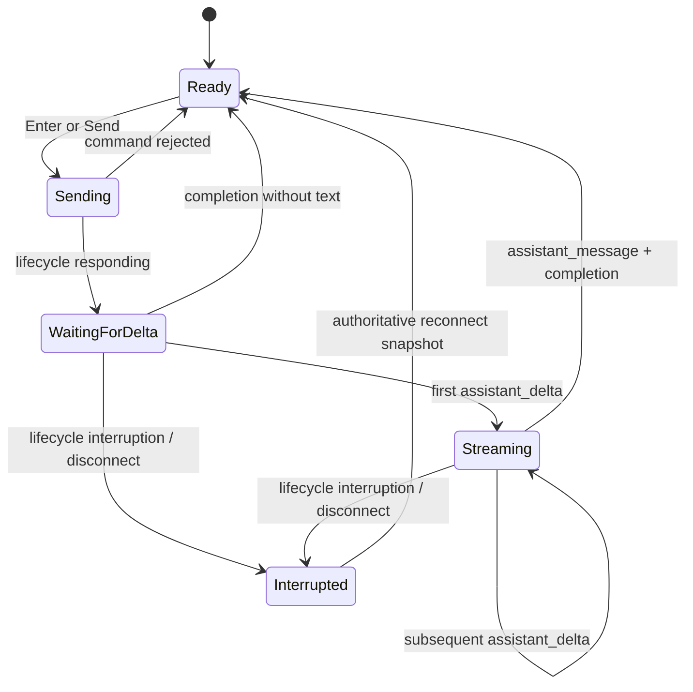
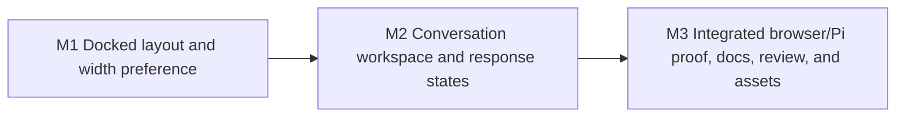

# Local Agent Sidebar Workspace Redesign Plan

## Outcome

The optional Markdown local-agent experience becomes a polished Codex-style workspace rather than an overlaying utility drawer. On desktop, readers can resize a docked right pane while the whiteboard reflows within the remaining viewport. The conversation, connection, context, queue, archive, loading, streaming, interruption, and blocked-request states remain understandable without competing visually with the chat.

This is a presentation and browser-interaction follow-up to `2026-07-27-local-agent-sidebar.md`. It deliberately adds one browser preference—the validated sidebar width—while preserving the existing browser-to-loopback authority boundary, normalized protocol, content-only provider policy, transcript privacy, and no-automatic-replay rules.

## Requirements

### R1 — Docked desktop layout and page reflow

- At viewport widths of at least `64rem`, an open sidebar is a docked right pane rather than an overlay.
- Opening or resizing the pane reduces the whiteboard's available layout width. Markdown, Mermaid diagrams, tables, code blocks, and images reflow or overflow within that remaining region; the pane must not cover page content.
- The whiteboard remains centered within its available region and retains its existing maximum content width.
- The closed launcher is a compact top-right **Page agent** control. It is hidden while the pane is open and restored when the pane closes.
- Opening and closing may animate when motion is permitted. Direct pointer resizing must track the pointer without a lagging width transition.

### R2 — Width interaction and preference

- The desktop width defaults to `420px`.
- A reader can resize from the pane's left edge between `360px` and `720px`, additionally capped at 55% of the current viewport.
- The visible resize rule has a larger invisible hit target and uses pointer capture so a drag remains owned when the pointer leaves the handle.
- The handle is keyboard-focusable with `role="separator"`, vertical orientation, and current/minimum/maximum accessibility values.
- `ArrowLeft` grows the right pane and `ArrowRight` shrinks it by `8px`; holding Shift uses `32px` steps. `Home` and double-click reset to `420px`.
- Pointer cancellation and teardown release capture and temporary resizing state without leaving text selection disabled or event listeners active.
- The final user-selected width is stored once at the end of a pointer resize, not on every pointer movement. Each discrete keyboard step, `Home`, and double-click reset persists its resulting width immediately.
- The new key is `agent-whiteboard-agent-drawer-width`. It stores only a canonical base-10 integer in the absolute `360`–`720` range. Missing, malformed, noncanonical, or out-of-range values use `420`.
- A valid saved width is clamped for the current viewport without overwriting the wider preference merely because the current window is narrow. It becomes effective again when a later viewport can accommodate it.
- Browser storage failures do not make the pane unusable.

### R3 — Responsive and accessible behavior

- Below `64rem`, the pane remains an overlay and width resizing is unavailable. At `40rem` and below it occupies the full viewport width.
- Every overlay presentation is modal: it uses dialog semantics, traps focus, locks background scrolling, closes on Escape or overlay activation, and restores focus to the launcher.
- The docked desktop pane remains complementary, does not trap focus, and does not apply an obscuring overlay.
- Focus indicators, color contrast, status announcements, reduced-motion behavior, and light/dark themes remain functional.
- Resize and viewport changes must not strand focus, hide the close action, or produce horizontal page-level scrolling.

### R4 — Codex-style information hierarchy

- The pane uses the approved compact workspace treatment: quiet neutral surfaces, minimal borders, restrained shadows, denser typography, and conversation-first spacing. It may borrow interaction patterns but does not copy third-party branding.
- A compact header shows a Page agent mark, provider, lifecycle state, and current model when available. Long model names truncate visually while remaining accessible.
- Header actions contain close and an overflow menu. The menu owns **New conversation**, **Archives**, **Reconnect**, **Connection settings**, and **Inspect page context**.
- Before consent, one focused onboarding card explains the local Pi provider, content-only mode, context timing, and conversation resumption. Broker port and retry controls live under connection settings instead of permanently occupying the conversation surface.
- User messages use restrained right-aligned bubbles. Assistant messages are left-aligned and borderless. The design does not wrap every message or event in a prominent card.
- Context inspection and archives are alternate pane views with a clear back action. They do not append large utility sections into the timeline.
- Archive previews remain empty. The archive view displays only the existing sanitized metadata and actions.
- Queue controls appear near the composer only while queued follow-ups exist and retain edit/remove behavior.

### R5 — Composer keyboard and queue behavior

- An enabled, nonempty composer submits on Enter.
- Shift+Enter inserts a newline. Enter during IME composition never submits.
- The visible Send button remains operable for pointer and assistive-technology users; Enter is the primary keyboard path, not the only path.
- The textarea grows with content up to a bounded height and then scrolls internally.
- During an active response, Stop remains immediately available without removing the ability to submit another message into the shared follow-up queue. The polished control treatment must preserve both actions rather than replacing queue submission with Stop.
- Existing UTF-8 byte limits, context-delivery gating, command correlation, uncertain-delivery recovery, and queue limits remain unchanged.

### R6 — Waiting and streaming presentation

- Command submission and model response are distinct states. While a submit command is awaiting authoritative acceptance, the UI may announce **Sending** but must not imply that the provider accepted the turn.
- Once normalized lifecycle state is `responding`, an assistant loading row appears immediately if no assistant delta exists for the active turn. It uses a subtle animated indicator and an accessible **Pi is responding** label.
- The header simultaneously announces `Pi · Responding`; Stop is enabled for the active turn.
- The first `assistant_delta` replaces the loading indicator with progressively rendered assistant text. Subsequent deltas update that same message, and `assistant_message` reconciles the final complete text.
- Only authoritative state transitions remove the transient loading indicator: completion, interruption, a snapshot/lifecycle state that is no longer `responding`, or disconnect teardown. A blocked or error event is rendered immediately but does not by itself claim that the turn ended; its accompanying authoritative terminal transition clears the indicator. A response that completes without assistant text therefore removes the indicator without fabricating a message.
- Reduced-motion mode retains a visible nonanimated responding state.
- Existing WebSocket and NDJSON fallback streaming behavior remains authoritative; this plan does not add polling, simulated tokens, or automatic turn replay.

### R7 — Work summaries, activity, and tool information

- Raw Pi `thinking_delta` content, hidden chain-of-thought, provider payloads, native identifiers, paths, credentials, and raw tool data remain excluded from browser events, browser state, DOM output, and persistence.
- A generic **Thinking** or **Working** loading label is lifecycle UI, not model reasoning and not a persisted timeline message.
- An explicitly normalized `visible_summary` activity is rendered as a collapsed **Work summary** disclosure. It may contain only the broker-approved summary already present in the normalized event.
- `status`, retry, and compaction activity remain compact and collapsed by default. Errors, interruptions requiring attention, and blocked requests remain expanded.
- A normalized blocked `tool` event is labeled **Tool request blocked** and states that content-only mode prevented execution. A blocked `permission` event receives the corresponding sanitized label.
- The browser never invents a work summary from hidden reasoning and never displays attempted tool names, arguments, payloads, output, or claims that a blocked tool ran.
- Pi currently ignores native thinking deltas and exposes no visible summary for them. Adding provider-generated reasoning summaries is not part of this redesign.

### R8 — Existing workflows and privacy remain intact

- Explicit Connect consent, minimal pre-consent status probing, literal `127.0.0.1`, exact Origin authorization, Local Network Access handling, and no-content-on-connect behavior remain unchanged.
- Streaming, queue editing/removal, Stop, reconnect, history pagination, context replacement, archives, errors, and multi-tab broker synchronization remain available after the DOM restructuring.
- The browser preference allowlist becomes theme, drawer-open state, decimal loopback port, and validated drawer width. It still excludes capabilities, resource metadata, native IDs, conversation IDs, messages, context, provider output, credentials, and hidden reasoning.
- No broker, provider, wire-protocol, persistence, or public API change is required for the redesign.

### R9 — Documentation and generated assets

- README, security documentation, and agent-facing security guidance describe the width preference alongside the existing browser-storage boundary.
- Reader-facing guidance accurately describes Enter/Shift+Enter, desktop resizing, responsive behavior, loading, real streaming, safe work summaries, and blocked tool activity where those details are useful.
- Source JavaScript and CSS are reviewed before deterministic asset generation. Generated JavaScript, CSS, and manifest digests are updated only from the accepted source.

### R10 — Tests at every applicable layer

- Unit/component tests cover preference parsing and persistence, resize boundaries and cleanup, layout state, keyboard submission, IME handling, loading transitions, delta reconciliation, activity disclosure defaults, and storage privacy.
- Browser integration tests use the real publishing process and HTTPS viewer with the deterministic loopback broker fixture to cover actual CSS layout, pointer and keyboard resizing, reload persistence, responsive modal behavior, Enter/Shift+Enter, queue/Stop coexistence, loading before the first delta, progressive streaming, archive/context views, and sanitized blocked activity.
- End-to-end coverage uses real Chromium, the real loopback broker, pinned Pi, and the deterministic local model server to prove Enter submission, a visible pre-delta loading state, more than one streamed text update, final completion, and unchanged exact-context/privacy boundaries.
- Tests remain hermetic, deterministic, credential-free, network-local, and isolated. Prose is reviewed directly rather than tested through brittle phrase assertions.

## Design

### Approach

Keep the existing transport, protocol decoder, conversation state, and security behavior, but separate the browser drawer into four presentation responsibilities:

1. layout and width preference;
2. navigation among conversation, onboarding/settings, context, and archives;
3. composer and active-turn controls;
4. normalized timeline and transient response-state rendering.

The redesign uses the current vanilla DOM and CSS architecture. Targeted internal functions are appropriate where they create stable, independently testable behavior—for example width normalization and response-state derivation—but the implementation must not introduce a framework, duplicate broker state in browser storage, or add production interfaces solely for tests.

### Components

#### Layout and preference controller

Owns the saved width, viewport clamp, desktop docked state, overlay state, pointer/keyboard resize lifecycle, and the CSS custom property consumed by the page and pane. It accepts only parsed numeric values and never places an untrusted storage string into CSS.

#### Pane view controller

Owns the active view—conversation, onboarding/connection settings, context, or archives—and header/menu state. It preserves the existing consent and archive command paths while changing only where controls are presented.

#### Composer controller

Owns textarea growth, Enter/Shift+Enter/IME semantics, submit availability, and coordinated Send/Stop presentation. It continues to call the existing command construction and transport boundaries.

#### Timeline renderer

Owns user/assistant layout, transient loading state, streamed assistant reconciliation, and activity presentation. It consumes only the existing validated normalized state and continues to sanitize assistant Markdown.

#### Test fixtures

The deterministic broker fixture exposes test-controlled phase barriers between `lifecycle: responding`, first delta, later delta, and completion. The real Pi model fixture likewise waits on explicit test releases before each split content phase, so browser E2E can observe loading and streaming without fixed sleeps, scheduling races, or hosted services.

### Response flow



`Sending` may be announced in the composer or header but does not create an assistant message. `WaitingForDelta` creates the transient loading row. Only normalized assistant events create durable visible assistant content.

### Activity presentation

| Normalized event | Presentation | Default |
| --- | --- | --- |
| `visible_summary` | Work summary disclosure | Collapsed |
| `status` | Quiet activity row | Collapsed |
| `retry` / `compaction` | Labeled activity disclosure | Collapsed |
| blocked `tool` | Tool request blocked | Expanded |
| blocked `permission` | Permission request blocked | Expanded |
| error / interruption | Actionable error or interruption row | Expanded |

This table changes presentation only. It does not broaden the event schema or permit native provider data into the browser.

### Decisions

- `64rem` is the docked/overlay boundary because the minimum pane plus a useful document region does not fit reliably below it.
- The saved width remains an absolute preference while viewport clamping is temporary, preventing a small window from destroying the reader's wider desktop choice.
- Main-page reflow is implemented through layout state and a numeric CSS custom property rather than measuring or rewriting rendered Markdown nodes.
- Enter submission is added without removing the Send button or the active-turn queue workflow.
- Loading is derived from authoritative lifecycle plus absence of a delta, avoiding a false claim of provider acceptance.
- Existing streamed deltas are surfaced more clearly; no transport or provider streaming redesign is needed.
- Work summaries are limited to normalized `visible_summary` events. Native Pi thinking remains ignored even though the disclosure is visually described as work/thinking information.
- The prototype is a visual reference only. Production code must follow repository security, accessibility, test, and asset-generation contracts rather than copy disposable prototype code verbatim.

## Execution Map



The implementation is intentionally sequential. M1 and M2 both own the same hot browser source and component-test files; M3 owns the phase-controlled fixtures, one reviewed asset generation, real-server browser integration, and final documentation. Parallel writers would create more merge and verification risk than delivery benefit. The Go browser fixture embeds `internal/assets/dist/**`, so Playwright must run only after the integrated source is independently reviewed and regenerated in M3; running it against stale committed assets would not validate M1 or M2.

| Milestone | Outcome | Primary ownership | Validation |
| --- | --- | --- | --- |
| M1 | Tested source contracts for width, layout state, and responsive behavior | `viewer.js`, `viewer.css`, `viewer.test.js` | Vitest plus targeted source inspection |
| M2 | Complete approved workspace source and interaction states | Same browser source/test owner; sequential after M1 | Vitest plus mandatory structural review |
| M3 | Generated real-server integration, real-Pi E2E, and synchronized docs | Browser fixtures/specs, docs, `internal/assets/dist/**`, manifest | Playwright integration/E2E, asset check, final repository gate |

## Milestones

### Milestone 1: Docked layout and width preference

**Covers:** R1–R3, storage portion of R8, and unit portion of R10

**Files:**

- `internal/assets/src/viewer.js`
- `internal/assets/src/viewer.css`
- `internal/assets/src/viewer.test.js`

**Deliverable**

The browser source has unit-tested width, layout-state, resize, persistence, and responsive-accessibility contracts ready for integration after reviewed asset generation. The later real-browser gate remains responsible for proving actual CSS reflow and pointer geometry.

**Implementation**

1. Use batched RED/GREEN tests for width parsing/persistence and resize behavior. Preserve a passing baseline for unrelated open/close and focus behavior before restructuring it.
2. Add the width preference to the explicit browser-storage allowlist and return it from preference loading without relaxing port or open-state validation.
3. Add desktop layout state and the numeric width CSS property so the page's available region changes with the pane. Disable resize transitions during active dragging.
4. Add the separator handle, pointer capture/cleanup, keyboard controls, reset behavior, viewport clamp, and resize-event response.
5. Expand overlay dialog semantics and focus handling across the entire below-`64rem` overlay range; retain full-width presentation at `40rem` and below.
6. Perform the mandatory structural review for listener ownership, teardown, naming, and layout coupling before the milestone gate.

**Validation**

- `pnpm test`
- Targeted source inspection confirms that stored text reaches CSS only after numeric validation and that every pointer, viewport, keyboard, and teardown listener has one cleanup owner.
- Actual bounding-box separation, pointer geometry, breakpoint transitions, and theme presentation are explicitly deferred to M3 after reviewed asset generation; M1 does not claim browser integration from stale embedded assets.

### Milestone 2: Conversation workspace and response states

**Covers:** R4–R8 and unit portion of R10
**Depends on:** M1

**Files:**

- `internal/assets/src/viewer.js`
- `internal/assets/src/viewer.css`
- `internal/assets/src/viewer.test.js`

**Deliverable**

The integrated browser source and component tests encode the approved Codex-style hierarchy and preserve every existing conversation workflow while adding keyboard submission, authoritative pre-delta loading, clearer streaming, safe work summaries, and sanitized blocked-tool information. The source is ready for independent review and one deterministic generation in M3.

**Implementation**

1. Use batched RED/GREEN slices at stable UI boundaries: navigation/onboarding, composer input semantics, response-state rendering, and normalized activity presentation.
2. Restructure the header, overflow menu, onboarding/settings, conversation, context, archives, queue, and composer without changing command or transport contracts.
3. Preserve the current connection, context-delivery, archive, queue, and error state machines while moving their controls into the approved views.
4. Add Enter submission, Shift+Enter newline, IME protection, bounded auto-growth, and coordinated Send/Stop controls that continue to permit queued follow-ups.
5. Derive `Sending`, loading, streaming, completion, and interruption presentation from command correlation and normalized state. Ensure reconnect and replay do not duplicate the transient loading row or resubmit a turn.
6. Render each normalized activity kind according to the approved table. Continue rejecting unknown fields and raw reasoning/provider data before rendering.
7. Specify the fixture phase contract consumed by M3—responding, first delta, later delta, and completion—without generating assets or claiming real-browser evidence in this milestone.
8. Perform the mandatory structural review, including DOM ownership, event cleanup, focus order, render cost during deltas, and preservation of sanitized Markdown behavior.

**Validation**

- `pnpm test`
- Unit assertions cover Enter versus Shift+Enter and composition, one submit per action, loading appearance/removal for every authoritative terminal transition, generic errors that do not falsely end a responding turn, multi-delta accumulation, disclosure defaults, exact blocked labels, storage-key allowlisting, and teardown.
- The mandatory structural review checks the complete navigation and responsive state model. Actual focus order, CSS presentation, and real transport timing are deferred to M3 after independent source review and asset generation.

### Milestone 3: Real-Pi proof, documentation, review, and deterministic assets

**Covers:** R9–R10 and integrated R1–R8
**Depends on:** M2

**Files:**

- `internal/assets/src/viewer.js`
- `internal/assets/src/viewer.css`
- `internal/assets/src/viewer.test.js`
- `tests/browser/fixture.js`
- `tests/browser/local-agent-sidebar.spec.js`
- `tests/browser/local-agent-real-pi.spec.js`
- `README.md`
- `docs/security.md`
- `skills/agent-whiteboard/references/security.md`
- `internal/assets/dist/viewer.min.js`
- `internal/assets/dist/viewer.min.css`
- `internal/assets/manifest.json`

**Deliverable**

The approved source is independently reviewed, proven through the real pinned-Pi browser path, documented accurately, and represented by deterministic bundled assets.

**Implementation**

1. Extend both deterministic fixtures with explicit phase barriers and test-controlled releases for responding, first delta, later delta, and completion. The real model server still emits native role, split content, stop, usage, and completion records without public network or credentials, but no phase depends on a fixed delay.
2. Request a focused independent review of the integrated source and component tests for accessibility, responsive layout, storage validation/privacy, loading-state truthfulness, hidden-reasoning exclusion, blocked-tool wording, and preservation of queue/Stop/reconnect behavior.
3. Resolve required source findings and rerun affected unit checks.
4. Generate the bundled browser assets from the reviewed source, inspect the generated diff and manifest, and verify regeneration produces no further changes.
5. Add real-server browser integration assertions for desktop page/sidebar bounding-box separation; pointer and keyboard resize/persistence; tablet overlay behavior in the `40rem < width < 64rem` range; live resize across `64rem` in both directions; modal role, `aria-modal`, overlay, scroll lock, focus behavior, and handle availability; Enter/Shift+Enter; response barriers; streaming; queue/Stop; context; archives; and blocked activity.
6. Extend the real-Pi browser test to submit with Enter, wait for responding/loading, release and assert a strict partial response, release the remaining model stream, and assert final response plus ready completion. Retain exact context and browser-origin request assertions.
7. If integration fixes alter bundled source, repeat the targeted source review before regenerating and rerunning affected browser checks.
8. Update user and agent documentation for the new preference allowlist, resize/keyboard behavior, streaming/loading distinction, safe visible summaries, and content-only blocked-tool display.

**Validation**

- `pnpm run build` after source review, followed by `pnpm run check:assets`
- `pnpm exec playwright test tests/browser/local-agent-sidebar.spec.js --project=chromium`
- `pnpm exec playwright test tests/browser/local-agent-real-pi.spec.js --project=chromium`
- `go test ./internal/assets ./internal/whiteboard`
- Targeted documentation review; do not add tests that assert prose wording.

## Validation

### During implementation

- Apply batched RED/GREEN for new UI behavior. Use behavior-preserving baseline checks before restructuring existing conversation controls.
- Run the smallest unit command that can disprove each source slice. Run browser commands only after reviewed source has been regenerated into the embedded assets.
- Test observable DOM, accessibility, layout, storage, command, and event behavior rather than private helper existence or fixture markers.
- Keep fixture timing controlled by explicit state, promises, or deterministic server phases; do not rely on arbitrary sleeps.
- Complete structural cleanup after each coherent slice and rerun focused checks when cleanup can affect behavior.

### Milestone gates

- **M1:** all viewer unit tests and targeted source-contract inspection; no stale-asset Playwright claim.
- **M2:** all viewer unit tests plus mandatory structural review; no generation or stale-asset Playwright claim.
- **M3:** one reviewed generation, the complete deterministic sidebar Playwright spec, real-Pi browser E2E, focused Go asset/handler packages, documentation review, and deterministic asset verification.

### Final gate

Run once after the accepted source, tests, docs, and generated assets are integrated:

```sh
go test ./...
go test -race ./...
go vet ./...
pnpm test
pnpm run check:assets
pnpm run test:browser
git diff --check
```

CI remains responsible for the repository's supported Go/OS matrix and clean generated-file verification. No CI test may require hosted-provider credentials, public network access, fixed ports, or existing machine state.

## Assumptions and Risks

- Browser UI source, tests, fixtures, generated assets, and documentation are tightly coupled; sequential ownership is safer than parallel same-checkout writers.
- Continuous page reflow can expose overflow bugs in diagrams, tables, and code blocks. Existing max-width/overflow rules and browser bounding-box assertions must verify representative content rather than assuming CSS grid behavior is sufficient.
- Rendering sanitized Markdown on every delta may become noticeable for unusually frequent or long streams. Preserve the current bounded message contract and inspect responsiveness; any batching strategy that changes visible streaming cadence requires reassessment rather than silent addition.
- A lifecycle event can precede, follow, or arrive in the same task as user and delta events. Loading logic must derive from state and active-turn identity, not a timer or DOM append order.
- A command write does not prove provider acceptance. The visual distinction between Sending and Responding must remain accurate under rejection, disconnect, and uncertain delivery.
- Local storage is same-origin and capability pages share that origin. Width is non-sensitive, but strict key/value allowlisting remains necessary to preserve the documented privacy boundary.
- The sidebar redesign must not weaken pre-consent networking, exact-origin authorization, context commit ordering, event validation, sanitization, replay handling, or content-only enforcement.

## Deferred Work

- Raw chain-of-thought or Pi native thinking-token display.
- Provider-generated visible reasoning summaries not already present in normalized events.
- Actual tool execution, tool names, arguments, payloads, output, or permission controls; content-only mode continues to block tools.
- Per-board widths, server-synchronized UI preferences, live cross-tab width synchronization, or preferences beyond open state, port, width, and theme.
- Left-side docking, detachable windows, multiple simultaneous agent panes, and exact third-party visual cloning.
- Sidebar support for standalone HTML or browsers outside the currently supported Chrome scope.
