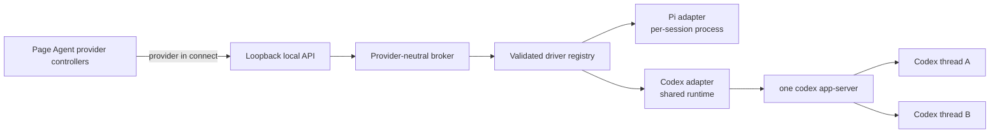
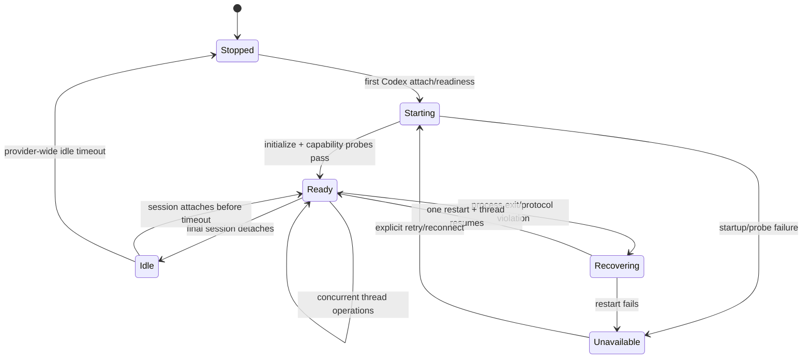
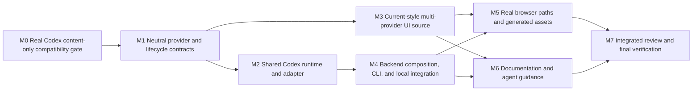

# Codex App-Server Provider Plan

## Outcome

The Page Agent supports Pi and Codex as two independent, content-only conversation providers. Readers switch between them inside the existing drawer, and the last selected provider is restored automatically from local storage. Each provider retains its own conversation, queue, lifecycle, and history for the same whiteboard.

Codex runs through one broker-owned `codex app-server` process that multiplexes all loaded Codex threads. The integration uses Codex's native authentication and configured default model, but it does not expose coding-agent capabilities: no tools, filesystem access, skills, project instructions, MCP, apps, hooks, subprocesses, or network access are available to a Page Agent turn.

The implementation extends the current Page Agent visual system. The standalone prototype is a behavioral reference only; production controls reuse the existing drawer's typography, spacing, colors, focus treatment, responsive breakpoints, and component patterns.

## Requirements

### R1 — Provider selection and preference

- The onboarding view and connected drawer header both provide a Pi/Codex selector.
- Selecting a provider is immediate and silent. It does not show a “selected,” “remembered,” or similar notification.
- Selection alone sends no page content, starts no conversation, and grants no connection consent. The existing explicit **Connect** action remains the consent boundary for a provider that has not been connected during the current page visit.
- The last selected value is stored under a dedicated same-origin local-storage key and restored on later visits. Only the canonical strings `pi` and `codex` are accepted; missing, malformed, or inaccessible storage falls back to Pi.
- Connect consent, conversation identifiers, page identity, messages, context, and provider output are never stored in browser storage.

### R2 — Separate provider conversations

- One whiteboard may have one current Pi conversation and one current Codex conversation, plus provider-specific archives. Provider identity remains part of the durable conversation key.
- Switching providers never converts, archives, deletes, submits to, or interrupts either conversation.
- After both providers have been explicitly connected, the browser keeps an independent validated connection/state controller for each provider. An inactive provider may continue responding, and switching back renders its current or replayed authoritative state.
- Stop targets only the selected provider's active turn. Queued follow-ups remain scoped to the provider where they were submitted.
- Starting, restoring, listing, or deleting a conversation operates only on the selected provider's native session.

### R3 — Content-only turn semantics

- Pi and Codex receive the same canonical application framing: the first contextual message atomically contains the complete Markdown, complete creator context, page metadata, and reader message. A changed resource sends one complete replacement; ordinary follow-ups omit unchanged page content.
- Selection and Connect send no Markdown or creator context. A failed or ambiguous delivery never triggers automatic model-turn replay.
- The canonical envelope retains broker turn and message IDs so history and crash reconciliation do not expose or depend on native provider identifiers.
- The Codex model receives only the canonical envelope and prior conversation content. It receives no local project context or additional whiteboard-derived data.

### R4 — Strict Codex capability boundary

- Before production integration proceeds, a hermetic test using the pinned real Codex CLI must prove the selected stable app-server configuration prevents tools, commands, file reads/writes, project or global instruction loading, skills, MCP servers, apps/connectors, hooks, subprocesses, and web/network access.
- The proof includes sentinel filesystem and local-network targets plus adversarial prompts requesting each excluded capability. Absence of a side effect and absence of tool availability are both required; prompt instructions alone are not enforcement.
- `thread/start` and `thread/resume` must return no loaded `instructionSources`. Any nonempty instruction source list fails before page content is submitted.
- Any tool-, command-, file-, web-, MCP-, app-, skill-, permission-, or approval-related request/item is a content-policy violation. The adapter declines when the protocol permits, exposes only the existing generic blocked state, interrupts the affected turn, and restarts the Codex runtime before accepting more work. Native names, arguments, paths, payloads, output, and approval details never reach browser events or logs.
- Raw reasoning and reasoning deltas are ignored. Only final-answer `agentMessage` content, or unphased agent messages on compatible older versions, becomes assistant output. Context-compaction may use the existing sanitized compaction activity.
- If the pinned CLI cannot enforce this boundary, implementation stops at the compatibility gate and the design returns for revision; it does not ship a prompt-only approximation.

### R5 — Native authentication and model readiness

- Agent Whiteboard uses the user's existing Codex native login state. It never accepts, copies, persists, displays, or logs provider credentials and does not add login UI.
- Codex readiness uses the initialized stable app-server API, `account/read`, `model/list`, and the stable capability query needed for input-capacity preflight. It does not send page content.
- The adapter selects the configured/default usable text model reported by Codex and displays its normalized label read-only. There is no Page Agent model picker or Agent Whiteboard model override.
- Missing executable, missing authentication, no usable default model, unavailable content-only enforcement, incompatible capability bounds, startup failure, and protocol incompatibility map to existing provider-neutral readiness/error categories.
- One unavailable provider does not prevent the local broker or the other provider from working.

### R6 — Shared Codex runtime and concurrency

- Agent Whiteboard starts its own Codex app-server over stdio JSONL; it never attaches to an unrelated user-managed daemon or exposes an app-server socket.
- One lazily started app-server process serves every active Codex session. Requests use correlated IDs and serialized writes; responses and notifications are demultiplexed by thread, turn, and item identity.
- Different Codex threads may have turns in flight concurrently. The broker continues to serialize ordinary turns and queued follow-ups within one conversation.
- Closing or idling one Codex session detaches only that thread. The shared process remains available while another Codex session is active and stops after the provider-wide idle interval when no session is attached.
- Provider shutdown and forced process escalation are adapter-owned. The broker does not assume one child process per conversation and does not inspect Pi or Codex process details.

### R7 — Failure and recovery behavior

- A shared app-server exit interrupts every active Codex turn without replaying it. Queued but unsent browser follow-ups remain in their respective broker conversations.
- Recovery is coordinated once at the Codex runtime boundary. Concurrent sessions share the same restart attempt, then independently resume their recorded threads and replay normalized current state.
- Pi conversations and transports remain usable during Codex startup, crash, restart, or incompatibility.
- `turn/start` is accepted only after a valid correlated response supplies the native turn. Loss of the transport before that response is an unknown acceptance outcome. Reconciliation inspects persisted thread history for the canonical broker envelope; ambiguous or malformed history remains unknown and is never replayed.
- `turn/completed` is authoritative for completion, interruption, and failure. Unknown noncritical notifications are ignored. Malformed known messages, duplicate responses, mismatched thread/turn/item routing, server requests outside the explicitly handled deny path, and ambiguous acceptance fail closed without exposing native data.

### R8 — Provider-neutral architecture

- `internal/provider`, `internal/broker`, `internal/agentstate`, `internal/agentprotocol`, and the local API contain provider-neutral contracts and closed provider names, not provider-specific control-flow branches.
- The broker resolves a driver from a validated provider registry and then executes the same conversation actor behavior. It does not import Pi or Codex packages.
- `internal/pi` and the new `internal/codex` adapter do not import or invoke each other. Each owns its native protocol, validation, executable resolution, environment, session lifecycle, and runtime cleanup.
- Shared code is limited to genuinely neutral primitives, including the canonical content-only envelope and deterministic broker-visible message identity derivation.
- Provider-specific display data is supplied through validated descriptors/events. Browser rendering uses the selected descriptor and per-provider state rather than scattered Pi/Codex conditionals.
- Architecture tests prevent broker-to-adapter imports, adapter cross-imports, provider-name switches outside composition/validation boundaries, and reintroduction of provider-native identifiers into browser protocol values.

### R9 — Stable protocol compatibility

- The Codex adapter uses the stable app-server surface only: initialization, account/model/capability readiness, thread start/resume/read/delete, turn start/interrupt, and the notifications required for agent messages and authoritative turn state.
- Experimental app-server capability is not enabled, and generated version-wide schemas are not copied into production. Small explicit Go DTOs accept only fields needed by the integration, reject duplicate/malformed critical data, and tolerate unknown fields or notifications only where they are noncritical.
- There is no rigid allowlist of installed Codex versions. Startup capability probes determine compatibility; the pinned real-CLI fixture establishes the supported contract in CI.
- The browser/broker v1 protocol gains the closed provider value `codex` while preserving all existing message shapes, limits, strict validation, and Pi behavior. Native thread, turn, request, item, path, and account identifiers remain behind the adapter.

### R10 — Configuration and operations

- `agent serve` resolves `codex` from `PATH` and accepts `--codex-executable PATH` plus `AGENT_WHITEBOARD_PROVIDER_CODEX_EXECUTABLE`, matching the existing Pi precedence and explicit-empty validation.
- The macOS managed daemon may record resolved absolute Pi and Codex executable paths, but no credentials or ambient provider tokens. Foreground and daemon documentation describe both providers accurately.
- Provider environments remain separately allowlisted. Pi retains its current offline/telemetry controls; Codex receives only the environment necessary for native auth, its owned state, locale, and process operation, with ambient API keys and unrelated secrets excluded.
- Logs and stable errors contain provider-neutral labels and sanitized causes. They never contain whiteboard content, creator context, user messages, Codex JSONL, instruction paths, native IDs, credentials, tool details, or raw stderr.

### R11 — Current Page Agent styling and accessibility

- The implementation reuses the existing `.agent-*` drawer components, CSS variables, neutral palette, type scale, spacing rhythm, shadows, focus indicators, and light/dark theme behavior. Disposable prototype CSS and visual branding are not copied.
- The selector fits the existing compact header and overflow/menu language. The onboarding selector fits the existing setup card and button treatment without adding redundant explanatory chrome.
- Provider changes are silent; connection, error, and destructive archive actions may retain their existing actionable announcements.
- The established `64rem` docked/modal boundary, `40rem` full-width mobile behavior, resize handling, focus trap, keyboard navigation, reduced motion, and drawer alignment remain intact.
- Labels, placeholders, loading announcements, provider/model status, setup guidance, archive rows, and errors use the active provider dynamically. Mobile and narrow desktop layouts do not clip or misalign the header selector or actions.

### R12 — Documentation and verification

- README, configuration, security, HTTP/browser protocol, and agent-facing guidance explain provider selection, local preference storage, independent conversations, native auth, the shared Codex runtime, and the exact content-only boundary.
- Unit tests cover every changed validator, registry, lifecycle, parser, state transition, and browser preference/rendering helper.
- Integration tests use pinned real Pi and Codex CLIs with local deterministic model servers, temporary homes/state, ephemeral ports, and no public network or existing credentials.
- Browser tests cover silent selection, preference reload, explicit consent per provider, independent histories/queues, switching during an active response, provider-specific Stop, unavailable-provider isolation, current styling, accessibility, and mobile/desktop alignment.

## Design

### Approach

Refactor the existing single-driver seam into a registry of provider-owned drivers while keeping the broker conversation actor provider-agnostic. The existing durable identity already contains a provider, so Pi and Codex naturally address separate mappings for the same origin and capability. Extract Pi's canonical content-only envelope into a neutral package and make both adapters use it for submission, history reconstruction, and reconciliation.

The Codex adapter owns a shared app-server runtime. A session is a thread-scoped view over that runtime, not a process owner. This keeps process sharing and restart coordination inside Codex while preserving the broker's existing queue, replay, context-commit, archive, and multi-tab semantics.

The browser similarly moves from one hard-coded Pi state object to two instances of one provider-neutral connection controller. The selected provider determines which instance is rendered; previously connected inactive instances remain subscribed. DOM and CSS changes extend the present Page Agent workspace rather than introduce a second component vocabulary.

### Component boundaries

#### Provider contracts and content framing

- Add Pi and Codex to one closed provider-name validator and descriptor table.
- Replace the session `Child()` assumption with provider-owned bounded shutdown/escalation and add driver-level shutdown for shared runtimes.
- Move the canonical turn envelope, parser, and deterministic assistant-message identity out of `internal/pi` into a neutral internal package consumed by both adapters.
- Keep native session references opaque, bounded, non-serializable provider values in memory and bounded opaque strings only inside the durable mapping codec.

#### Broker, state, and browser protocol

- The broker accepts a validated driver registry, selects by `Identity.Provider`, and passes the selected driver into the existing actor. Registry lookup is the only runtime dispatch point.
- Durable keys remain `(origin, markdown, capability ID, provider)`. Existing Pi schema-1 mappings continue to decode unchanged; Codex mappings use the same schema and separate keys.
- The browser protocol accepts `pi` or `codex` wherever a provider is represented. Conversion preserves the selected name instead of substituting Pi.
- Local API attachment routing remains provider-neutral because conversation IDs are broker-generated and unique.

#### Codex app-server adapter

- A runtime owns the process, initialization handshake, request correlation, bounded JSONL parsing, stderr draining/redaction, thread subscriptions, idle timer, restart singleflight, and final shutdown.
- A driver owns readiness and thread create/resume/inspect/delete. It obtains native auth state and the default model from stable app-server calls and verifies the content-only capability contract before a thread may receive content.
- A session owns one thread's event channel, history projection, turn submission/preflight, interrupt, reconciliation, and detach. It never terminates a process used by another session.
- History parsing accepts only canonical Agent Whiteboard user envelopes and allowed final agent messages. Native IDs are correlated internally but converted to deterministic broker IDs before leaving the adapter.

#### Browser provider controllers

- One descriptor table supplies canonical key, label, glyph/text treatment, guidance, and storage value.
- One connection-controller implementation owns transport, replay cursor, conversation ID, command ledger, queue, timeline, provider status, and teardown for each provider.
- The selected key only changes rendering and persistence. Connected inactive controllers continue processing validated events.
- Existing render functions receive the active descriptor/state so text and accessibility labels are dynamic without provider-specific branches.

### Flow

Provider selection never traverses this flow. Explicit Connect creates or resumes only the selected provider connection. The first contextual Submit uses the shared canonical envelope. Normalized provider events return through the same broker and browser protocol regardless of adapter.

### Codex runtime state

An exit transition publishes interruption to active sessions before recovery. Accepted or active turns are never automatically restarted. Queued turns have not crossed the adapter boundary and remain broker-owned.

### Material decisions

- A shared process belongs to the Codex adapter, not the broker, because process cardinality and restart coordination are provider-specific.
- Both browser provider controllers stay connected after explicit consent so inactive response status and history remain authoritative without treating selection as consent.
- The existing canonical envelope is shared instead of inventing a Codex-only prompt, preserving context replacement, IDs, history, and security semantics.
- Capability probing replaces a Codex version allowlist. A missing stable method, missing model capacity bound, unexpected instruction source, or unenforceable capability boundary makes Codex unavailable before content is sent.
- Provider absence is isolated. The broker can serve Pi when Codex is missing and Codex when Pi is missing.
- The prototype supplies interaction intent only. Existing production styles and accessibility behavior are the implementation standard.

## Execution Map

M0 and M1 are sequential barriers: M0 can invalidate the integration, and M1 freezes every provider, lifecycle, envelope, state, broker, and browser-protocol contract consumed later. After M1, M2 and M3 begin together. M4 may begin as soon as M2 completes without waiting for M3 because it owns no browser source. After M3 and M4 integrate, M5 and M6 begin together. M7 is the exclusive integration/review gate.

| Lane | Outcome and dependencies | Exclusive writes | Reserved/shared surfaces | Mutable resources | Focused validation | Parallel with |
| --- | --- | --- | --- | --- | --- | --- |
| M0 compatibility gate | Prove the pinned real CLI contract before production code; no dependency | `tests/integration/codex_app_server_compat_test.go`, `tests/fixtures/codex/**`, provider pin entries in `package.json` and `pnpm-lock.yaml` when required | Production packages are read-only; generated schemas stay in test temp directories | Its own temporary Codex home, sentinel files, local model server, ephemeral ports, and child processes | Narrow real-CLI compatibility test | None: its result determines whether M1 is allowed |
| M1 contract barrier | Freeze neutral contracts and preserve Pi; depends on M0 | `internal/provider/**`, `internal/contentturn/**`, `internal/pi/**`, `internal/agentstate/**`, `internal/agentprotocol/**`, `internal/broker/**`, `tests/integration/architecture_test.go` | Codex and browser implementations are prohibited until these contracts pass | Go test temp directories and process fixtures owned by this lane | Focused Go and Pi regression/race checks | None: these are the shared inputs for every later lane |
| M2 Codex adapter | Complete shared runtime and thread sessions; depends on M1 | `internal/codex/**` | M0 fixtures and all M1 contracts are read-only; app composition is reserved to M4 | Lane-specific temporary homes, local model servers, ephemeral ports, app-server children, and test caches | Codex unit, integration, concurrency, and race tests | M3 |
| M3 browser UI source | Complete selector, preferences, dual controllers, styling, and source tests; depends on M1 | `internal/assets/src/viewer.js`, `internal/assets/src/viewer.css`, `internal/assets/src/viewer.test.js` | `internal/assets/dist/**`, manifest, and Playwright fixtures/specs are reserved to M5; protocol contracts are read-only | Vitest worker/cache only; no generated assets or browser servers | `pnpm test` plus source structural/style review | M2, and M4 after M2 completes |
| M4 backend integration | Compose drivers and finish CLI/daemon/local integration; depends on M2 | `internal/app/**`, `internal/config/**`, `internal/cli/**`, `internal/launchagent/**`, `internal/localapi/**`, `tests/integration/provider_routing_test.go` and backend-focused tests created by this lane | M1 contracts and M2 adapter are read-only; browser source/fixtures/assets remain reserved to M3/M5 | Go test temp homes, state roots, provider children, local model servers, and ephemeral ports distinct from M3 | Focused app/CLI/daemon/local API and provider-isolation integration checks | M3 if it is still active |
| M5 browser/E2E and assets | Prove real Pi/Codex browser paths and generate reviewed assets; depends on M3 and M4 | `tests/browser/**`, `internal/assets/dist/**`, `internal/assets/manifest.json` | Accepted source assets are read-only; documentation is reserved to M6 | Exclusive Playwright servers, browser processes, provider/model children, temporary homes, ports, screenshots, and asset-generation command | Targeted then full browser suite and asset check | M6 |
| M6 documentation | Synchronize user, operator, security, API, and skill guidance; depends on M3 and M4 | `README.md`, `docs/**` except this execution plan, `skills/agent-whiteboard/**` | Tests, generated assets, and production source are read-only | No shared runtime; documentation checks read stable fixtures only | Targeted docs/skill checks and link/example inspection | M5 |
| M7 final integrator | Review combined risk boundaries and establish completion; depends on M5 and M6 | No planned feature writes; any required correction is controller-owned after parallel lanes stop | Entire repository is stable and exclusively controlled by the integrator | Repository-wide test/build caches and any final local processes | Full Go, race, vet, JS, asset, browser, and diff gates | None |

Pairwise ownership is explicit: M2 and M3 share only frozen M1 inputs and have no common files, generated outputs, fixtures, processes, ports, caches, or validation commands. M4 may overlap M3 only after M2 stops; their writes and runtime resources remain disjoint. M5 and M6 share only the accepted behavior as a read-only input and have disjoint files and mutable resources. The index and `HEAD` remain frozen for each active writable cohort; staging, commits, broad generators, and repository-wide tests resume only after every lane in that cohort stops and the controller reconciles all tracked and untracked paths.

## Milestones

### Milestone 0: Prove Codex content-only compatibility

**Covers:** R4, R5, R9, and the Codex portion of R12

**Ownership:** `tests/integration/codex_app_server_compat_test.go`, `tests/fixtures/codex/**`, and provider pin entries in `package.json`/`pnpm-lock.yaml` only when required

**Parallel with:** none; this is a release-feasibility barrier

**Deliverable**

A hermetic executable compatibility test proves the current pinned Codex app-server can initialize over stdio, report native account/model/capacity state, create multiple threads, stream a plain text response, and prevent every excluded capability without filesystem or network side effects.

**Implementation**

1. Generate the pinned CLI's schema into a temporary test directory for inspection only; identify the smallest stable DTO surface and exact launch/turn policy needed by R4.
2. Run the app-server against an isolated temporary Codex home and deterministic local model endpoint. Use a private empty working directory, disabled experimental API, disabled network, disabled shell/tools/features, empty MCP/app/plugin/hook/skill inputs, and no project instruction discovery.
3. Assert initialization ordering, `account/read`, default `model/list`, capacity capability, two simultaneously loaded threads, per-thread turn routing, interrupt, thread read/resume/delete, and clean shutdown.
4. Use filesystem and local HTTP sentinels plus adversarial requests to prove the model cannot read, write, execute, browse, invoke skills, or call any configured external tool. Assert `instructionSources` is empty.
5. Stop and return to design if enforcement depends only on prompting, any excluded side effect occurs, or the stable protocol cannot supply a reliable model-capacity preflight.

**Validation**

- Focused compatibility test with the pinned real Codex CLI and deterministic local model fixture.
- Repeat only the narrow concurrent-thread and process-exit cases if they reveal a race; then run `go test -race ./internal/codex` once the package exists.

### Milestone 1: Freeze provider-neutral contracts and preserve Pi

**Covers:** R3, R8, R9, and Pi compatibility portions of R7/R12
**Depends on:** M0

**Ownership:** `internal/provider/**`, `internal/contentturn/**`, `internal/pi/**`, `internal/agentstate/**`, `internal/agentprotocol/**`, `internal/broker/**`, and `tests/integration/architecture_test.go`

**Parallel with:** none; every later lane consumes these frozen contracts

**Deliverable**

The core supports a closed two-provider registry and provider-owned lifecycle without changing observable Pi behavior. Both adapters can consume the same canonical content envelope, and the broker no longer exposes per-session child-process assumptions.

**Implementation**

1. Add the closed Codex provider name and provider-neutral validation helpers.
2. Extract the canonical envelope/parser and deterministic message derivation from Pi; preserve byte-for-byte Pi prompts and history behavior with regression tests.
3. Define driver/session shutdown contracts that cover both dedicated and shared runtimes. Move Pi graceful/terminate/kill ownership behind its adapter while preserving bounded cleanup and retry safety.
4. Replace the broker's single driver with a validated registry and route solely by durable identity. Remove hard-coded Pi substitution in conversion, handoff, recovery, and archive paths.
5. Extend schema-1 state validation to both providers while keeping existing Pi files readable and keeping native references opaque.
6. Add architectural dependency tests for the approved package boundaries and provider-dispatch rule.

**Validation**

- `go test ./internal/provider ./internal/pi ./internal/agentstate ./internal/broker`
- `go test -race ./internal/pi ./internal/broker`
- Existing Pi integration tests remain unchanged in outcome.

### Milestone 2: Implement the shared Codex runtime and thread sessions

**Covers:** R3–R7, R9, and Codex adapter portions of R12
**Depends on:** M1

**Ownership:** `internal/codex/**`; M0 fixtures are read-only and application wiring belongs to M4

**Parallel with:** M3

**Deliverable**

The Codex driver satisfies the frozen provider contract through one lazy, multiplexed, content-only app-server runtime with thread-specific sessions, strict normalization, coordinated recovery, and provider-owned cleanup.

**Implementation**

1. Implement bounded stdio JSONL transport, initialization, request correlation, server-request denial, notification routing, stderr handling, and deterministic shutdown using the M0-proven launch policy.
2. Implement readiness, default model/capacity selection, thread start/resume/inspect/delete, and provider-wide idle behavior.
3. Implement canonical turn preflight/submission, native acceptance tracking, final-answer streaming, history projection, reconciliation, interrupt, and thread detach.
4. Demultiplex concurrent threads and enforce one active ordinary turn per thread. Coordinate one restart after process loss and notify all affected sessions without replay.
5. Fail closed on malformed critical data, policy-violating items, approval requests, incorrect routing, duplicate responses, and unknown acceptance while retaining no native or sensitive data in errors.

**Validation**

- `go test ./internal/codex`
- Focused concurrent-thread, unknown-acceptance, runtime-exit, restart-singleflight, and idle-shutdown tests.
- `go test -race ./internal/codex`
- Re-run the M0 real-CLI compatibility test against the integrated adapter.

### Milestone 3: Add the provider switcher within the current Page Agent source

**Covers:** R1, R2, R7, R9, R11, and browser-source portions of R12
**Depends on:** M1

**Ownership:** `internal/assets/src/viewer.js`, `internal/assets/src/viewer.css`, and `internal/assets/src/viewer.test.js`; generated assets and Playwright files belong to M5

**Parallel with:** M2, and M4 after M2 completes

**Deliverable**

The production drawer source provides the approved silent Pi/Codex switching behavior, automatic preference restoration, explicit per-provider Connect consent, live independent state, and provider-specific controls while following the current Page Agent styling and accessibility system.

**Implementation**

1. Add the validated provider preference to the existing explicit storage allowlist and create one descriptor-driven controller/state instance per provider.
2. Update connect commands, event validation, archive validation, labels, guidance, composer, loading, errors, and accessibility names to use the active validated descriptor.
3. Add the selector to onboarding and the compact header using current control/menu patterns. Make switching silent and render only the selected provider while connected inactive controllers keep processing events.
4. Preserve explicit Connect, context review, queue/Stop coexistence, archives, reconnect, settings, focus management, resize behavior, themes, and responsive layout.
5. Add source-level regressions for preference, consent, state isolation, active switching, failure isolation, and provider-dynamic labels without modifying the Playwright fixture reserved to M5.
6. Perform structural and visual source review without generating bundled assets.

**Validation**

- `pnpm test`
- Source inspection confirms existing design tokens, breakpoints, focus behavior, and responsive component patterns are reused.

### Milestone 4: Integrate providers through composition and operations

**Covers:** R2, R5–R10, and non-browser portions of R12
**Depends on:** M2

**Ownership:** `internal/app/**`, `internal/config/**`, `internal/cli/**`, `internal/launchagent/**`, `internal/localapi/**`, `tests/integration/provider_routing_test.go`, and backend-focused integration tests created by this lane; M1/M2 packages are read-only

**Parallel with:** M3 if it is still active

**Deliverable**

The foreground broker and managed daemon expose both providers through the same local API. Missing or failed providers are isolated, durable conversations remain separate, and CLI/environment precedence is complete and tested.

**Implementation**

1. Compose Pi and Codex drivers independently and register both even when one executable is unavailable. Use provider-specific environment builders and state roots.
2. Wire the frozen browser protocol and registry through application composition and the local API without provider-specific broker branches.
3. Verify separate mappings, workspaces, archives, context commits, recovery, queues, and attachments for the same page across both providers.
4. Add `--codex-executable`, its environment override, daemon resolution/persistence, help output, explicit-empty handling, and cleanup behavior parallel to Pi.
5. Add local API/integration coverage proving one provider's readiness or runtime failure cannot affect the other.

**Validation**

- `go test ./internal/app ./internal/config ./internal/cli ./internal/launchagent ./internal/localapi`
- `go test ./tests/integration -run 'Provider|Codex|Pi|Agent'`
- Race checks for app/Codex/local-API interaction after focused tests pass.

### Milestone 5: Prove browser paths and generate accepted assets

**Covers:** R1–R9, R11, and browser portions of R12
**Depends on:** M3 and M4

**Ownership:** `tests/browser/**`, `internal/assets/dist/**`, and `internal/assets/manifest.json`; source assets and documentation are read-only

**Parallel with:** M6

**Deliverable**

The generated viewer, real broker, pinned Pi, and pinned Codex CLI demonstrate the complete user-visible behavior on desktop and mobile without stale source or fixture assumptions.

**Implementation**

1. Extend the deterministic broker fixture for two providers and add browser regressions for preference, consent, isolation, active switching, failure isolation, current styling, accessibility, and alignment.
2. Add real-Codex browser coverage using the hermetic local model fixture and explicit phase barriers for pre-delta, streaming, completion, interruption, shared-runtime crash, and recovery.
3. Prove separate Pi/Codex conversations for one published resource, switching while Codex responds, provider-specific Stop/queue behavior, exact first/replacement context, native-ID privacy, and unavailable-provider isolation.
4. Review accepted JS/CSS, generate bundled assets once, and run the asset consistency check before real-browser validation.

**Validation**

- `pnpm test`
- `pnpm run check:assets`
- Targeted provider browser specs, followed by `pnpm run test:browser` at this lane gate.
- Bounding-box and accessibility assertions cover the header selector/actions and onboarding alignment rather than relying only on screenshots.

### Milestone 6: Synchronize documentation and agent guidance

**Covers:** R10 and documentation portions of R12
**Depends on:** M3 and M4

**Ownership:** `README.md`, `docs/**` except this execution plan, and `skills/agent-whiteboard/**`; production source, tests, fixtures, and generated assets are read-only

**Parallel with:** M5

**Deliverable**

User, operator, security, API, and agent-facing guidance accurately describes both providers, automatic provider preference, separate conversations, native authentication, shared Codex runtime, executable configuration, and the enforced content-only boundary.

**Implementation**

1. Update README and configuration/operations guidance for provider selection, `--codex-executable`, environment precedence, daemon behavior, and unavailable-provider isolation.
2. Update security and protocol guidance for local-storage boundaries, exact context delivery, shared runtime recovery, native-ID privacy, and excluded Codex capabilities.
3. Update the Agent Whiteboard skill so agent-facing instructions match the shipped provider behavior without promising deferred tools or account UI.
4. Inspect commands, examples, links, and terminology against the integrated behavior.

**Validation**

- Skill validation plus direct link, command, example, and diff inspection that does not compile or read generated viewer assets while M5 owns them.
- Repository Go documentation/integration tests are reserved to M7 after the parallel lanes stop; no brittle prose-only assertions are added.

### Milestone 7: Review and verify the integrated result

**Covers:** all requirements
**Depends on:** M5 and M6

**Ownership:** no planned feature writes; any correction is controller-owned after both parallel lanes have stopped

**Parallel with:** none; this is the final integration gate

**Deliverable**

The complete branch has one reconciled diff, resolved high-risk findings, passing repository gates, and no unexplained tracked/untracked files or ownership violations.

**Implementation**

1. Reconcile M5/M6 outputs against the ownership map and inspect all tracked/untracked paths before staging.
2. Review capability enforcement, process sharing/recovery, provider isolation, strict protocol normalization, state compatibility, and responsive UI consistency.
3. Apply any required corrections sequentially under controller ownership and rerun only invalidated focused evidence before the final gate.

**Validation**

- `go test ./...`
- `go test -race ./...`
- `go vet ./...`
- `pnpm test`
- `pnpm run check:assets`
- `pnpm run test:browser`
- `git diff --check`

CI remains responsible for the supported operating-system matrix and clean generated-file verification. No test may require public-network access, hosted credentials, fixed ports, existing user state, or an already-running provider process.

## Assumptions and Risks

- Codex's app-server contract can change independently of Agent Whiteboard. Stable-method DTOs, capability probes, and the pinned compatibility test limit this risk without pretending every installed version is identical.
- Content-only enforcement is the release gate. A read-only sandbox alone is insufficient because it may still permit reads or command execution; all excluded capabilities must be absent or independently denied before content is submitted.
- Codex native authentication and user configuration share a home boundary. The launch policy must consume authentication without loading user instructions, tools, MCP, apps, plugins, hooks, or ambient secrets; M0 must prove that separation with the real CLI.
- One shared process creates correlated-failure risk. Runtime-owned demultiplexing, bounded queues, restart singleflight, per-thread session state, and race testing are required before browser integration.
- Existing Pi cleanup currently relies on broker-visible child handles. Moving escalation behind the adapter is a high-risk refactor and requires preservation tests before Codex is introduced.
- Browser capability pages share one origin, so the provider preference is intentionally non-sensitive and global to that publishing origin. Provider connection consent and state remain memory-only.
- The current drawer source, generated assets, fixtures, and docs are tightly coupled. Asset generation occurs only after source behavior and styling have been reviewed.

## Deferred Work

- Codex tools, filesystem/project access, skills, MCP, apps/connectors, hooks, web search, shell commands, file changes, approvals, dynamic tools, collaboration/subagents, plan/review modes, images, and local-image input.
- Attaching to a pre-existing Codex app-server daemon or exposing the owned app-server over WebSocket or a network socket.
- A Page Agent model, reasoning-effort, personality, permissions, or account selector; login/logout and credential management UI.
- Cross-provider transcript conversion, shared history, handoff, comparison, or simultaneous submission.
- Automatic connection consent restoration or background provider startup merely because a preference was restored.
