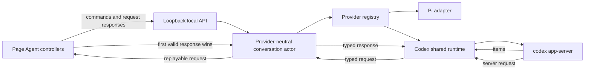

# Codex App-Server Provider Plan

## Outcome

The Page Agent supports Pi and Codex as independent conversation providers. Readers can switch providers in the existing drawer, and each provider retains its own conversation, queue, lifecycle, and archives for the same whiteboard.

Codex runs through one broker-owned `codex app-server` process shared by all loaded Codex threads. Agent Whiteboard uses the user's normal Codex home, authentication, model, approval policy, sandbox, tools, MCP servers, apps, hooks, skills, and other effective configuration. It does not edit `~/.codex/config.toml`, set a private `CODEX_HOME`, or add per-turn model, approval, sandbox, or tool overrides.

The complete whiteboard context package is injected into the contextual user message. Tool activity is visible in Page Agent. Stable App Server approvals and MCP elicitation are presented as interactive requests, and Page Agent sends the reader's response back to App Server. Additional tool restriction and a stronger cross-agent sandbox are explicitly deferred.

## Requirements

### R1 — Provider selection and preference

- The onboarding view and connected drawer header provide a Pi/Codex selector.
- Selection is immediate and silent and does not connect, send content, or interrupt either provider.
- The selected canonical value, `pi` or `codex`, is the only provider data stored in browser local storage. Invalid or unavailable storage falls back to Pi.
- Connect consent, conversation identifiers, page identity, messages, context, requests, decisions, and provider output remain memory-only in the browser.

### R2 — Separate provider conversations

- One whiteboard can have one current Pi conversation and one current Codex conversation, plus provider-specific archives.
- Provider identity remains part of the durable conversation key.
- Once explicitly connected during the page visit, each provider has an independent browser controller and validated connection. An inactive provider may continue responding.
- Stop, queue editing, new conversation, archive restore, and archive deletion affect only the selected provider.

### R3 — Contextual turn semantics

- Pi and Codex receive the same canonical application envelope. The first contextual message atomically contains the complete Markdown, creator context, page metadata, reader message, and broker turn/message IDs.
- A changed resource sends one complete replacement envelope. Ordinary follow-ups omit unchanged whiteboard content.
- Provider selection and Connect send no Markdown or creator context.
- Codex receives the canonical envelope as user-message content. Agent Whiteboard does not attempt to replace App Server's system or developer instructions.
- Failed or ambiguous submission is never automatically replayed.

### R4 — Effective Codex configuration

- Production launches `codex app-server` with the user's normal Codex home. It neither sets a private `CODEX_HOME` nor passes configuration overrides merely to constrain tools, approvals, sandboxing, model selection, reasoning effort, compaction, MCP, apps, hooks, or skills.
- Agent Whiteboard never edits or rewrites the user's Codex configuration or authentication files.
- New-thread creation omits model, model-provider, reasoning-effort, service-tier, approval-policy, sandbox, and tool overrides so App Server applies the effective user configuration.
- Resumed threads preserve their native configuration and recorded model.
- The successful thread response's resolved model is displayed read-only. Agent Whiteboard provides no model or configuration editor.
- App Server remains the authority that executes tools and enforces its configured approval and sandbox policy.

### R5 — Tool activity and stable interactive requests

- Stable App Server item notifications are normalized into bounded Page Agent activity for commands, file changes, MCP calls, web searches, image views, collaboration calls, plans, compaction, and other supported tool work. Native request, thread, turn, and item identifiers never enter the browser protocol.
- Activity exposes the information a local reader needs to understand the action, result, and approval decision, including bounded command, path, diff, tool-name, argument, output, and failure summaries where App Server supplies them.
- Stable server requests for command execution, file changes, permissions, and MCP elicitation become typed browser requests with broker-generated IDs and bounded validated payloads.
- Page Agent renders accessible interactive cards. Supported responses include the choices offered by the native request: accept, accept for session when supported, decline, cancel, stable permission subsets and scope, and structured MCP elicitation responses.
- The first valid response across attached browser tabs wins. The broker atomically resolves the request, sends exactly one response to App Server, and broadcasts a resolved event so other tabs become read-only.
- A response to an unknown, expired, already-resolved, wrong-conversation, or wrong-kind request is rejected without reaching App Server.
- Pending requests remain replayable while the conversation and runtime are alive. If the final attachment disappears and no configured automatic resolution exists, the broker cancels or declines the native request so a turn cannot wait forever.
- If the effective Codex approval policy does not request approval, Page Agent does not invent an approval step. In particular, `approval_policy = "never"` allows App Server to execute according to the effective sandbox without a browser prompt.
- Unknown server-request methods fail closed with an App Server error response and a provider-neutral terminal failure; they are never silently approved.

### R6 — Authentication, readiness, and context capacity

- Agent Whiteboard relies on existing native Codex login state and never accepts, copies, persists, displays, or logs credentials.
- Readiness uses initialization and `account/read` without sending whiteboard content.
- Agent Whiteboard does not read, estimate, set, or override context windows or automatic-compaction thresholds.
- `contextCompaction` notifications become visible provider-neutral compaction activity.
- `ContextWindowExceeded` becomes `context_too_large`; Agent Whiteboard does not truncate, change models, manually compact, or replay the turn.
- One unavailable provider does not prevent the local broker or the other provider from working.

### R7 — Shared runtime and concurrency

- Agent Whiteboard starts its own App Server over stdio JSONL and never exposes its transport over a network socket.
- One lazy process serves every active Codex session. Correlated requests use serialized writes; responses, notifications, and server requests are demultiplexed by thread and turn.
- Different Codex threads may have turns and requests in flight concurrently. Ordinary turns remain serialized within one broker conversation.
- Session shutdown detaches one thread. The shared process stops only after a provider-wide idle interval with no attached sessions.
- A process exit interrupts every active Codex turn without replay. Recovery is coordinated once; sessions independently resume their threads afterward.

### R8 — Provider-neutral architecture

- Provider, broker, state, browser-protocol, and local-API packages use closed provider-neutral contracts and do not import Pi or Codex adapters.
- A validated registry is the sole provider dispatch point.
- Pi and Codex adapters own their native protocols and lifecycle and never import each other.
- Shared code is limited to neutral primitives such as the canonical content envelope and broker-visible identity derivation.
- App Server requests are represented by provider-neutral typed request/response contracts; Codex-specific JSON-RPC details stay inside `internal/codex`.

### R9 — Stable protocol compatibility

- The adapter uses stable App Server methods and notifications only. Experimental APIs and experimental permission profiles are not enabled.
- Small explicit Go DTOs validate required fields and bounds, reject duplicate or malformed critical data, and ignore unknown noncritical notification fields.
- Startup capability checks replace an installed-version allowlist. Hermetic scripted-App-Server tests pin the stable JSONL contract; an optional operator smoke test checks an installed real CLI without making CI depend on machine credentials or state.
- The browser protocol adds `codex`, tool-activity events, interactive-request events, request-resolution events, and response commands while retaining strict validation and Pi compatibility.

### R10 — Configuration and operations

- `agent serve` resolves `codex` from `PATH` and accepts `--codex-executable PATH` plus `AGENT_WHITEBOARD_PROVIDER_CODEX_EXECUTABLE`, matching Pi precedence.
- Foreground and managed-daemon operation use the same default user Codex configuration. The daemon records only resolved executable paths; it does not copy configuration or credentials.
- The Codex environment preserves the values required for normal native home/config/auth and tool execution. Sensitive values are never logged.
- Stable errors and logs exclude whiteboard content, user messages, raw JSONL, credentials, and native identifiers. Tool and approval detail travels only through bounded local protocol events and is not added to logs.

### R11 — Page Agent styling and accessibility

- Provider controls and activity/request cards reuse the existing drawer's typography, spacing, colors, focus treatments, responsive breakpoints, and light/dark behavior.
- Tool activity clearly distinguishes running, completed, failed, and interrupted states.
- Interactive request cards are keyboard operable, expose labels and status changes to assistive technology, prevent duplicate submission, and retain an unambiguous resolved state.
- Provider switching, queueing, Stop, archives, context review, reconnection, focus trapping, resize behavior, reduced motion, and mobile alignment remain intact.

### R12 — Documentation and verification

- README, configuration, security, protocol, and skill guidance describe provider selection, default Codex configuration reuse, interactive approvals, tool activity, shared runtime recovery, and the explicitly deferred sandbox hardening.
- Unit tests cover every changed validator, registry, parser, request state transition, and browser helper.
- Integration tests use temporary state, isolated scripted App Server fixtures, ephemeral ports, and no public network, installed CLI, or existing user credentials. Production must not set a private `CODEX_HOME`.
- Browser tests cover provider isolation, switching during active work, tool activity, every supported stable interactive request family, first-response-wins behavior, reconnect/replay, unavailable-provider isolation, accessibility, and mobile/desktop alignment.

## Design

### Provider and broker contracts

- Add `codex` to the closed provider-name validators and descriptors.
- Replace the broker's single driver with a validated registry selected by durable identity.
- Move Pi's canonical envelope/parser into a neutral package while preserving Pi prompts byte-for-byte.
- Retain the existing neutral preflight seam for Pi compatibility in this first provider slice. Pi keeps its native sizing behavior; Codex returns a valid non-estimating sentinel because App Server owns compaction and capacity enforcement, and maps native context overflow when a turn runs.
- Move child-process escalation behind provider-owned lifecycle contracts so Codex can share one process safely.
- Add bounded provider-neutral tool activity and interactive request types. A session accepts an atomic response through a request ID generated outside native App Server identifiers.

### Codex adapter

- The runtime owns the process, initialization, JSONL framing, correlation, serialized writes, stderr draining, request routing, restart coordination, and idle shutdown.
- The driver owns readiness and thread create/resume/read/delete.
- A session is a thread-scoped view that owns normalized history, submission, interrupt, activity, pending-request state, and detach.
- A pending-request table maps broker-generated opaque request IDs to native response channels. Compare-and-resolve guarantees exactly one App Server response.
- App Server executes tools. The adapter validates and normalizes item lifecycle without reproducing execution in Agent Whiteboard.

### Browser and local protocol

- One descriptor-driven controller exists per provider after explicit Connect; only the selected controller is rendered.
- Tool activity is timeline state. Interactive requests are live conversation state and are also emitted as replayable events.
- A response command carries the broker request ID, request kind, and one validated typed response. It never carries a native JSON-RPC ID.
- All attached clients receive request and resolution events. The conversation actor serializes competing response commands, making the first valid command authoritative.
- Disconnect of the last attachment triggers bounded native cancellation for unresolved requests.

### Runtime flow

### Material decisions

- Production uses the user's default Codex home/configuration and never edits it.
- The context package is user-message content; system-instruction replacement is unnecessary.
- App Server's effective tools, approval policy, and sandbox are authoritative for this initial implementation.
- Stable approvals and MCP elicitation are relayed interactively through Page Agent; they are not automatically approved by Agent Whiteboard. Experimental `request_user_input` remains inactive because `experimentalApi` is disabled.
- Tool limitation and stronger cross-agent sandboxing are deferred. This is an explicit trust assumption for the current non-public deployment, not a security guarantee.
- A shared App Server belongs to the Codex adapter because its process cardinality and recovery are provider-specific.

## Milestones

### M0 — Stable App Server contract fixture

Create a hermetic scripted-App-Server fixture that proves initialization, account readiness, default model resolution without overrides, thread start/resume/read/delete, concurrent thread routing, turn streaming, tool item notifications, each supported stable server-request/response family, interrupt, compaction, context overflow, and clean shutdown. The fixture speaks the exact bounded JSONL shapes consumed by the adapter and never inspects or modifies real user configuration. Keep the installed-real-CLI procedure manual and optional because repository tests may not depend on machine credentials, mutable user state, or an unpinned external binary.

Validation: focused scripted transport tests, narrow repeated/race cases only where concurrency evidence requires them, and the optional hosted-provider smoke procedure for an operator-selected installed CLI.

### M1 — Neutral contracts and Pi preservation

Add the closed provider registry, extract canonical content framing, move process ownership behind adapters, retain the compatibility preflight seam with provider-specific semantics, extend durable state to Codex, and add typed activity/request/response protocol contracts. Preserve existing Pi behavior with unit, integration, architecture, and race tests.

Validation: focused tests for `internal/provider`, `internal/pi`, `internal/agentstate`, `internal/agentprotocol`, and `internal/broker`.

### M2 — Shared Codex runtime and sessions

Implement bounded stdio JSONL transport, initialization, correlation, thread sessions, readiness, history, submission, tool-item normalization, interactive server requests, exactly-once responses, compaction, overflow mapping, interrupt, reconciliation, shared restart, and idle shutdown. Launch with the normal user Codex environment and no production config overrides.

Validation: `internal/codex` unit, scripted integration, concurrency, and race tests plus the M0 contract fixture.

### M3 — Provider and interactive Page Agent UI

Implement the selector, preference, independent controllers, provider-dynamic text, tool activity, stable approval cards, permission selection, MCP elicitation, first-response-wins resolution, reconnect replay, responsive styling, keyboard behavior, and source tests. Keep the browser schema ready for future structured questions without activating the experimental App Server API.

Validation: `pnpm test` plus focused structural and accessibility review.

### M4 — Composition, CLI, daemon, and local API

Register Pi and Codex independently, route through the neutral broker, add Codex executable configuration, preserve the default Codex home/config environment, isolate provider failures, and cover distinct mappings, queues, archives, attachments, pending requests, and cleanup.

Validation: focused app, config, CLI, launch-agent, local-API, and provider-routing integration tests.

### M5 — Browser paths and generated assets

Extend deterministic browser fixtures for provider isolation, tool lifecycle, all supported stable request families, concurrent-tab response races, switching during work, Stop/queue behavior, crash recovery, responsive layout, and accessibility. Review source and generate bundled assets once.

Validation: `pnpm test`, `pnpm run check:assets`, targeted browser specs, then `pnpm run test:browser`.

### M6 — Documentation and final verification

Synchronize README, operations, configuration, security, protocol, and skill guidance with the shipped behavior. Explicitly document that the default Codex configuration is used unchanged and that tool restriction and stronger sandboxing are deferred.

Validation: `go test ./...`, `go test -race ./...`, `go vet ./...`, `pnpm test`, `pnpm run check:assets`, `pnpm run test:browser`, and `git diff --check`.

## Assumptions and Risks

- Whiteboard content is untrusted model input. With normal Codex tools enabled, prompt injection can cause tool activity or requests; an effective `approval_policy = "never"` can permit actions without Page Agent confirmation. The current non-public deployment accepts this risk temporarily.
- Reusing the default Codex home means user MCP servers, apps, hooks, skills, project instructions, model defaults, approval policy, and sandbox settings can affect a turn. Agent Whiteboard must neither conceal this nor claim a content-only boundary.
- A browser attached to the local broker can see bounded tool, command, path, diff, and approval details for its conversation. Trust and origin controls remain important even before public release.
- App Server protocol changes can break the adapter. Explicit DTOs, startup checks, scripted contract fixtures, and the optional real-CLI smoke procedure reduce but do not eliminate that risk.
- One shared process creates correlated-failure risk. Bounded queues, exact routing, restart singleflight, and race testing are required.
- A request can outlive a browser attachment. Replay plus last-attachment cancellation prevents indefinite native waits, but crash recovery cannot recreate a server request that App Server itself lost.

## Deferred Work

- A dedicated App Server configuration, config editor, model/reasoning/personality selector, or login/logout UI.
- Tool allowlists, content-only execution, per-whiteboard filesystem roots, experimental permission profiles, container/VM isolation, and a proper cross-agent sandbox.
- Enabling App Server's experimental `request_user_input` capability and activating structured user-question cards after that API becomes stable or is explicitly accepted.
- Attaching to a pre-existing App Server daemon or exposing the owned transport over a socket.
- Cross-provider transcript conversion, shared history, handoff, comparison, or simultaneous submission.
- Automatic connection-consent restoration or provider startup merely because a preference was restored.
