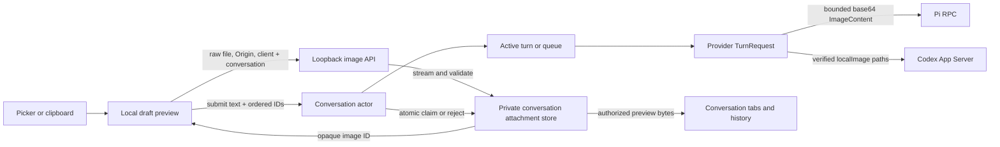
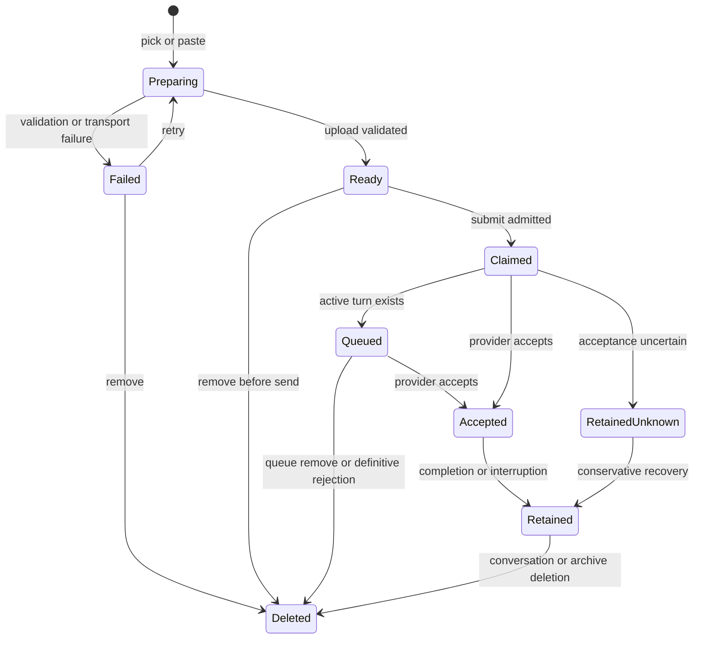
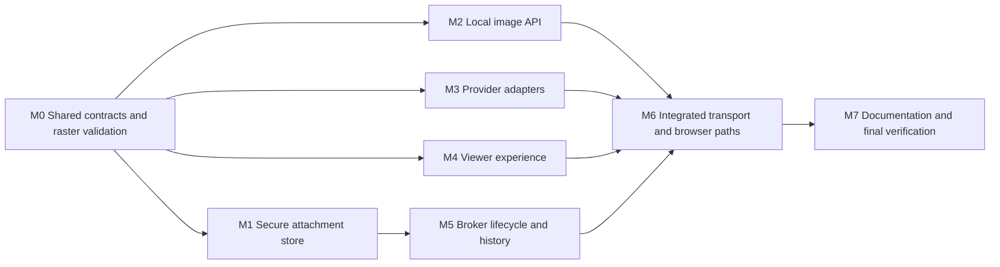

# Local Agent Image Attachments Plan

## Outcome

Page Agent readers can add visual context to Pi or Codex messages by selecting one or more local images in a single picker action or pasting images into the composer. The composer previews every image before submission, reports preparation and failure states inline, and keeps the current restrained Page Agent focus treatment instead of showing a browser-default textarea outline.

Images travel only from the browser to the loopback Agent Whiteboard broker. They are never published to the Whiteboard server or converted into public image capabilities. The broker stages validated files in the private conversation workspace, submits them through each provider's native multimodal input, and retains claimed images with that conversation so queued messages, other attached tabs, reconnects, and restored archives can render the same user-message previews.

The approved interaction reference is `docs/prototypes/image-attachments.html`.

## Requirements

### R1 — Add and preview images

- The composer has one accessible attachment button that opens a file input with `multiple` enabled and accepts PNG, JPEG, GIF, and WebP.
- One picker action may add several files. New selections append to already prepared images rather than replacing them.
- Pasting one or more clipboard image items while the composer is focused adds them to the same ordered draft. Mixed clipboard content preserves plain text as text and adds image items as attachments.
- The draft may contain at most 8 images, each at most 10 MiB, with at most 20 MiB of image bytes in one turn.
- Content detection is authoritative: the broker accepts only a decodable PNG, JPEG, GIF, or WebP regardless of extension or browser-declared media type. SVG, PDFs, malformed images, and all other formats fail.
- Each preparing or ready image appears in a compact horizontal preview strip above the textarea. The strip keeps the composer height bounded and scrolls horizontally when necessary.
- Each preview has an accessible name and an individual remove action. Removal is visible on hover or keyboard focus and remains directly discoverable on coarse-pointer/touch devices.
- Duplicate files are allowed and preserve selection/paste order.
- A message may contain text and images, text only, or images only. Send is disabled only when there is neither valid text nor a ready image, or while any selected image is still preparing.

### R2 — Preparation, failure, and retry

- Selection or paste starts an independent loopback upload for each image. The preview shows a per-image preparing overlay until the broker validates and stages the file.
- A failure keeps an identifiable preview with an inline safe error and Retry and Remove actions. It never discards another successfully prepared image.
- Failed images are never referenced by a submit command. If at least one ready image or valid text remains and no image is still preparing, the reader may send without the failed image.
- Client-side type and size checks provide immediate feedback, but the loopback broker repeats every security and limit check and is authoritative.
- Removing an unsent ready image revokes its staged object through the broker and releases its browser object URL. Leaving the page eventually expires any abandoned staged objects.
- Provider/model image capability is part of the connected conversation snapshot. A text-only selected model leaves ordinary messaging available but disables the attachment control with an accessible explanation.

### R3 — Focus and keyboard behavior

- Focusing the textarea shows only the existing styled composer border and shadow. The textarea has no separate user-agent focus border or outline.
- Keyboard focus remains visible on the attachment, remove, retry, Send, and Stop controls.
- Existing Enter, Shift+Enter, IME composition, auto-growth, Send/Stop, modal focus trapping, and reduced-motion behavior remains unchanged.
- Upload status and image add/remove outcomes use a polite live region; validation failures use an assertive alert only when reader action is required.

### R4 — Private staged transport

- Image bytes use a dedicated loopback HTTP resource under `/api/v1/agent/images`; they are not embedded as base64 in WebSocket or command JSON.
- Upload, preview retrieval, and staged deletion require the exact authorized browser Origin, Agent Whiteboard API-version header, conversation ID, and client ID. Credentials and referrers remain omitted.
- A successful raw-body upload returns only an opaque image ID, detected media type, and byte length. Browser filenames are supplied separately in the later submit command as bounded display metadata and are never used as filesystem paths.
- A submit command carries an ordered list of `{image_id, name}` references. The broker resolves all IDs atomically for the same origin, provider, conversation, and client before it starts or queues the turn.
- A staged ID is one-use: successful active/queued admission claims it for that message. A conflicting conversation/client, expired ID, duplicate ID, or reused ID fails without submitting any part of the turn.
- The command fingerprint includes ordered image IDs and display names, preserving existing idempotency and conflict detection without copying image bytes into the command ledger.
- The local agent protocol version becomes `2` while retaining the existing loopback route namespace. Old/new viewer-daemon pairs fail explicitly as incompatible; server assets and the local daemon must be upgraded together.

### R5 — Storage, quotas, and cleanup

- Original images and a small atomic metadata manifest live beneath the existing owner-only stable conversation workspace. File names are generated from broker IDs and detected extensions; the reader filename is display-only metadata capped at 255 UTF-8 bytes.
- Creation uses no-follow, exclusive, owner-only filesystem operations and atomic manifest replacement. Symlinks, hard-link/path substitution, noncanonical names, unexpected files, and unsafe directory ownership/modes fail closed.
- At most 20 MiB and 8 unclaimed images may be staged for one client draft. All retained image originals in one conversation workspace are capped at 512 MiB.
- Unclaimed images expire 15 minutes after upload. A five-minute bounded sweep and broker startup remove expired or unreferenced staging files; cleanup never follows links or crosses the conversation workspace.
- Images claimed by a queued turn remain until dispatch. Removing that queue item deletes its claimed images; editing the queued text does not alter them.
- A definitive rejection before provider acceptance deletes that turn's claimed images. An unknown acceptance outcome retains them conservatively because the provider may have accepted the turn.
- Accepted images remain with the conversation so native provider history can continue referring to them and Page Agent can render previews after reconnect or archive restore.
- Starting a new conversation archives the prior workspace and its images. Archive deletion and conversation cleanup remove the entire corresponding workspace through the existing guarded cleanup path.
- Shutdown waits only for bounded in-progress filesystem operations. A partial/uncertain mutation fails closed and is repaired or swept on the next broker start; it is never reported as a successful upload or submit.

### R6 — Conversation, queue, and history presentation

- User-message and queue protocol values carry bounded image descriptors containing opaque ID, display name, and detected media type—never bytes or filesystem paths.
- On successful submission, the composer clears its text and attachment draft together. The user-message bubble shows the claimed previews and accompanying text, matching the approved single, multiple, and sent states.
- Other tabs attached to the same conversation receive the same descriptors and retrieve preview bytes through the authorized loopback image endpoint.
- Queue rows expose attached image count and previews and preserve existing edit/remove behavior. Removing a queue row releases the associated files.
- History pages decorate provider text history with broker-owned manifest descriptors by message ID. A missing or corrupt attachment manifest fails closed with a safe unavailable-preview state; it does not corrupt or hide text history.
- Preview fetching is bounded, `no-store`, and abortable. Object URLs are revoked when their message/view is discarded.

### R7 — Provider-neutral turn contract

- `provider.TurnRequest` gains an ordered image-input collection with opaque ID, display name, detected media type, byte length, and a validated absolute private path.
- Turn validation requires valid text or at least one image, enforces the per-turn count/aggregate limits, rejects duplicate image IDs/paths, and continues to validate page context independently.
- The canonical textual context envelope remains byte-compatible for text fields and never embeds image bytes, paths, or IDs. Provider adapters send the envelope as the first text input and append native image inputs in reader order.
- Session capability reports whether the resolved native model accepts image input. The broker rejects images for a text-only session before provider submission while preserving text-only operation.
- Provider-neutral errors add exact cases for unsupported image input, unsupported/malformed image, per-image/turn/workspace limit, missing/expired image, and image storage failure. Browser messages remain stable and reveal no path, native identifier, content, or cause.

### R8 — Pi adaptation

- Pi startup parses the selected model's `input` modalities and reports image capability when `image` is present. Missing modality metadata fails closed for images without making text-only startup unavailable.
- Immediately before the native `prompt` call, Pi reads each already-validated staged file through a bounded no-follow path, base64-encodes it, and sends the documented `images` array of `{type:"image", data, mimeType}` beside the unchanged envelope message.
- The Pi RPC record bound is raised only to the derived worst case for the existing maximum escaped envelope plus 20 MiB of raw image input after base64 expansion and fixed JSON overhead. Tests pin the calculation and reject any larger record.
- Pi never changes the user's model or `images.blockImages` setting. A native setting that disables images remains authoritative; documentation states that such a setting can substitute Pi's native “image reading is disabled” behavior after Agent Whiteboard has delivered a valid image.
- Pi history remains provider-native. The broker manifest, not base64 content extracted from Pi session files, supplies browser preview descriptors.

### R9 — Codex adaptation

- Codex uses stable App Server methods only and keeps `experimentalApi` disabled.
- Runtime initialization calls stable `model/list` and records image capability for catalog models. A missing `inputModalities` field follows the documented compatibility default of text plus image; an unknown resolved model fails closed for image submission without breaking text turns.
- `turn/start.input` contains the unchanged envelope `{type:"text", text:...}` first, followed by one `{type:"localImage", path:...}` item per attachment in reader order. Agent Whiteboard supplies no per-turn model, sandbox, approval, detail, or other configuration override.
- Every local image path remains inside the conversation `cwd` and is verified again immediately before `turn/start` to prevent workspace/path replacement.
- Codex history parsing continues to derive Agent Whiteboard turn/message IDs from the textual envelope. The broker manifest supplies preview descriptors instead of trusting or exposing native `localImage` paths.
- This contract is supported by the current official Codex App Server manual and the stable schema generated from `codex-cli 0.146.1` on 2026-08-08; implementation must keep the existing explicit-DTO and startup-capability strategy rather than version-string allowlisting.

### R10 — Documentation and non-goals

- README, security guidance, hosted-provider smoke guidance, and the agent-facing skill explain picker/paste behavior, local-only transport, provider capability, retention, quotas, native provider policy, and deletion semantics.
- The standalone prototype remains a design reference; production UI uses bundled viewer source and generated assets.
- This release does not add drag-and-drop, camera capture, image annotation/cropping/editing, PDFs, SVG, remote image URLs, public Whiteboard image publication, image generation, or attachment support for non-image files.
- It does not change provider authentication, model choice, Codex sandbox/approval policy, Pi image settings, or the existing no-automatic-replay rule.

## Design

### Approach

Use staged loopback uploads rather than inline base64 commands. A browser draft owns opaque staged IDs; submit atomically claims those IDs into the broker turn/queue; provider adapters consume the corresponding private files. This keeps binary data out of command correlation, WebSocket replay, and queue JSON, while allowing Pi and Codex to use their different native formats behind one provider-neutral contract.

The public publishing server is deliberately absent from the flow. This preserves the existing browser-to-loopback privacy boundary and avoids turning private reader images into public bearer capabilities.

### Components

#### Raster validation

A shared internal raster-format component owns magic-byte detection plus PNG/JPEG/GIF/WebP configuration decoding. The public image service and agent attachment staging both use it, so accepted formats and malformed-file handling cannot drift.

#### Agent attachment store

A dedicated internal attachment domain owns limits, secure workspace paths, staged/claimed metadata, atomic manifests, authorized reads, claims, release, expiry, and sweeping. It exposes reader/metadata operations to the broker; callers never construct attachment paths.

Manifest state is conversation-local and includes attachment ID, detected format, byte length, display name after claim, owner client while staged, message/turn identity after claim, lifecycle state, and timestamps. It contains no image bytes, page content, native IDs, or credentials.

#### Loopback local API

The local API streams one raw image body at a time into the broker attachment boundary and returns bounded JSON metadata. It adds authorized GET and DELETE operations for previews and unsent removal, updates exact CORS preflight matrices, and preserves canonical Host/Origin/private-network checks and privacy-safe request recording.

#### Broker and protocol

The protocol carries only image references and descriptors. The conversation actor serializes upload ownership changes with submit, queue removal, turn rejection, handoff, and cleanup. The actor decorates live user events, queue snapshots, replay, and history from the manifest so every tab sees one authoritative image state.

#### Provider adapters

Pi converts bounded staged files to its native base64 `ImageContent` array. Codex passes the verified private paths as stable App Server `localImage` inputs. Both receive the canonical context envelope as their first text input and expose resolved image capability through the neutral session contract.

#### Viewer

The viewer owns draft files, upload controllers, browser object URLs, ordered state, retry/remove actions, submit gating, and accessible rendering. It derives no filesystem path and sends no image to the publishing origin.

### Control flow

### State transitions

### Decisions

- Staged uploads are preferred over inline base64 because binary command/replay/queue amplification is disproportionate and Pi is the only adapter that actually requires base64.
- Original image bytes remain private and conversation-local. Retention follows conversation/archive lifetime because Codex may need `localImage` paths when resuming native history.
- The broker manifest is authoritative for browser previews; native provider histories are authoritative for text. This avoids parsing/exposing Pi base64 or Codex paths to the browser.
- Image-only turns are supported because the approved composer enables Send when ready images exist without text. The context envelope still supplies a text input to each provider.
- Protocol version `2` is an intentional compatibility boundary; silent partial image support across mismatched viewer/daemon versions is not acceptable.
- Drag-and-drop remains deferred even though the prototype can demonstrate it; the requested production inputs are multi-select picker and paste.

## Execution Map

The first milestone freezes every shared type, limit, error, and JSON shape. After that barrier, storage, local API, provider, and viewer lanes have disjoint writes and can proceed in parallel. Broker lifecycle waits for the concrete attachment store. The integration milestone exclusively owns shared app wiring, browser fixtures/specs, and generated assets.

| Lane | Outcome | Depends on | Exclusive ownership | Reserved/shared surfaces | Focused validation | Parallel with |
| --- | --- | --- | --- | --- | --- | --- |
| M0 | Frozen v2 schemas, limits, errors, raster contract | Approved design | `internal/agentprotocol/**`, `internal/provider/**`, shared raster package, affected `internal/image/format*` | Reserves submit/event JSON, capability shape, and attachment interfaces for all lanes | Protocol/provider/raster unit tests | None; sequential barrier |
| M1 | Secure staged/claimed workspace storage | M0 | New attachment-domain package and its tests | Consumes frozen limits/types; does not edit broker/local API | Store, quota, expiry, atomicity, symlink/TOCTOU tests | M2, M3, M4 |
| M2 | Authorized streaming upload/read/delete HTTP surface | M0 | `internal/localapi/**` | Backend attachment interface frozen by M0; no broker edits | Handler, CORS matrix, size, shutdown, privacy tests | M1, M3, M4 |
| M3 | Native Pi and Codex multimodal submission/capability | M0 | `internal/pi/**`, `internal/codex/**` | Consumes provider image contract; does not change neutral schemas | Exact RPC/App Server fixtures and adapter tests | M1, M2, M4 |
| M4 | Picker, paste, previews, focus, failure UI | M0 | `internal/assets/src/viewer.js`, `viewer.css`, `viewer.test.js` | Generated `dist/**` and Playwright fixtures/specs reserved for M6 | Source DOM/state/accessibility tests | M1, M2, M3 |
| M5 | Atomic claim, queue, replay, history, cleanup | M1 | `internal/broker/**` and broker tests | Consumes M0 contracts and M1 store; app wiring reserved for M6 | Broker lifecycle, races, history, queue, recovery tests | None after M1; may overlap unfinished M2–M4 only if contracts remain unchanged |
| M6 | Composed end-to-end feature | M2–M5 | `internal/app/**`, `tests/browser/**`, applicable `tests/integration/**`, `internal/assets/dist/**`, asset manifest | Exclusive ownership of composition, fixtures, running ports, and generated outputs | App/integration tests, source assets, browser desktop/mobile, asset check | None; integration barrier |
| M7 | Synchronized guidance and final gate | M6 | `README.md`, relevant `docs/**`, `skills/agent-whiteboard/**` | Prototype retained; no production code changes except review fixes routed to owner | Docs tests and repository-wide required checks | None |

Mutable browser fixtures, generated assets, dependency metadata, broker test workspaces, provider subprocess fixtures, and loopback ports are exclusive to their listed lane. M1–M4 use separate temporary directories and no shared daemon. No dependency or generated-output mutation is planned.

## Milestones

### M0 — Shared contracts and raster validation

**Deliverable**

The protocol-v2 and provider-neutral contracts are complete, strict, and independently tested before dependent implementations begin.

**Implementation**

1. Move format detection/config decoding into a shared internal raster component and keep public image behavior byte-for-byte compatible.
2. Define the exact image limits, metadata, capability, provider input, submit references, queue/timeline descriptors, status/errors, and attachment-store interfaces described above.
3. Change text validation so a turn/history user item is valid with empty text only when it has at least one valid image.
4. Keep image data outside the content envelope and command/event JSON size accounting; include ordered references in command fingerprints later in M5.
5. Bump the local protocol constant to `2` and update strict Go protocol codecs/tests. Browser codecs are implemented in M4 from these frozen shapes.

**Validation**

- `go test ./internal/raster ./internal/image ./internal/agentprotocol ./internal/provider`
- Exact boundary tests for 0/1/8/9 images, per-image/aggregate bytes, duplicate IDs, image-only turns, optional text, strict unknown/null/duplicate JSON fields, and v1/v2 mismatch.

### M1 — Secure conversation attachment store

**Deliverable**

Validated images can be staged, authorized, claimed, read, expired, retained, and removed entirely within one guarded conversation workspace.

**Implementation**

1. Implement streaming creation with exclusive owner-only files, incremental byte bounds, content validation, detected extension assignment, and fsync/atomic manifest publication.
2. Implement origin/provider/conversation/client authorization for staged objects and conversation authorization for claimed preview reads.
3. Implement atomic ordered claim by turn/message, queue release, definite-rejection release, conservative unknown retention, quota accounting, and idempotent cleanup.
4. Implement startup repair and periodic expiry sweep without following links or accepting substituted directories/files.
5. Integrate complete attachment-directory removal with existing workspace cleanup rather than creating a second conversation deletion path.

**Validation**

- Focused package tests using temporary owner-only workspaces.
- Unix security tests for symlinks, path swaps, hard links where applicable, modes, partial files/manifests, fsync/rename failures, quota races, claim/delete races, expiry, restart repair, and cleanup retry.
- `go test -race` once for the attachment package, with high repeat counts only on named race-sensitive tests if needed.

### M2 — Loopback image API

**Deliverable**

Authorized browser clients can upload one raw image, retrieve a conversation preview, and delete an unsent staged image without binary WebSocket frames or public-server involvement.

**Implementation**

1. Add POST/GET/DELETE routing under `/api/v1/agent/images`, bounded response DTOs, exact version/client/conversation headers, and backend calls that stream request bodies.
2. Extend CORS preflight with route-specific methods/header sets while preserving exact Origin, Host, trusted-origin, private-network, credentials-omit, no-store, and no-referrer behavior.
3. Reject missing/duplicate headers, queries, malformed IDs, wrong content types, unknown clients/conversations, oversized/chunked bodies, and cross-conversation reads/deletes with safe errors.
4. Ensure request recording captures only canonical route, method, status, and safe code; it must never capture filename, ID, image bytes, media type, path, or underlying cause.
5. Include upload/preview operations in bounded shutdown tracking so server close cannot leak goroutines or partial staging files.

**Validation**

- `go test ./internal/localapi`
- Matrix tests for trusted/untrusted origins, automatic literal loopback, WebSocket and streaming connections, CORS preflight, all methods, bad headers, length/chunked overflow, cancellation, shutdown, and privacy-safe recorder output.

### M3 — Pi and Codex native image input

**Deliverable**

Both provider adapters accept the same neutral turn images and emit the exact supported native multimodal input without changing provider configuration.

**Implementation**

1. Extend Pi startup model parsing with input modalities and expose session capability.
2. Build Pi prompt RPC images from bounded verified files, calculate the enlarged record cap from frozen limits, wipe transient base64/JSON buffers where practical, and preserve acceptance-unknown semantics.
3. Extend the scripted Pi fixture to assert image order, media types, bytes, text-first envelope behavior, model capability, oversized records, native rejection, interrupt, history, and cleanup.
4. Add stable Codex `model/list` capability discovery to the shared runtime without enabling experimental APIs or changing thread defaults.
5. Emit text-first plus ordered `localImage` inputs for `turn/start`; validate paths immediately before the ordered call and preserve existing early-notification buffering and acceptance semantics.
6. Extend explicit Codex DTOs and scripted fixtures for image-capable/text-only/unknown models, missing modality compatibility, multiple paths, path replacement, history, reconciliation, crash, and restart.

**Validation**

- `go test ./internal/pi ./internal/codex`
- Focused race tests for shared Codex runtime capability discovery and concurrent thread submissions.
- Optional real-provider smoke checks remain operator-run and never become CI dependencies on credentials or installed mutable binaries.

### M4 — Production composer and transcript UI

**Deliverable**

The bundled source viewer matches the approved prototype for picker, paste, preview, remove, processing, failure, sent, responsive, and focus states.

**Implementation**

1. Implement strict v2 browser codecs for capability, upload metadata, submit image references, queue images, and live/history descriptors.
2. Add a hidden `multiple` picker, attachment button, paste extraction, ordered draft state, local object URLs, per-image upload abort/retry/remove, and aggregate validation.
3. Render the compact strip, preparing/error overlays, accessible remove controls, count badge, queue previews, sent-message previews, and unavailable-preview fallback using existing light/dark variables and breakpoints.
4. Keep Send disabled during preparation, support image-only submit, preserve text for recoverable upload failures, and clear/revoke the draft only after command dispatch follows existing semantics.
5. Fetch remote-tab/history previews with authorized loopback requests and bounded abortable reads; never insert a local path or public URL.
6. Override textarea `:focus-visible` locally so `.agent-composer:focus-within` remains the sole text-entry focus surface; preserve focus visibility for every actual control and coarse-pointer removal access.

**Validation**

- `pnpm test`
- Source tests for multi-select append order, paste-only/mixed clipboard, image-only send, 8/9 and byte limits, duplicate images, partial failure, retry, cancellation, removal, capability-disabled UI, upload races, queue/sent rendering, object URL revocation, focus computed styles, keyboard/IME, touch affordances, reduced motion, and cleanup on provider switch/drawer close/page unload.

### M5 — Broker turn, queue, replay, and history lifecycle

**Deliverable**

Image references participate atomically in active turns and queues, remain consistent across tabs/replay/history, and follow exact deletion/retention semantics.

**Implementation**

1. Route stage/read/delete requests to the correct conversation actor and serialize them with handoff, shutdown, and archive operations.
2. Resolve and atomically claim every ordered submit reference before active/queued admission; update fingerprinting and never retain bytes in the ledger or replay log.
3. Extend queue accounting/state with descriptors, release on removal/definite rejection, transfer ownership on dispatch, and retain on acceptance/unknown outcome as specified.
4. Decorate normalized user-message events, snapshots, queue events, replay, and history pages from the manifest while keeping provider paths and image bytes out of protocol events.
5. Cover new-conversation/archive handoff, restore, delete, crash recovery, stale tabs, duplicate commands, conflicting clients, and state-repair failure without cross-conversation exposure.

**Validation**

- `go test ./internal/broker`
- Focused repeated tests only for atomic claim/submit, queue remove/dispatch, competing-tab commands, handoff, and cleanup races.
- `go test -race ./internal/broker`

### M6 — Composition and complete browser workflows

**Deliverable**

The real app wires storage, broker, local API, both providers, bundled assets, and browser behavior into one verified feature.

**Implementation**

1. Compose attachment limits/store with the broker and local API using existing agent state roots, IDs, clock, timers, logging, and shutdown ownership.
2. Extend deterministic browser fixtures with raw upload/read/delete endpoints, safe failures, capability variants, claimed queue/history data, and no public-network dependency.
3. Add desktop and mobile Playwright paths for multi-file selection, clipboard paste, processing, partial failure/retry, remove, image-only/text-plus-image sends, sent/queued previews, another tab, reconnect/history, provider switching, text-only models, focus styling, Stop, and archive deletion.
4. Add process/integration coverage for strict loopback transport, owner-only workspace files, daemon restart sweep, Pi native images, Codex scripted `localImage`, and independent provider conversations.
5. Perform structural UI/accessibility review, then generate `internal/assets/dist/**` and the asset manifest exactly once after source behavior is stable.

**Validation**

- Focused `go test` for `internal/app`, affected integration packages, and process paths.
- `pnpm test`
- `pnpm run check:assets`
- `pnpm exec playwright test tests/browser/local-agent-sidebar.spec.js tests/browser/local-agent-transport.spec.js --project=chromium`
- Targeted real-Pi browser coverage where the existing hermetic harness supports it.

### M7 — Documentation and final verification

**Deliverable**

User, operator, security, protocol, and agent guidance accurately describes the shipped feature and its limits.

**Implementation**

1. Update README and hosted smoke guidance with the picker/paste workflow, provider capability behavior, image-only turns, queue/history previews, and server/daemon v2 compatibility requirement.
2. Update security guidance with local-only bytes, Origin/client/conversation authorization, bearer-like opaque IDs, workspace retention, quotas, abandoned staging, archive deletion, Codex path use, and Pi base64/native-policy behavior.
3. Update the agent-facing skill and references without implying that Page Agent attachments are public Whiteboard image resources.
4. Keep the prototype as a non-production interaction reference and ensure its focus treatment remains aligned with production.

**Validation**

- `go test ./...`
- `go test -race ./...`
- `go vet ./...`
- `pnpm test`
- `pnpm run check:assets`
- `pnpm run test:browser`
- `git diff --check`

## Validation Strategy

### During implementation

Each lane runs the smallest package/source check that can disprove its current behavior. Filesystem and actor race tests use temporary directories, injected clocks/timers, bounded channels, and named focused repetition only. Browser tests use in-memory files and clipboard payloads, ephemeral loopback ports, and no hosted service.

### Milestone gates

- M0 proves schema and limit stability before any parallel lane consumes it.
- M1–M4 each prove their isolated boundary without shared mutable fixtures.
- M5 proves attachment lifecycle against the real broker actor before HTTP/UI integration.
- M6 proves complete user-visible paths and regenerates assets once.
- M7 runs the repository-required broad gate once against the final integrated state.

### CI and operator checks

CI owns hermetic Go, JavaScript, asset, and Chromium suites. Installed-provider/model behavior remains an explicit operator smoke check because credentials, provider defaults, Pi settings, and Codex catalogs are machine state. A skipped operator smoke check must be reported; it does not replace the scripted stable-contract tests.

## Assumptions and Risks

- The approved UI permits image-only messages and uses the composer's focus-within styling as the sole textarea focus surface.
- Agent attachment limits are fixed implementation safeguards, distinct from configurable public publishing limits: 8 images, 10 MiB each, 20 MiB per turn/draft, and 512 MiB retained per conversation workspace.
- Stable Codex App Server currently supports `turn/start` inputs of `text`, `image`, and `localImage`, and `model/list.inputModalities`; the adapter must continue using capability checks and explicit DTOs because installed App Server contracts can change.
- Pi RPC currently supports multiple base64 `ImageContent` values. Its native `images.blockImages` setting is not exposed by the RPC state used here, so Agent Whiteboard can report model capability but cannot promise that user policy will allow the model to receive pixels.
- Retained originals consume local disk for the conversation/archive lifetime. The 512 MiB quota bounds one workspace; users release space through conversation/archive deletion. Agent Whiteboard must not delete accepted Codex image paths early because native resume may still depend on them.
- A malicious trusted publishing origin can submit hostile image bytes to the loopback broker. Strict byte/pixel decoding, limits, no-follow storage, private paths, safe errors, and no public re-serving are mandatory; trusting an origin remains a consequential security decision.
- Protocol v2 requires coordinated viewer/server and local-daemon upgrades. Clear incompatible-version UI is preferable to silently dropping attachments or misrepresenting delivery.

## Deferred Work

- Drag-and-drop and OS share-sheet/camera capture.
- PDF or arbitrary-file attachments, SVG, remote URL ingestion, and public Whiteboard image capabilities.
- Client-side or server-side cropping, annotation, optimization, thumbnail generation, transcoding, animation controls, and EXIF editing.
- Per-user configurable agent attachment limits or retention periods.
- Deleting individual images from already accepted historical messages.
- Overriding or editing native model/image settings from Page Agent.
