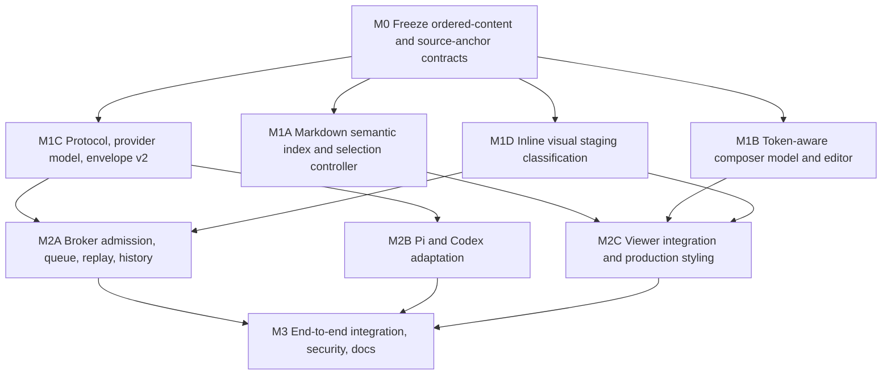

# Page Agent Inline Context References Plan

## Outcome

Readers can point at a precise part of a rendered Markdown whiteboard and place that source directly inside a Page Agent message. A reader may drag-select arbitrary text, add a heading-defined section, or add a rendered raster image. Each choice becomes an atomic inline reference at the saved composer caret, so ordinary text can appear before, between, and after multiple references.

The interaction follows the approved Cursor-style model: a reference is part of the message's ordered content, not an attachment card or an unordered context bag. Text selection keeps the browser's native highlight and exposes one page-styled **Add to message** button immediately above the first selected line, falling below when space is constrained. Section and image actions appear only on hover, keyboard focus, or coarse-pointer layouts. Sent messages, queued messages, live replay, and restored native history preserve the same inline ordering and source identity.

References focus the complete page context that Page Agent already supplies on the initial or replacement turn. They do not replace that context. Text and section references carry a revision-pinned semantic position; image references additionally deliver the selected image pixels to an image-capable model through the private loopback image path, while remaining an inline reference in the reader-facing UI.

The approved interaction references are:

- `docs/prototypes/markdown-selection-ui.html` for document-side selection, placement, feedback, section hover, and image hover.
- `docs/prototypes/context-selection.html` for Cursor-style inline composer and sent-message presentation.

## Product decisions

### D1 — References are ordered message content

- A Page Agent user message is an ordered sequence of text and reference parts.
- A reference is inserted at the last valid composer caret. If no caret has been established, it is appended.
- Adding a reference focuses the composer immediately after the inserted token and opens Page Agent when it is closed.
- Repeated select-and-add actions create multiple independent references. There is no multi-select mode, selection tray, or separate attachment row.
- Adjacent text remains freely editable. Backspace or Delete removes a reference atomically; a reference can never be partially edited.
- Clicking an inline reference returns to and briefly emphasizes its source when the currently rendered page digest matches. A reference from an earlier revision remains readable in history but does not jump to a misleading location.

### D2 — Page context remains complete

- The first accepted turn still supplies the complete Markdown and creator context. A later page revision still uses the existing complete replacement-context flow.
- Inline references supplement that context by expressing which source the reader means and where it occurs in the argument.
- A submitted reference must identify the resource and digest currently observed by the conversation. A stale draft is rejected with existing reload-board guidance rather than silently resolving against a different revision.
- The broker validates reference shape, identity, digest, limits, and image ownership. Reference labels, excerpts, headings, and positions remain untrusted reader content; the broker does not claim they are authoritative reproductions of Markdown it no longer retains.

### D3 — Selection kinds

The first release supports three reference kinds:

1. `text`: an arbitrary non-empty browser selection wholly inside the rendered Markdown surface. It may begin and end in different rendered blocks.
2. `section`: a heading-scoped Markdown range.
3. `image`: one rendered Markdown raster image plus its source position and visual bytes.

Tables, list items, code blocks, blockquotes, and paragraphs are selectable through ordinary text drag, but do not receive whole-block action buttons. Mermaid diagrams, standalone HTML, PDFs, SVG, video, audio, and arbitrary external media are not visual-reference inputs in this release.

### D4 — Section semantics

- A section starts at a heading and ends immediately before the next heading of the same or higher level, or at end of document.
- Lower-level nested sections are included in their parent. Activating a nested heading selects only that nested range.
- An H1 action is labeled **Add page** and covers its heading-scoped page range.
- H2 through H6 actions are labeled **Add section**.
- Content before the first heading has no invented section name or action.
- A document without headings has no section action.
- Duplicate heading text is distinguished by heading ancestry, sibling ordinal, source range, and page digest rather than by title alone.

### D5 — Text selection interaction

- Native browser drag/keyboard selection remains intact. The viewer does not replace the highlight or automatically add every selection.
- After a non-collapsed valid selection settles, a single page-native **Add to message** button appears above the first selected line with viewport collision handling; it appears below when necessary.
- The action is hidden when the selection collapses, leaves the Markdown surface, includes viewer or Page Agent controls, or becomes stale after rerender.
- Pointer-down on the action preserves the Selection until activation. Escape, a new selection, page rerender, or a scroll that invalidates placement dismisses it.
- Keyboard-created selections expose the same action. Pressing Tab while a valid document selection is active moves to the popup action; Shift+Tab returns to the selection's source block.
- Activation gives a short **Added** state, a polite live-region confirmation, and a restrained source pulse. It does not leave persistent badges or highlights on the document.
- If the selected quote or resulting draft exceeds its reference/message budget, activation leaves the selection intact, adds nothing, and reports the exact bounded reason so the reader can shorten the selection.

### D6 — Section and image actions

- Source-selection controls are installed only when the rendered payload has Page Agent enabled. They do not appear on ordinary public Markdown viewers that have no local-agent integration.
- The section action is associated with the heading, appears on section hover or its own keyboard focus, and uses the same surface, border, radius, type scale, focus treatment, and blue accent as the rest of the viewer.
- On coarse-pointer layouts the action remains directly discoverable without hover.
- A rendered Markdown image receives an **Add image** action on hover/focus/coarse-pointer layouts. The image's nearest heading ancestry supplies its human label; alt text is used when present, otherwise a deterministic `Image N` label is used.
- Section or image activation uses the same Added confirmation and composer insertion behavior as text selection.
- Text and section references may be added to a local draft before broker connection; Page Agent opens to its setup state and preserves the draft through successful connection. An image action requires a connected image-capable model because its bytes must be staged to a conversation. Before that point, activation opens Page Agent with a concise connect/capability explanation and does not create a fake or alt-text-only token.

### D7 — Selected image behavior

- A selected image is represented in message content as an inline `image` reference. It is never added to the ordinary attachment preview strip and is never represented by the top-level attachment list in browser events.
- The browser may prepare only a rendered `data:` raster or a same-origin Agent Whiteboard raster URL. It fetches the original bytes with omitted credentials, no referrer, no-store caching, and the existing image byte limits.
- The viewer uploads those bytes to the existing loopback image staging service, marking the staged object as an inline-reference visual. The publishing server does not copy the image and the loopback broker never fetches a public URL.
- Raster magic-byte validation remains authoritative. PNG, JPEG, GIF, and WebP are accepted; all other formats fail safely.
- Selected-image bytes and ordinary attachments share the existing per-turn image count and aggregate-byte limits. The model capability gate applies to both.
- Removing an unsent image token releases its staged object. Removing an image token from a queued message releases its claimed object if no remaining part uses it.
- Closing and reopening the drawer retains a valid unsent image token. Switching provider, replacing/resetting the target conversation, or losing definitive ownership of its conversation/client releases the staged visual and removes the token with a polite draft-change announcement. Abandoned objects still expire under the existing sweep.
- Pi and Codex receive the pixels through their existing native image mechanisms. A canonical reference marker maps the visual to its exact position in the reader's ordered message.

### D8 — Revision and source navigation

- Every reference is pinned to the rendered payload's resource kind, resource ID, update timestamp, and context digest.
- Text anchors identify start and end rendered blocks, one-based Markdown source lines, and Unicode-scalar offsets within the rendered block text. The exact selected rendered text is included as the quote.
- Section anchors identify the heading token and the one-based, end-exclusive Markdown line range computed by markdown-it.
- Image anchors identify the containing rendered block, the Markdown source line range, image ordinal, alt text, and nearest heading path.
- Heading paths contain heading level, visible title, and same-level sibling ordinal. They are descriptive positional context, not selectors trusted in isolation.
- A matching live source scrolls into view and receives a brief focus pulse. If the digest differs, the UI says that the source belongs to an earlier page revision and leaves the current document untouched.

## Message contract

### Canonical ordered model

Introduce one provider-neutral ordered-content model shared by the browser protocol, broker, queue, provider events/history, and canonical native envelope:

```text
MessageContent
└── parts[]
    ├── TextPart
    │   └── text
    └── ReferencePart
        └── reference
            ├── id
            ├── kind: text | section | image
            ├── label
            ├── source
            │   ├── resource_kind
            │   ├── resource_id
            │   ├── resource_updated_at
            │   ├── context_digest
            │   ├── heading_path[]
            │   ├── start_anchor
            │   └── end_anchor
            ├── quote                 # text only
            ├── markdown              # bounded section/page slice only
            ├── section_lines         # section/page only
            └── visual                # image only
                ├── image_id
                ├── name
                ├── alt
                └── image_ordinal
```

Rules:

- Parts are non-empty, adjacent text parts are normalized into one part, and the first/last part may be either kind.
- Reference IDs are opaque browser-generated IDs and are unique within one message.
- `image_ordinal` is derived by broker/provider normalization in first-reference order; it is not accepted from a browser command. Browser submit content carries only the staged `image_id` and bounded display name, while browser event content carries the resulting safe descriptor. The canonical provider envelope carries reference ID plus derived ordinal and omits the staged ID.
- A message contains at most 16 references and 64 normalized parts.
- Existing 64 KiB reader-message limits apply to the aggregate semantic content: reader text, quotes, selected section Markdown, labels, heading titles, alt text, and fixed structural overhead. A single quote is capped at 16 KiB, a section Markdown slice at 48 KiB, and labels/heading titles are separately bounded.
- A message remains valid with text, a reference, an ordinary image attachment, or any allowed combination. Empty text fragments are discarded during normalization.
- Section references include the exact raw Markdown slice for the computed bounded line range, so the selected material is present at that position in the reader message even after a long or compacted conversation. A section/page action whose slice exceeds the remaining 64 KiB semantic budget is not truncated; activation reports that it is too large and asks the reader to select a smaller range.
- Text references include the exact visible quote because inline Markdown syntax means rendered character offsets do not map one-to-one to raw Markdown bytes.
- Image reference descriptors never contain bytes, a filesystem path, or the public capability URL.

### Browser protocol v3

Increment the local-agent browser protocol and WebSocket subprotocol from v2 to v3. Old and new server/daemon assets fail explicitly with the existing incompatible-version UX.

- `submit` replaces `message` with required normalized `content`; ordinary `images` remains available only for existing attachment semantics.
- `queue_edit` replaces `message` with `content`.
- queue items replace `message` with `content`.
- user timeline items and `user_message` events replace `text` with `content`.
- assistant and activity timeline items remain plain `text`.
- An inline image reference nests its opaque `{image_id,name}` reference in submit/queue-edit commands and its safe `{image_id,name,media_type}` descriptor in queue/user/timeline events rather than adding it to top-level `images`; strict command and event validators use the appropriate phase-specific visual shape.
- Strict JSON shape, duplicate-field rejection, aggregate frame bounds, command correlation, replay bounds, and privacy-safe errors remain mandatory.
- Command fingerprints serialize normalized parts in order and include immutable reference fields, digest, positions, and nested image IDs/names.

### Provider-neutral contract

- `provider.TurnRequest` replaces its plain message string with `MessageContent` while preserving the separate collection for ordinary attachments and native visual inputs.
- Inline image inputs are collected in first-reference order; ordinary attachments follow them in their existing order. Each image reference records the one-based native image ordinal used by the canonical envelope.
- `provider.Event` and `provider.HistoryItem` carry ordered content for user messages. Assistant/activity text remains unchanged.
- Provider validation enforces canonical normalization and validates that every inline visual maps to exactly one private validated `ImageInput` owned by the turn.
- Queue edits may change text, delete/reorder existing immutable references, or delete image references. They may not inject a new reference or mutate reference metadata after admission.

### Canonical native envelope v2

The provider-visible textual frame becomes `agent-whiteboard-turn-v2` and stores a length-prefixed canonical representation of ordered reader content instead of a single `reader-message-untrusted` string.

- The representation preserves exact part order and identifies inline image ordinals without embedding IDs, paths, URLs, or bytes.
- It preserves the message-local reference ID and visual ordinal. On native history restore, the broker joins `(message_id, reference_id)` to its private manifest to restore a safe browser image descriptor; the staged image ID itself is not provider-visible.
- Application instructions describe all reference metadata and quotes as untrusted reader content, direct the model to resolve positions only within the supplied current Markdown, and map image markers to native image input order.
- The initial/replacement/continuation context policy remains unchanged: references focus current context and never override replacement semantics.
- `contentturn.Parse` accepts both v1 and v2 so existing Pi/Codex native archives remain restorable. A v1 reader message becomes one text part.
- New turns always emit v2. Native history projection reconstructs ordered content from v2 and continues to project v1 as plain text.
- Envelope size calculations and provider-native JSON/RPC record limits are recalculated and pinned in tests.

## Rendering and source indexing

### Markdown index

Extend the markdown-it render pass to create a semantic index before sanitization:

- Assign deterministic parse-order IDs to selectable block tokens.
- Record each block token's one-based source line range from `token.map`.
- Record heading level, visible heading text after inline rendering, same-level sibling ordinal, and current heading ancestry.
- Compute section end lines by scanning forward to the next heading of equal or higher level.
- Record rendered image ordinal, containing block, source line range, alt text, and heading ancestry.
- Emit only bounded `data-agent-*` identifiers into sanitized HTML. Keep full index data in an in-memory map owned by the render controller rather than serializing excerpts or Markdown into DOM attributes.
- Confirm DOMPurify preserves only the explicitly needed data attributes and continues to remove executable or unexpected markup.

For a text selection, map Range endpoints to their nearest indexed blocks and count Unicode scalars through eligible text nodes. Ignore action controls, task-checkbox controls, theme controls, Mermaid-generated DOM, and the Page Agent drawer. Build the quote with the same eligible-node walker, inserting one `\n` at rendered block boundaries; preserve meaningful internal whitespace in code rather than relying on browser-dependent `Range.toString()` cross-block behavior.

### Rerender lifecycle

- `renderWhiteboard` owns and destroys the selection controller along with Mermaid and theme controllers.
- Theme-only Mermaid rerenders do not invalidate the Markdown index, but a complete source rerender dismisses the popup, clears transient source effects, and invalidates saved document ranges.
- Selection and reference controllers use AbortController-style cleanup or explicit listener disposal. No global listener survives `destroy()`.
- Source navigation uses the in-memory index only when resource identity and digest match the reference.

## Composer and timeline design

### Token-aware editor

Replace the textarea with a small purpose-built contenteditable editor; do not use an offset side table over a plain textarea.

- The authoritative draft is a normalized array of text/reference parts. The DOM is a projection and is reparsed through a narrow, validated mutation path.
- Text nodes are editable. Reference spans are `contenteditable="false"`, atomic, accessible objects with compact source labels.
- Selection/caret mapping utilities translate DOM positions to model positions before document selection steals focus, then restore a valid caret after insertion.
- Input, beforeinput, selectionchange, composition, paste, cut, undo/redo, Enter-to-send, Shift+Enter, arrow movement, Home/End, Backspace/Delete, and mouse placement receive focused unit and browser coverage.
- Pasted HTML is reduced to plain text. Clipboard image items retain the existing ordinary-attachment behavior. Copying a reference yields a readable plain-text fallback; pasting that fallback does not forge a trusted reference.
- The editor normalizes adjacent text after every edit and never derives a reference object from editable text or HTML.
- The existing styled composer focus ring, auto-growth bounds, send/stop behavior, modal focus trap, reduced motion, and screen-reader labeling remain intact.

### Draft insertion and multiple references

- The composer records its most recent valid model caret whenever its selection changes.
- **Add to message** inserts at that model caret. If the caret is inside a text part, the part is split around the new reference.
- If the preceding text ends in a non-whitespace scalar, insertion adds one U+0020 before the token. If following text begins with a non-whitespace scalar, insertion adds one U+0020 after it and places the caret after that space. Existing spaces/newlines are never duplicated or rewritten.
- The Page Agent drawer opens if needed, the new token becomes visible, and focus lands immediately after it.
- Adding the same source twice creates two independent reference IDs. Adding another image stages another one-use visual object, matching existing duplicate-image semantics.

### Queue, live events, and history

- Queue rows use the same editor projection in an edit mode initialized from queued content.
- The queue editor can reorder/delete existing tokens and edit text, but cannot add source references directly; new source actions always target the primary composer.
- A successful queue edit transmits complete normalized content. The broker compares each retained reference with the admitted immutable reference by ID and canonical fingerprint.
- Live user bubbles, replayed events, and history pages render text and reference tokens in order. Ordinary image attachments remain beneath the message as they do today.
- User-message rendering never passes reference labels or quotes through Markdown rendering. A text-only user message retains the current safe Markdown rendering. A message containing any reference renders each text part as literal text with preserved line breaks, so Markdown syntax can never cross, wrap, hide, or reposition an atomic token.
- Clicking a history token invokes source navigation only for the current matching revision.

## Security and privacy

- Markdown, creator context, reader text, reference labels, quotes, selected section slices, alt text, and positional metadata are all untrusted content.
- References confer no new server capability. Resource identity and digest must match the conversation's active observation; the broker does not follow a reference URL.
- Public image bytes are fetched only by the already trusted, hash-pinned viewer from the current page's same origin or a bounded `data:` URL, then uploaded to loopback. Same-origin fetches stream into a hard byte cap, use omitted credentials/no referrer/no-store, reject redirects or final origins that differ from the page origin, and validate the resulting raster before insertion. Bounded data-URL length is checked before decoding. The loopback daemon never performs SSRF-capable fetches.
- The Markdown CSP adds `'self'` to `connect-src` only when Page Agent is enabled, alongside the existing loopback origins, so the trusted viewer can read a same-origin raster capability. Sanitized Markdown still cannot execute scripts, and credentials/referrers remain omitted.
- Existing loopback Origin, Host, private-network, API-version, conversation/client ownership, raster validation, no-follow filesystem, staging expiry, quota, cleanup, and archive-retention controls apply to inline visuals.
- Browser protocol events expose only safe descriptors. They never expose local paths, native IDs, image bytes, public image URLs, full page context, or creator context.
- Reference data is counted in command, queue, replay, timeline, provider-history, and envelope bounds. Malformed, excessive, duplicate, or inconsistent parts fail closed without partial image claims.
- Submit admission claims all ordinary attachments and inline visuals atomically. A definitive rejection releases newly claimed inline visuals; unknown provider acceptance retains them conservatively under existing rules.

## Accessibility and responsive behavior

- Popup, heading, and image actions are native buttons with clear accessible names that include a bounded source label.
- Added/failure outcomes use the existing polite/assertive live-region conventions.
- Source pulses do not carry meaning alone and respect `prefers-reduced-motion`.
- Reference tokens expose kind, label, and removal behavior to assistive technology. A keyboard user can place the caret before/after a token and remove it atomically.
- Touch/coarse-pointer layouts do not depend on hover. Popup placement respects visual viewport edges and safe areas.
- Dark, light, and system themes use existing viewer variables; no prototype-only palette is copied into production.
- Docked and modal Page Agent layouts remain usable from 320 px upward. Opening the drawer still reflows rather than obscures source content where the current layout is docked.

## Non-goals

- Replacing complete page-context delivery with selected-only context.
- Automatically adding browser selections.
- Persistent source badges, a selection tray, or a bulk multi-select mode.
- Whole-block actions for paragraphs, tables, lists, code, or quotes.
- Rich-text authoring beyond plain text plus atomic source references.
- Dragging tokens between messages, forging tokens through HTML paste, or adding new source references inside a queued-message editor.
- Remote cross-origin image fetching, broker-side URL fetching, SVG/PDF/HTML capture, Mermaid screenshots, OCR, cropping, or annotation.
- Publishing selected visual bytes back to Agent Whiteboard or making private reader data public.
- Changing provider authentication, model selection, Codex approval/sandbox policy, or Pi image settings.
- Public prototype hosting. Any interactive design review remains reachable only through the existing tailnet-only Tailscale Serve setup.

## Implementation topology



M0 is a sequential contract barrier. M1A–M1D may proceed concurrently after its schemas and invariants are frozen because they own disjoint files. M2A–M2C may proceed concurrently once their corresponding M1 dependencies land. M3 is a sequential integration and verification barrier.

## File ownership by lane

| Lane | Exact ownership | Must not edit concurrently |
|---|---|---|
| M0 contract owner | `internal/provider/message.go`, `internal/provider/message_test.go`, `internal/agentprotocol/content.go`, `internal/agentprotocol/content_test.go`, this plan | Existing protocol/envelope/adapters before contract approval |
| M1A Markdown selection | new `internal/assets/src/markdown-context.js`, new `internal/assets/src/markdown-context.test.js` | `viewer.js`, `viewer.css`, composer module |
| M1B composer editor | new `internal/assets/src/message-editor.js`, new `internal/assets/src/message-editor.test.js` | `viewer.js`, `viewer.css`, Markdown selection module |
| M1C protocol/envelope | `internal/agentprotocol/protocol.go`, `internal/agentprotocol/events.go`, `internal/agentprotocol/protocol_test.go`, `internal/agentprotocol/image_contract_test.go`, `internal/provider/provider.go`, `internal/provider/provider_test.go`, `internal/provider/image_contract_test.go`, `internal/contentturn/**` | Broker, provider adapters, viewer integration |
| M1D visual staging | `internal/agentattachment/**`, `internal/localapi/images.go`, focused image tests under `internal/localapi/` | Broker image admission and viewer integration |
| M2A broker | `internal/broker/**` | Provider adapters and browser source |
| M2B provider adapters | `internal/pi/**`, `internal/codex/**` | Broker, protocol, contentturn |
| M2C viewer integration | `internal/assets/src/viewer.js`, `internal/assets/src/viewer.css`, `internal/assets/src/viewer.test.js`, `internal/whiteboard/viewer.go`, `internal/whiteboard/viewer_test.go`, `package.json` | M1A/M1B modules after handoff; generated assets |
| M3 integration/docs | `tests/browser/**`, `tests/integration/**`, `README.md`, `docs/http-api.md`, `docs/security.md`, `docs/hosted-provider-smoke.md`, `skills/agent-whiteboard/**`, `docs/prototypes/**`, generated `internal/assets/dist/**` | All feature lanes must be quiescent |

If implementation is performed without parallel workers, preserve the same milestone order. If parallel workers are used, M0 must publish exact Go and JSON fixtures before downstream work begins, and M2C is the only lane that integrates the two browser modules into `viewer.js` and shared CSS.

## Milestones

### M0 — Freeze contracts and fixtures

**Goal:** make every downstream lane compile against one approved semantic model.

Tasks:

1. Add pure provider-neutral message/reference types, normalization, cloning, equality/fingerprint support, byte accounting, and validation.
2. Add matching strict browser JSON types and canonical fixtures for text-only, one text reference, multiple interleaved references, section, inline image, ordinary attachment plus inline image, and invalid/stale shapes.
3. Freeze source-anchor coordinate semantics, bounds, empty/adjacent-text normalization, reference uniqueness, visual ordinal rules, and queue-edit immutability rules.
4. Confirm a v3 browser protocol bump and v2 canonical native envelope; record v1 native-envelope compatibility fixtures.
5. Add table-driven tests for Unicode scalar offsets, duplicate headings, duplicate references, aggregate byte counts, invalid timestamps/digests, and image mapping.

Acceptance:

- Pure contract packages pass without browser, broker, or native provider dependencies.
- One JSON fixture round-trips JavaScript expectations and Go strict decoding without ambiguous optional fields.
- No unresolved contract decisions remain for downstream lanes.

Validation:

```sh
go test ./internal/provider ./internal/agentprotocol
```

### M1A — Markdown semantic index and selection controller

**Goal:** derive stable revision-pinned positions from rendered Markdown without changing normal reading behavior.

Tasks:

1. Extend markdown-it token processing in the new module to compute block IDs, source lines, heading ancestry/ordinals, section ranges and exact source slices, and image metadata.
2. Expose renderer hooks that emit bounded identifiers and return the in-memory semantic index.
3. Implement Range endpoint mapping across blocks, eligible-text walking, Unicode scalar conversion, deterministic block-boundary newlines, quote extraction, and invalid-selection rejection.
4. Implement popup placement from the first client rect, collision fallback, dismissal, keyboard Tab handoff, Added state, source pulse, and cleanup.
5. Implement heading/image action metadata and matching-source navigation helpers.
6. Test nested/duplicate headings, H1 page behavior, preamble/no-heading documents, exact section source slicing, oversized sections, inline emphasis/links, lists/tables/code/task checkboxes, emoji, cross-block selection, invalid control crossings, viewport edges, and rerender destruction.

Acceptance:

- Pure helpers return deterministic anchors for the same Markdown and digest.
- Normal copy selection still works and no reference is created without explicit activation.
- No untrusted content is placed in raw HTML attributes.

Validation:

```sh
pnpm exec vitest run --environment jsdom internal/assets/src/markdown-context.test.js
```

### M1B — Ordered draft model and token-aware editor

**Goal:** provide reliable inline editing independent of transport or source selection.

Tasks:

1. Implement normalized ordered draft operations: insert text/reference, split/merge text, move caret, delete atomic token, reorder, clone, serialize, and calculate limits.
2. Implement the contenteditable projection with non-editable token elements and model/DOM caret conversion.
3. Handle beforeinput, input, composition, paste, copy/cut, undo/redo, Enter/Shift+Enter, arrows, Backspace/Delete, focus, and auto-growth.
4. Implement readable clipboard fallback and rejection of pasted token HTML.
5. Implement read-only inline rendering for sent timeline content and editable rendering for queue content. Preserve current Markdown rendering for text-only messages and use literal line-preserving text parts for mixed reference messages.
6. Add jsdom tests plus DOM-focused fixtures for text around multiple tokens, first/last token, deletion, IME, multiline text, emoji, pasted HTML, hostile DOM mutation, and Markdown delimiters adjacent to tokens.

Acceptance:

- The model, not DOM offsets, determines command content.
- Every edit yields canonical parts or a safe validation error.
- Existing textarea keyboard semantics are preserved where applicable.

Validation:

```sh
pnpm exec vitest run --environment jsdom internal/assets/src/message-editor.test.js
```

### M1C — Protocol, provider model, and canonical envelope

**Goal:** preserve ordered references through strict wire validation and native history.

Tasks:

1. Apply the v3 command/event schema to submit, queue edit, queue snapshot, live user events, timeline pages, frame validation, and protocol constants.
2. Replace provider user-message strings with ordered content in turn requests, user events, and history items; keep assistant/activity text unchanged.
3. Build `agent-whiteboard-turn-v2` with deterministic length-prefixed ordered content and image ordinal markers.
4. Parse v1 and v2 envelopes; normalize v1 messages into one text part and keep reconciliation identity behavior unchanged.
5. Recalculate message, timeline, envelope, and native-record bounds. Add exact-byte and malformed/truncation tests.
6. Update canonical command fingerprint inputs and strict duplicate/unknown-field tests.

Acceptance:

- Text-only behavior projects identically except for the intentional browser protocol bump and native envelope version.
- Existing v1 provider histories remain readable.
- Malformed structures cannot reach the broker or provider adapter.

Validation:

```sh
go test ./internal/agentprotocol ./internal/provider ./internal/contentturn
```

### M1D — Inline visual staging

**Goal:** reuse private raster staging while separating inline-reference lifecycle and presentation from ordinary attachments.

Tasks:

1. Add a staged/claimed purpose classification for ordinary attachment versus inline reference without exposing it in filenames or paths.
2. Extend claim/release operations to atomically claim inline visuals referenced from content and to release removed queued references.
3. Enforce shared per-turn count/byte quotas across both purposes and existing per-draft/conversation quotas.
4. Preserve preview retrieval, expiry, no-follow path checks, manifest repair, archive retention, and cleanup behavior.
5. Add loopback upload metadata needed to declare an inline-reference draft while keeping bytes and public source URLs out of JSON.
6. Test mixed claims, duplicate/reused IDs, purpose mismatch, partial failure, queue removal, unknown acceptance, cleanup, and archive restoration.

Acceptance:

- Inline visual bytes never reach browser command/event JSON or the public publishing store.
- A mixed submit either claims every referenced visual/attachment or none.
- Existing attachment behavior remains compatible within protocol v3.

Validation:

```sh
go test ./internal/agentattachment ./internal/localapi
```

### M2A — Broker admission, queue, replay, and history

**Goal:** make ordered content authoritative throughout conversation lifecycle.

Tasks:

1. Convert submit payloads into provider content and atomically resolve nested inline visuals plus ordinary attachments.
2. Require every source reference to match actor resource identity and current context digest before admission.
3. Store normalized content in active/queued turns; update byte accounting, cloning, zeroing, command ledgers, idempotency, and replay events.
4. Implement queue-edit comparison against immutable admitted references, allowing text edits and token reorder/deletion only. Release deleted inline visuals safely.
5. Publish structured user events and queue snapshots to all clients.
6. Project provider history content into structured browser timeline items and decorate inline visuals from broker manifests by reference/message ID.
7. Cover recovery, handoff, context replacement, concurrent tabs, active/queued dispatch, rejection, unknown acceptance, replay-window loss, archive restore/delete, and shutdown.

Acceptance:

- Reference order and identity are identical in submit, queue, live event, replay, and history.
- Stale digest submissions fail before provider dispatch and before partial image claims.
- Other attached tabs receive the same safe structured representation.

Validation:

```sh
go test ./internal/broker
go test -race ./internal/broker
```

### M2B — Pi and Codex provider adaptation

**Goal:** give both providers equivalent ordered semantic context and visual mapping.

Tasks:

1. Update Pi preflight/session/event/history code to build/parse envelope v2 and return structured user content.
2. Send inline visual inputs in canonical ordinal order through Pi's native image array, followed by ordinary attachments, without changing model selection or image policy.
3. Update Codex turn input to send envelope v2 as the first text input and local images in the same canonical ordinal order.
4. Update Codex live/history projection and both providers' reconciliation paths to recover message/turn identity and ordered content from v2 while accepting v1 history.
5. Pin exact native payloads, malformed history handling, byte limits, image capability failures, no-follow path verification, and mixed visual/attachment order in tests.

Acceptance:

- The model can associate every inline image marker with the intended native image ordinal.
- Text, section, and image references preserve order in provider-visible content.
- Old v1 conversations remain restorable without manufacturing reference tokens.

Validation:

```sh
go test ./internal/pi ./internal/codex
go test -race ./internal/pi ./internal/codex
```

### M2C — Viewer integration and production styling

**Goal:** connect the approved document interaction to the real Page Agent composer and conversation.

Tasks:

1. Integrate the Markdown index/controller into `renderWhiteboard` and expose add/navigate callbacks without coupling rendering to broker state.
2. Replace the textarea with the token editor and adapt submit gating, pending-command behavior, provider switching, draft clearing, focus trapping, and public controller test hooks.
3. Connect text popup, section actions, and image actions to saved-caret insertion. Open Page Agent and preserve explicit Added feedback.
4. Prepare selected image bytes through bounded same-origin/data reads plus loopback upload; reject redirects/final-origin changes and show token-local preparation/failure/retry/remove states rather than attachment previews.
5. Render structured queue rows, live user events, timeline pages, and archive-restored history.
6. Add production CSS using existing variables and responsive/theme/reduced-motion conventions. Do not copy prototype shell styles.
7. Add `'self'` to Page-Agent-enabled Markdown `connect-src`, keep the disabled configuration unchanged, and update exact CSP tests.
8. Preserve text/section drafts through setup and connection; gate image activation on a connected image-capable conversation; define drawer-close, disconnect/reconnect, provider-switch, new-conversation, and handoff cleanup exactly as D6-D7 require.
9. Expand the `pnpm test` script from its current single-file target to the complete `internal/assets/src/*.test.js` suite without adding a dependency, so new module tests run in the ordinary repository gate.
10. Update viewer unit tests for strict v3 commands/events, multi-reference drafts, source navigation, stale references, pre-connect drafts, provider/conversation transitions, cleanup, and mixed selected/attached images.

Acceptance:

- The approved prototype states work in the real viewer at desktop and narrow widths.
- A selected item is visibly part of the message text before and after sending.
- The ordinary attachment row remains reserved for explicit local attachments.

Validation:

```sh
pnpm test
go test ./internal/whiteboard
pnpm run check:assets
```

### M3 — End-to-end integration, documentation, and release gate

**Goal:** verify the complete reader workflow and synchronize public guidance.

Tasks:

1. Add Playwright flows for pointer text selection, keyboard text selection, popup placement above/below, multiple references with surrounding text, section boundaries, duplicate headings, pre-connect text/section drafts, image capability gating/preparation, provider/conversation transitions, token deletion, queue edit, send, replay, source jump, stale revision behavior, modal/docked layout, dark theme, touch/coarse pointer, and reduced motion.
2. Extend local transport/security tests for protocol v3, exact CORS/CSP behavior, same-origin image reads, loopback-only staging, and no public or cross-origin fetch.
3. Add provider-backed or fixture-backed browser coverage proving sent/restored tokens and selected visual delivery while remaining hermetic.
4. Update README, HTTP protocol documentation, security guidance, hosted-provider smoke guidance, and the agent-facing skill with selection semantics, revision behavior, limits, local-only visual transport, provider visual-order checks, and non-goals.
5. Keep the approved prototypes as design evidence; add a brief note that production behavior is verified by browser tests and prototypes are not runtime assets.
6. Rebuild committed browser assets only after source tests pass.
7. Run milestone-focused tests first, then the full normal/race/vet/browser gates once.

Acceptance:

- Complete workflows are deterministic without public network, credentials, existing ports, or machine state.
- Documentation matches production behavior and protocol v3.
- Generated assets match source and the worktree contains only intentional changes.

Validation:

```sh
go test ./...
go test -race ./...
go vet ./...
pnpm test
pnpm run check:assets
pnpm run test:browser
```

Optional human design review may publish the prototypes through the already configured Tailscale Serve endpoint, verified as `tailnet only`. It is not a substitute for hermetic browser tests and must never use Funnel or a public host.

## Test matrix

| Layer | Required evidence |
|---|---|
| Pure message model | normalization, order, byte accounting, reference uniqueness, Unicode offsets, visual mapping |
| Markdown index | nested/duplicate headings, H1 page, preamble, no headings, block maps, cross-block text, images |
| Editor | caret split/restore, multiple tokens, atomic deletion, IME, paste/copy, undo, Enter/Shift+Enter, hostile DOM |
| Protocol | strict v3 JSON, bounds, duplicate fields, command fingerprint, queue/live/timeline shapes, old-version rejection |
| Envelope | exact v2 bytes, v1 compatibility, initial/replacement/continuation, malformed/truncated input, image ordinals |
| Staging | mixed-purpose atomic claim, quota, expiry, no-follow paths, release, repair, archive retention |
| Broker | active/queue/replay/history order, stale digest, multi-tab, edit immutability, rejection/unknown acceptance |
| Pi | native prompt plus ordered images, history/event parse, capability and size failures |
| Codex | text envelope plus ordered localImage inputs, history parse, path revalidation, capability failures |
| Browser E2E | approved UI states, multiple selection, section/image actions, sent/history tokens, source jump, responsive/a11y |
| Security | CSP/CORS exactness, no public mutation, no cross-origin/broker fetch, no bytes/paths in events/errors |

## Completion gate

Before implementation is called complete, verify all of the following:

- [ ] References are inline ordered parts everywhere; no production path converts them into an unordered attachment/context bag.
- [ ] The full page context remains the authoritative current source and stale reference submissions fail closed.
- [ ] Section boundaries exactly follow heading level rules, including H1, nested headings, duplicate titles, preamble, and EOF.
- [ ] Native text selection and copy behavior remain available; Add is always explicit.
- [ ] Multiple references retain before/between/after text through queue, live replay, and restored history.
- [ ] Selected raster pixels reach image-capable providers privately but never appear as ordinary attachments in the UI.
- [ ] Browser events, durable mapping, logs, and errors contain no page context, image bytes, local paths, or public capability URLs beyond existing allowed page metadata.
- [ ] V1 native archives restore, v3 browser incompatibility is explicit, and command idempotency includes ordered reference content.
- [ ] Source navigation never jumps across a digest mismatch.
- [ ] Keyboard, touch, dark theme, narrow viewport, and reduced-motion behavior are covered.
- [ ] Unit, integration, race, vet, asset, and browser gates pass.
- [ ] README, detailed docs, and the bundled agent skill describe the shipped behavior accurately.

## Rollout and rollback

- Perform all implementation on the dedicated `feature/page-agent-inline-context-references` branch. Do not implement, commit, or push this feature directly on `master`.
- After the complete M3 verification gate passes, commit the intentional plan, prototypes, implementation, tests, documentation, and generated assets; push the feature branch and open a new pull request targeting `master`.
- The pull request body must summarize the approved interaction, protocol/envelope migrations, selected-image privacy boundary, compatibility/rollback behavior, and exact validation results. Do not open the PR while required checks are failing or the implementation is knowingly partial.
- Ship viewer assets and local broker together because browser protocol v3 is intentionally incompatible with v2.
- No durable mapping schema migration is required for text/section references; selected-image manifest changes must decode prior attachment-only manifests or perform a bounded explicit migration with fixtures.
- Native envelope parsing remains backward-compatible, so rollback must not delete or rewrite provider-native histories.
- The approved release includes all three reference kinds behind one v3 contract. If selected-image preparation proves infeasible, stop and return to product review; do not silently ship a partial scope or degrade an image token to alt text.
- A rollback restores the previous bundled viewer and broker together. Unclaimed inline-reference staged images follow existing expiry cleanup; claimed archive visuals remain under guarded conversation cleanup.
