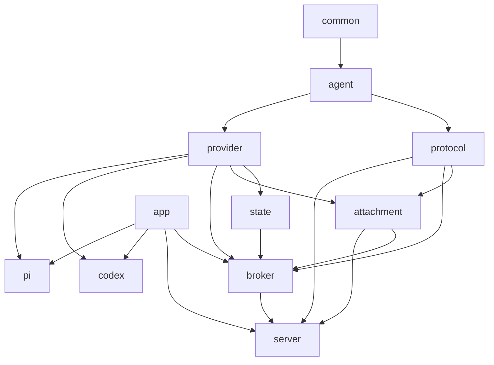
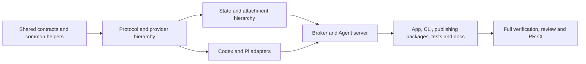

# Agent Package Hierarchy Refactor Plan

## Outcome

Reorganize the repository into an orderly `internal/agent/...` hierarchy and consolidate small helper packages without changing runtime behavior, public APIs, browser protocols, provider protocols, storage formats, security boundaries, or command behavior.

## Requirements

- **R1:** Start from current `master` and deliver the refactor on a dedicated branch and pull request.
- **R2:** Introduce root `internal/agent` shared types, limits, and context digest helpers.
- **R3:** Move substantial Agent responsibilities into `internal/agent/{protocol,provider,state,attachment,broker,server,codex,pi}`.
- **R4:** `agent/server` remains the literal-loopback browser transport; `agent/broker` remains conversation orchestration; `webapi` remains the publishing HTTP contract.
- **R5:** Absorb `contentturn` into `agent/provider`, `raster`, `processgroup`, and `launchagent` into `common`, and `assets` into `whiteboard`.
- **R6:** Rename `internal/http` to `internal/webapi`.
- **R7:** Remove standalone mock packages in favor of test-local doubles where feasible without weakening test coverage.
- **R8:** Preserve every observable behavior and security property. This is a structural refactor, not a feature change.
- **R9:** Run all repository-required unit, race, vet, asset, JavaScript, browser, and integration validation; create the PR and repair CI until all checks pass.

## Design

### Package hierarchy

```text
internal/agent
├── protocol
├── provider
├── state
├── attachment
├── broker
├── server
├── codex
└── pi
```

The root `agent` package is a dependency foundation and never imports its children. `app` is the composition root and wires providers, broker, state, attachments, and server.

### Dependency direction



Arrows mean “is consumed by.” Shared provider names, fixed limits, and exact context digest calculation live in root `agent`. Browser wire types remain in `protocol`; provider runtime types remain in `provider`; conversions remain in `broker`.

### Common OS and media helpers

`common` absorbs raster validation, provider-independent child process launch/cleanup, and macOS LaunchAgent management. The process contract must not import `agent/provider`; provider adapters consume a low-level `common` process interface. Platform build-tag files remain separate.

### Compatibility

All changes are internal except filesystem locations of embedded source assets. Exported `pkg/agentwb` signatures, HTTP paths and JSON, local Agent API version and messages, provider-native payloads, configuration, CLI output, and durable files remain byte- or behavior-compatible as applicable.

## Execution Map



| Lane | Outcome | Depends on | Exclusive ownership | Shared/reserved surfaces | Validation | Parallel with |
| --- | --- | --- | --- | --- | --- | --- |
| M1 | Root Agent and common contracts compile | None | `internal/agent/*.go`, `internal/common/**` | Provider process interfaces reserved for M2 integration | Focused common/root tests | None; freezes shared contracts |
| M2 | Protocol and provider packages moved; envelope absorbed | M1 | `internal/agent/protocol/**`, `internal/agent/provider/**` | Root Agent contract frozen | `go test` for both packages | None; provider consumes M1 contract and supplies M3/M4 contracts |
| M3 | Durable state and attachments moved | M2 | `internal/agent/state/**`, `internal/agent/attachment/**` | No app/broker edits | Focused package tests | M4 |
| M4 | Codex and Pi moved under Agent | M2 | `internal/agent/codex/**`, `internal/agent/pi/**` | No app/broker edits; provider contract frozen | Focused adapter tests | M3 |
| M5 | Broker and loopback server moved and integrated | M3, M4 | `internal/agent/broker/**`, `internal/agent/server/**` | App wiring reserved for M6 | Focused broker/server tests | None; consumes every Agent contract |
| M6 | Remaining imports, publishing helpers/assets, test doubles and docs aligned | M5 | `internal/app/**`, `internal/cli/**`, `internal/webapi/**`, `internal/whiteboard/**`, `internal/image/**`, `internal/store/**`, `pkg/**`, `tests/**`, docs | Asset generation and repository-wide import graph | Affected packages, asset checks, integration checks | None; shared integrator |
| M7 | Review and final gates pass; PR CI green | M6 | No feature ownership; corrective edits only | Entire checkout, generated assets, CI | Required full suite and PR checks | None |

The implementation is controller-owned and sequential where shared package identities and imports make concurrent writers unsafe. M3 and M4 are structurally parallel-safe after M2 because their write sets and focused tests are disjoint, but delegation is optional; the controller retains integration ownership.

## Milestones

### Milestone 1: Shared contracts and common helpers

Create root Agent primitives; move limits and context digest; absorb raster validation and OS helpers into `common`; remove the provider-to-process implementation dependency cycle. Preserve low-level process semantics and LaunchAgent behavior.

### Milestone 2: Protocol and provider hierarchy

Move browser protocol and provider-neutral runtime contracts under `internal/agent`; absorb canonical turn envelope code into provider; update focused consumers and tests without collapsing browser and provider types.

### Milestone 3: State and attachments

Move durable mappings/state and private attachment lifecycle under Agent. Preserve filesystem schemas, permissions, atomicity, expiration, image ownership, and security validation.

### Milestone 4: Native adapters

Move Codex and Pi adapters. Preserve native session behavior, process lifecycle, image handling, event normalization, approvals, history, and retries.

### Milestone 5: Broker and server

Move conversation orchestration and loopback transport. Remove the broker-to-transport dependency by keeping transport-facing connection contracts in broker or an established lower package. Preserve exact loopback binding, origin/CORS authorization, commands, replay, shutdown, queueing, and recovery.

### Milestone 6: Repository integration

Update app and CLI wiring, rename publishing `http` to `webapi`, move raster use to common, embed browser assets from whiteboard, remove obsolete package directories, localize test doubles, update architecture documentation, and ensure no stale imports remain.

### Milestone 7: Verification and delivery

Run review and all final checks, commit, push, open the PR, inspect every CI job, and make corrective commits until CI is green and the PR is mergeable.

## Validation

### Focused

```sh
go test ./internal/common ./internal/agent/...
go test ./internal/app ./internal/cli ./internal/webapi ./internal/whiteboard ./internal/image ./internal/store
go vet ./internal/...
```

### Final gate

```sh
go test ./...
go test -race ./...
go vet ./...
pnpm test
pnpm run check:assets
pnpm run test:browser
```

Also inspect `go list ./...` for obsolete packages/imports and the Git diff for unintended generated or unrelated changes.

## Assumptions and Risks

- Package movement will temporarily break compilation; milestones restore coherent package groups rather than preserving a build after every file move.
- `common` must stay independent of Agent packages. Any unavoidable reverse import is a design violation, not an accepted cycle workaround.
- Embedded asset relocation may require deterministic build-script path updates; generated output must match committed assets.
- macOS/Linux build-tag coverage and race tests are required because OS helpers and concurrent broker code move.
- No public compatibility shim packages are needed because all moved packages are under `internal/`.

## Deferred Work

- No runtime feature changes, protocol version changes, schema migrations, or new configuration.
- No further merging of the approved substantial Agent subpackages.
