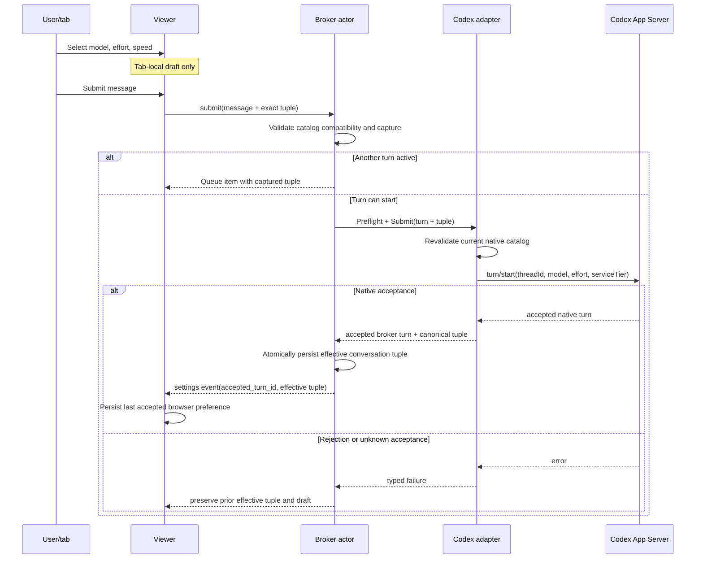
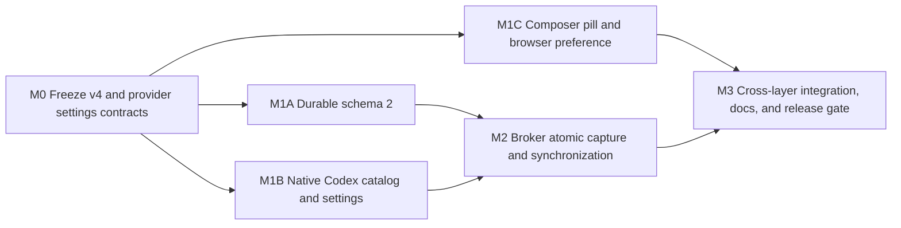

# Codex Model Controls Plan

## Outcome

Page Agent users can choose any visible native Codex model, a model-supported reasoning effort, and Standard or Fast speed from one compact composer pill. The exact tuple is captured with each submitted message, applied to the existing native Codex thread when that turn starts, and becomes the conversation default only after native acceptance. The last successfully accepted tuple becomes a browser-local preference for new Codex conversations on later whiteboards.

This is a pre-production breaking update. The viewer and broker move directly from local Page Agent API v3 to v4, durable Page Agent state moves directly from schema 1 to schema 2, and only the latest contracts remain supported.

## Requirements

### Selection and interaction

- **R1 — One Codex-only control.** Add one configuration pill to the composer footer. It is hidden for Pi. The closed pill always shows the selected model display name and effort, shows a lightning icon only when Fast is selected, and exposes its full state through an accessible name.
- **R2 — Reference menu pattern.** Opening the pill shows `Model`, `Effort`, and `Speed` rows with their current values. Each row opens a focused submenu with a checkmark on the current choice. The menus stay within the drawer at desktop and narrow widths and support pointer, keyboard, focus return, Escape, and outside-click dismissal.
- **R3 — Native catalog.** Model options come from the current native Codex App Server `model/list` catalog. Show all and only models advertised for the normal visible picker; do not hard-code releases or expose hidden models. Preserve native display names and descriptions.
- **R4 — Independent effort.** Effort is selected independently from the model, but only values in that model's native `supportedReasoningEfforts` are selectable. Preserve native effort descriptions and ordering.
- **R5 — Native speed semantics.** `Standard` maps to an explicit native default service tier (`serviceTier: null` on override; App Server may report `default`). `Fast` maps to native `serviceTier: "priority"` and is available only when the model advertises that tier.
- **R6 — No silent compatibility changes.** If the current effort or Fast selection is incompatible with another model, keep that model visible but disabled and explain the blocking setting. The user must change Effort or Speed first. Never choose a default, nearest effort, or Standard automatically in this interaction.
- **R7 — Queue visibility.** Each queued Codex message shows the model, effort, and speed captured when it was submitted. Editing queued text does not change its captured execution settings.

### Turn and conversation behavior

- **R8 — Atomic message capture.** A submit command carries the message, images, context when required, and one exact Codex settings tuple. The broker validates and captures them atomically. There is no separate mutable “change settings” broker command.
- **R9 — Existing native thread.** When a captured turn starts, call `turn/start` on the existing Codex thread with `model`, `effort`, and `serviceTier`. Codex defines these fields as overrides for that turn and subsequent turns; changing settings must not create or fork a native thread.
- **R10 — Next-message scope.** The active response and previously queued messages retain their captured settings. A newly submitted message uses the tuple visible in that tab at submission time. Different queued messages may intentionally carry different tuples and switch the native thread as they execute FIFO.
- **R11 — Acceptance boundary.** A tuple becomes the broker's effective conversation settings only after `turn/start` is natively accepted. Rejection does not update effective settings. Unknown acceptance follows the existing fail-closed unavailable/reconciliation behavior and must not manufacture a settings transition.
- **R12 — Effective native truth.** New/resumed threads use the complete effective model, effort, service tier, and bounded model presentation returned or resolved from App Server. A complete `thread/settings/updated` notification may correct subsequent effective state. Every partial `model/rerouted` notification marks settings unverified; only a later complete matching settings notification can resolve it, and unresolved reroutes fail the session closed. A hidden or removed current model remains displayable through non-selectable presentation metadata and is never injected into the visible picker.
- **R13 — New conversation.** `New conversation` initializes the candidate native Codex thread from the currently visible pill, including unsent changes. App Server `thread/start` receives `model`, `serviceTier`, and `config.model_reasoning_effort`. Creating or abandoning an empty thread does not update the cross-whiteboard browser preference.
- **R14 — Existing and archived conversations.** Existing current conversations and restored archives ignore browser preference and unsent pill state; their effective native settings win. Archives retain their last effective tuple in durable bookkeeping.
- **R15 — Queue lifetime unchanged.** Captured queue settings survive tab disconnect/reconnect only for the broker's existing in-memory lifetime. Broker restart continues clearing complete queued work as it does today. Do not add durable message, context, image, or queue recovery.

### Browser preference

- **R16 — Last accepted preference.** Persist the last successfully accepted Codex tuple in browser storage. It survives reloads and browser restarts and initializes new Codex conversations on whiteboards served from the same Agent Whiteboard origin.
- **R17 — Preference boundary.** The preference does not synchronize across origins, browsers, devices, or machines; does not enter broker global state; and never edits `~/.codex/config.toml`.
- **R18 — Draft locality.** Unsubmitted settings remain tab-local like unsent message text and are discarded on reload. They do not update browser preference or another tab.
- **R19 — Precedence.** Existing current conversation settings win over archive settings, which win when an archive is restored; a genuinely new conversation uses the supplied current pill or saved preference. If a saved preference no longer validates against the live catalog, create the new native thread without any partial override and use the complete effective native defaults returned by Codex.

### Authority, failure, and compatibility

- **R20 — Broker authority.** The browser can only submit bounded semantic values. The broker validates visibility, model identity, supported effort, and Fast support against its runtime catalog before claiming images or dispatching. The Codex adapter validates again against its current catalog before native RPC. Arbitrary native service tiers or model strings cannot pass through unchecked.
- **R21 — Catalog drift.** If the adapter detects stale or unsupported settings, reject the turn without losing the browser draft or changing effective settings, refresh the catalog, and publish the refreshed options. Do not silently fall back for an intentional submit or New-conversation command.
- **R22 — Catalog failure.** If catalog loading or validation fails, keep the current effective settings visible, disable the pill with `Model options unavailable`, and leave ordinary conversation/history recovery fail-closed according to current provider error boundaries.
- **R23 — Images.** Image enablement follows the model in the effective or draft tuple as appropriate. An incompatible image-bearing submit fails before partial claim or native dispatch. Preserve all existing private image, path, and quota guarantees.
- **R24 — One latest browser API.** Replace local Page Agent API v3 with v4 in place: `api_version: "4"`, `agent-whiteboard.v4`, v4 image headers, viewer codecs, server checks, fixtures, tests, and current documentation. Do not add runtime v3 handlers, negotiation, fallback parsing, or adapters.
- **R25 — One latest disk schema.** Replace durable Page Agent schema 1 with settings-aware schema 2. Only schema 2 is accepted and written. Do not add an old-state reader or migration path; pre-production Page Agent state is cleared before using the new build. Retain one strict schema marker so stale/malformed files fail closed.
- **R26 — Scope discipline.** Do not change public publishing `/api/v1` routes, public whiteboard storage compatibility, native provider-history envelope compatibility, Codex authentication, sandbox, approvals, personality, reasoning summaries, or Pi model selection. Historical plan documents remain historical evidence rather than runtime compatibility code.

### Acceptance examples

1. A new whiteboard with saved `5.6 Sol · High · Fast` creates a Codex thread using that tuple, but the preference changes only after a turn is accepted.
2. An existing whiteboard whose native thread is `5.6 Luna · Medium · Standard` shows that tuple even when browser preference is Sol/High/Fast.
3. While Fast is selected, a model without native `priority` remains visible and disabled with a Standard-speed requirement.
4. Queue A captures Sol/High/Fast and Queue B captures Luna/Medium/Standard. A executes first with its tuple; B later changes the same native thread to its own tuple.
5. A rejected turn leaves the conversation and browser preference on the previously accepted tuple.
6. Reload discards an unsent tuple; opening a different new whiteboard loads the last accepted browser preference.

## Design

### Contract model

Use one provider-neutral semantic settings contract:

```text
ExecutionSettings
  model: bounded canonical catalog model value
  effort: bounded native-advertised effort value
  speed: standard | fast
```

A selectable catalog entry carries the canonical model value, display name, description, default effort, ordered effort options and descriptions, image support, default status, and Fast support. Codex-native `priority`/`default` names never cross the browser boundary; the adapter owns that translation.

Keep semantic execution values separate from presentation metadata. Every effective or captured Codex setting exposed to the browser carries a broker-produced bounded `model_display_name` and selectability flag. The adapter resolves this from its full native catalog, including hidden entries; if the current native model is absent from the full catalog, its bounded canonical model value is the fallback display name. Only the visible catalog is selectable. Browser-supplied display metadata is ignored/rejected, and browser preference stores only the semantic tuple.

Settings are nullable only where Pi or a non-configurable provider is represented. A Codex submit, queued item, active accepted transition, native Codex session, and durable Codex session must have a complete tuple. Partial tuples are invalid. A live Codex session may temporarily mark effective settings unverified after an unmatched native reroute; while unverified, it retains the last verified tuple only as display/history metadata, disables selection and new dispatch, and cannot emit or persist a new effective tuple.

Add provider-neutral optional configurability rather than adding Codex methods to the base driver interface:

- create requests may carry optional initial settings;
- turn requests may carry optional captured settings;
- native session metadata and accepted-turn results carry complete effective settings plus bounded model presentation;
- a selectable-driver capability lists the current visible catalog while the adapter retains its full catalog for current-model resolution;
- provider settings events report only complete native effective changes or an explicit settings-unverified state; no partial settings event exists.

Pi rejects non-null settings and does not implement selectable-driver behavior. Existing Pi behavior and UI remain unchanged.

### Browser API v4

The v4 protocol freezes these cross-layer shapes:

- connect carries nullable initial settings; the broker uses them only when creating a new Codex current conversation;
- submit carries nullable settings, required and complete for Codex and null for Pi;
- New conversation carries nullable settings, required for Codex and null for Pi;
- queue items carry nullable captured settings;
- snapshots carry nullable effective settings with bounded model presentation, an explicit verified/unverified status, and the visible selectable catalog;
- a settings/catalog event carries either one complete verified effective setting with model presentation or an explicit unverified state, plus the refreshed visible catalog and an optional accepted broker turn ID. Only a verified event associated with native turn acceptance may update the browser preference;
- provider and snapshot image capability remains explicit and agrees with the effective selected model;
- archive restore publishes the restored native tuple through the ordinary snapshot/settings flow.

All command/event objects remain strict: reject unknown, duplicate, null-in-required-position, oversized, unsupported, and partial fields. Settings and catalog bytes count toward existing command/event/replay bounds; raise a bound only from measured worst-case catalog fixtures.

### Native Codex flow



Codex 0.146.1 feasibility evidence, captured 2026-08-12 from generated App Server v2 schemas and prompt-free local probes:

- `model/list` reports visible identity/display fields, `supportedReasoningEfforts`, defaults, input modalities, and `serviceTiers`;
- `turn/start` accepts `model`, `effort`, and `serviceTier`, documented as affecting that and subsequent turns;
- `thread/start` accepts `model`, `serviceTier`, and a general `config` object;
- prompt-free `thread/start` with `config.model_reasoning_effort = "xhigh"` reported Sol/xhigh/priority;
- prompt-free starts reported `serviceTier: "default"` for a null Standard override and `"priority"` for Fast;
- start/resume responses report model, reasoning effort, and service tier;
- `thread/settings/updated` reports a complete native settings object and `model/rerouted` reports only a native model change.

`thread/settings/updated` is therefore the sole notification authority for a complete post-start tuple. The adapter keeps the latest complete tuple and an ordered native-notification generation. Every `model/rerouted` advances that generation, marks settings unverified, and withholds any durable/public tuple transition regardless of earlier complete settings. Only a later complete settings notification in the new generation that names the exact `toModel` resolves the invalidation. A lone or mismatched reroute blocks subsequent dispatch and must resolve by the current turn's terminal boundary; if it does not, the adapter fails the session closed as protocol-incompatible. Never combine a rerouted model with effort or speed copied from an earlier or different complete tuple.

The implementation must use generated/current protocol behavior through bounded adapters rather than vendor generated files into the repository. If a materially different installed App Server lacks these stable fields, stop with protocol-incompatible rather than guessing.

### Persistence and precedence

Durable schema 2 extends each Codex session record with one complete effective tuple. Pi session records require settings to be absent. Model labels may remain as bounded display metadata for existing generic archive/readiness surfaces, but Codex execution behavior must use the tuple rather than a label.

After native turn acceptance, the broker performs an exact, atomic mapping transition for the current conversation before publishing accepted settings or completing the originating submit command. A failed/uncertain state update follows existing exact-state classification and fails closed; it must not announce a durable setting that was not proven.

A complete verified native settings notification updates the current in-memory tuple, presentation metadata, and durable session through the same exact-transition discipline. An unmatched reroute publishes only settings-unverified state and cannot alter the durable tuple. If a matching complete notification does not resolve it by the active turn's terminal boundary, fail the live session closed; after broker restart, native resume must establish a fresh complete tuple before the conversation is available. A notification for a stale/non-current native thread is ignored. Archives retain their complete tuple and presentation metadata when current/archive ownership changes.

Browser storage contains only the semantic tuple. No origin capability, conversation ID, native thread ID, credentials, paths, or catalog is persisted. A saved tuple is syntactically decoded first and then validated by the broker against the current native catalog when it is offered for a genuinely new conversation.

### Security and failure boundaries

- Validate settings before attachment claim, context commit preparation, queue mutation, or native dispatch.
- Keep catalog/model descriptions as text content; never render native strings through HTML.
- Bound model count, efforts per model, string lengths, pages/cursors, and aggregate catalog bytes.
- Treat duplicate/conflicting native catalog identities, unknown modality/tier structures, pagination loops, malformed complete settings notifications, and unresolved native reroutes as provider protocol failures.
- Update session settings, verification status, presentation metadata, and reroute correlation under synchronization; `NativeSession`, capabilities, preflight, submit, terminal handling, and notification handling must not race.
- Never log or forward raw App Server errors. Map stale/unsupported configuration to a closed provider/browser error and publish a refreshed safe catalog when available.

## Execution Map



M0 is a sequential shared-contract barrier. After it lands, M1A, M1B, and M1C are pairwise parallel-safe: they consume settled contracts, own disjoint source/tests, generate no shared artifacts, and use no live service or shared cache. M2 exclusively integrates broker/state/provider behavior. M3 exclusively owns browser fixtures, server-version integration, current documentation, generated assets, and broad validation.

| Lane | Outcome | Depends on | Exclusive ownership | Reserved/shared surfaces | Focused validation | Parallel with |
| --- | --- | --- | --- | --- | --- | --- |
| M0 | Provider-neutral settings/catalog types and strict v4 JSON contract | Approved design | `internal/agent/provider/**`, `internal/agent/protocol/**`, this plan | Do not edit broker, state, adapters, viewer, generated assets | `go test ./internal/agent/provider ./internal/agent/protocol` | None; barrier |
| M1A | One strict settings-aware durable schema 2 and atomic session-setting mutation | M0 | `internal/agent/state/**` | Broker `StateStore` integration reserved to M2 | `go test ./internal/agent/state` | M1B, M1C |
| M1B | Native catalog, initial/turn overrides, effective settings, reroute handling | M0 | `internal/agent/codex/**` | Broker mapping/events reserved to M2 | `go test ./internal/agent/codex`; `go test -race ./internal/agent/codex` | M1A, M1C |
| M1C | Codex pill/menu, compatibility helpers, draft state, browser preference | M0 | `internal/whiteboard/assets/src/viewer.js`, `viewer.css`, `viewer.test.js`, optional new settings module/tests under the same directory | `tests/browser/**`, dist assets, manifest reserved to M3 | `pnpm test` | M1A, M1B; may continue while M2 starts |
| M2 | Broker-authoritative catalog validation, queue capture, accepted persistence, multi-tab events | M1A, M1B | `internal/agent/broker/**` | Browser fixture and server transport reserved to M3 | `go test ./internal/agent/broker`; `go test -race ./internal/agent/broker` | M1C after M0 |
| M3 | Complete v4 viewer/broker/server flow, generated assets, docs, E2E | M1C, M2 | `internal/agent/server/**`, `tests/browser/**`, `tests/integration/**` as needed, `README.md`, `docs/http-api.md`, `docs/configuration.md`, `docs/hosted-provider-smoke.md`, `skills/agent-whiteboard/**`, `internal/whiteboard/assets/dist/**`, `internal/whiteboard/assets/manifest.json` | All feature lanes quiescent; owns Playwright server/profile/ports and asset generation | affected server/browser checks, then final gate | None; integrator |

The worktree already contains intentional uncommitted Codex freshness and Page Agent UI changes in Codex, viewer source/tests, browser fixtures, and generated assets. Execution must inventory and preserve them as the starting baseline. No lane may reset, overwrite, stage, or “clean up” those changes as unrelated work. Only M3 regenerates shared browser assets.

## Milestones

### M0 — Freeze provider and Page Agent v4 contracts

**Covers:** R3–R6, R8–R12, R20, R24

**Deliverable**

Pure Go contracts make complete settings and catalog semantics unambiguous before adapters, state, broker, or browser integrate them.

**Implementation**

1. Add bounded semantic settings, speed, model presentation, effective-settings verification state, catalog model, effort option, catalog validation/canonicalization, cloning, and compatibility checks in the provider package. Complete Codex tuples validate; Pi/non-configurable paths use nil.
2. Add optional settings to provider create/turn contracts; add complete effective settings and model presentation to native-session/accepted-turn contracts; and add provider events for complete verified settings or explicit unverified state. Add a selectable-driver interface without forcing Pi or generic test drivers to implement Codex behavior.
3. Replace protocol constants and strict JSON fixtures with v4. Define the approved connect/submit/New, queue, snapshot, settings/catalog event, and error shapes.
4. Add a closed error for invalid/stale model configuration without exposing native payloads. Ensure command fingerprints include settings so retries cannot reuse an ID with another tuple.
5. Pin exact bounds, nullability, provider-specific validity, clone safety, duplicate fields, incompatibility reasons, and worst-case catalog sizing in tests.

**Validation**

```sh
go test ./internal/agent/provider ./internal/agent/protocol
```

### M1A — Replace durable Page Agent state with schema 2

**Covers:** R11–R15, R25
**Depends on:** M0

**Deliverable**

Current and archived Codex sessions durably retain one complete effective tuple and its bounded model presentation; Pi remains settings-free; schema 1 is rejected with no migration path.

**Implementation**

1. Set the sole accepted/written schema marker to 2 and extend exact durable session JSON with nullable complete settings and bounded model presentation whose provider-specific presence is validated. Unverified is a live condition, not a durable replacement for the last verified tuple.
2. Add an exact current-session settings transition that identifies the intended conversation/native session, updates complete settings plus presentation atomically, advances timestamps monotonically, and retains current/archive uniqueness and uncertainty safeguards.
3. Include settings and presentation in deep clones, exact comparisons, handoff snapshots, archive transitions, validation, and filesystem shape checks.
4. Replace schema-1 fixtures and tests rather than adding dual readers. Verify unknown/missing/partial settings and stale schema fail closed.
5. Preserve the durable-store prohibition on page content, transcripts, queue entries, image bytes, and provider payloads.

**Validation**

```sh
go test ./internal/agent/state
```

### M1B — Implement native Codex selection and effective settings

**Covers:** R3–R6, R9, R11–R14, R20–R23
**Depends on:** M0

**Deliverable**

The Codex adapter lists the live selectable catalog, starts/resumes threads with truthful effective settings, applies a captured tuple to `turn/start`, and reports native setting changes safely.

**Implementation**

1. Replace the image-only model parser with one bounded paginated full-catalog parser that preserves native IDs/model values, visible/hidden status, display metadata, ordered effort options, defaults, modalities, and service tiers. Continue deriving image capabilities, expose only visible selectable entries, and resolve bounded presentation for hidden or removed effective models.
2. Canonicalize aliases and reject duplicate/conflicting models, malformed efforts/tiers/modalities, empty cursors, loops, excessive pages/models/efforts, and aggregate overflow.
3. For new threads, translate settings to `thread/start` model, explicit Standard/Fast service tier, and `config.model_reasoning_effort`. For native-default creation, omit the entire tuple and parse the complete effective response.
4. Parse model, reasoning effort, and service tier from start/resume responses and resolve bounded current-model presentation from the full catalog or canonical fallback. Existing resumes receive no browser preference override.
5. Revalidate every turn tuple against the runtime catalog, then include model, effort, and explicit service tier in `turn/start`. Return canonical settings and presentation only after the native turn response is structurally accepted.
6. Treat complete `thread/settings/updated` as authoritative. Treat every `model/rerouted` only as a new-generation invalidation signal: never synthesize effort/speed or trust any earlier complete tuple, emit unverified state, block further dispatch, and require a later complete matching tuple before the active turn's terminal boundary or fail closed. Refresh catalog after classified stale-setting failure.
7. Cover Standard/Fast translation, every advertised effort, unsupported combinations, hidden/removed current-model presentation, images under draft/effective models, complete settings before reroute followed by invalidation, complete settings after reroute resolving it, lone reroute, early-turn buffering, mismatched effort/Fast, malformed notifications, terminal unresolved reroute, concurrency, resume, and runtime restart.

**Validation**

```sh
go test ./internal/agent/codex
go test -race ./internal/agent/codex
```

### M1C — Build the composer pill, menus, and browser preference

**Covers:** R1–R7, R10, R16–R19, R21–R23
**Depends on:** M0

**Deliverable**

The real Page Agent composer provides the approved compact Codex control with accessible nested menus, local draft behavior, queue summaries, and safe browser-local last-accepted persistence.

**Implementation**

1. Add pure helpers for strict catalog/settings decoding, compatibility, model/effort/speed labels, complete-tuple fallback, and browser preference read/write. Use a dedicated bounded storage key and retain current graceful behavior when storage is disabled.
2. Keep a Codex draft tuple keyed by provider and broker conversation identity, with a baseline effective tuple, dirty flag, local revision, and submitted-turn revision. Initialize on the tab's first connection to that identity; for a genuinely new connect use the syntactically valid saved tuple. Preserve a dirty draft across ordinary disconnect/reconnect, resync, provider switching in that tab, and effective events from other tabs. Discard on reload or an actual current-conversation identity transition (New/archive restore), then initialize from that conversation's effective settings.
3. Add the pill to the composer footer and implement the approved root menu/submenus, checkmarks, disabled reasons, focus management, keyboard navigation, dismissal, narrow/docked positioning, themes, and accessible names. Render all native text with `textContent`.
4. Show bounded effective/draft `model_display_name` + effort and only a Fast lightning mark in the closed pill. A hidden/removed current model is rendered as non-selectable presentation, never injected into the visible catalog. Disable with `Model options unavailable` when no safe catalog or verified effective state exists. Hide the entire feature for Pi.
5. Capture the visible tuple in submit and New commands. Do not rewrite already queued tuples; show each queue item's captured summary below its editable text.
6. Update browser preference only from a verified accepted-turn settings event, never from connect/New/catalog refresh/unsent selection/queued admission. On any effective event, advance the baseline; replace the visible draft only when it was clean against the prior baseline or when the accepted turn matches its submitted revision and no later menu edit exists. Preserve later/dirty local intent. New/archive identity transitions always initialize from the new effective state without overwriting preference.
7. Keep drafts and message/image preparation intact on stale-setting rejection or unverified native state. Update image control truthfully as draft/effective model changes.
8. Test menus and focus at the stable DOM boundary rather than testing CSS/prose strings alone; cover localStorage failures, invalid preference, hidden/removed effective model presentation, cross-provider isolation, reload, offline dirty edits, ordinary reconnect/resync, own accepted revision, later local edit, unrelated multi-tab effective events, disabled compatibility, and reduced motion.

**Validation**

```sh
pnpm test
```

### M2 — Integrate broker validation, queue capture, and accepted synchronization

**Covers:** R7–R15, R19–R23
**Depends on:** M1A, M1B

**Deliverable**

The broker is authoritative for settings, captures one tuple with every Codex turn, persists only accepted effective state, and synchronizes safe catalog/settings events across attached tabs.

**Implementation**

1. On connect, obtain the selectable driver catalog. Resume existing current sessions without applying browser preference. For a genuinely new Codex mapping, validate a saved tuple if possible; if it is stale, omit the entire override and use native defaults. Publish snapshot catalog/effective settings.
2. Replace New's empty payload handling with the v4 settings-aware payload. Validate current-pill settings before creating a candidate; reject stale/incompatible intentional choices without archiving/stopping the current conversation.
3. Validate submit settings before image claim, reference/context conversion, prepared commit, queue mutation, or provider dispatch. Pi requires null; Codex requires one complete compatible tuple.
4. Extend active and in-memory queued turns, byte accounting, clone/zero paths, browser-safe queue projection, retry/idempotency records, and queue editing so the tuple is immutable with the queued message.
5. At dispatch, pass the captured tuple through preflight/submit. On native acceptance, exact-update durable current settings and presentation before publishing a verified accepted-turn settings event or completing the submit command. Preserve prior state on rejection; use existing unavailable/reconciliation handling for unknown acceptance.
6. Apply complete asynchronous native effective-setting events only to the matching current session, update durable settings/presentation under exact state classification, refresh capabilities/catalog, and publish to all tabs. An unverified reroute state blocks dispatch and publishes no tuple; unresolved terminal reroute makes the live conversation unavailable. Never let an inactive provider or archived thread mutate current state.
7. Ensure handoff/new/archive restore preserve provider-specific precedence, complete settings, and current-model presentation. Archive list may retain its existing compact model label; restoration must publish the complete native tuple and presentation.
8. Add regression coverage for two tabs, two queued tuples, text edit immutability, dirty-draft reconnect/resync, active failure, lone/paired/reordered reroutes, incompatible-effort/Fast reroutes, state-write uncertainty after native acceptance or settings correction, catalog drift, hidden current presentation, context replacement, images, handoff cleanup, archive restore, and broker restart clearing the whole queue.

**Validation**

```sh
go test ./internal/agent/broker
go test -race ./internal/agent/broker
```

### M3 — Integrate v4 transport, browser workflows, documentation, and release gate

**Covers:** R1–R26, including R26 scope discipline
**Depends on:** M1C, M2

**Deliverable**

One coherent latest viewer/broker build proves model, effort, and speed selection end to end and documents the actual pre-production contract.

**Implementation**

1. Replace every current runtime/fixture/test/doc v3 reference with v4, including status, HTTP stream, WebSocket subprotocol, image endpoints, fallback transport, strict CORS/version headers, browser fixtures, and incompatible-version UX. Do not edit historical plans merely to erase historical version references.
2. Extend the deterministic browser fixture to advertise multiple models with different efforts, image support, and Fast support; record exact settings on native-like create/submit; simulate acceptance, rejection, queueing, catalog refresh, archive restore, and cross-tab synchronization.
3. Add Playwright flows for menu placement and keyboard use, compatibility-disabled models, Fast icon, new-whiteboard preference, existing/archive precedence, current-pill New conversation, two queued tuples, failed acceptance, reload-local drafts, mobile containment, dark theme, and Pi unchanged.
4. Add real-component Codex adapter/integration coverage for exact App Server RPC shapes without public network or paid turns. Keep optional hosted-provider smoke guidance separate from hermetic gates.
5. Update README, current HTTP/configuration/smoke documentation, and bundled skill for the user workflow, native inheritance boundary, Standard/Fast mapping, persistence scope, queue lifetime, stale catalogs, state reset, and v4 restart requirement.
6. Document the pre-production upgrade: stop the broker, clear existing Page Agent conversation/workspace state, deploy viewer and broker together, and restart. Do not delete public whiteboards or provider-native Codex histories as part of runtime code.
7. Rebuild deterministic browser assets after source tests pass and verify the worktree retains the intentional pre-existing Codex/UI fixes.

**Validation**

```sh
go test ./internal/agent/server ./tests/integration/...
pnpm test
pnpm run check:assets
pnpm exec playwright test tests/browser/local-agent-sidebar.spec.js
```

## Validation

### During implementation

Use each milestone's focused command first. Write regression tests at the stable provider, strict JSON, durable-store, broker command/event, browser state, and rendered workflow boundaries. Do not add tests whose primary purpose is asserting documentation wording or implementation-specific helper structure.

### Final gate

After all source, fixtures, docs, and generated assets are integrated:

```sh
go test ./...
go test -race ./...
go vet ./...
pnpm test
pnpm run check:assets
pnpm run test:browser
git diff --check
```

Use focused repeat counts only if a specific settings/acceptance race demonstrates nondeterminism; do not repeat entire filesystem, broker, process, or browser suites.

### Manual/native smoke

With an authenticated local Codex App Server and a disposable Page Agent state home:

1. Verify the catalog matches native visible models and effort/Fast support.
2. Create a new board from a browser preference, submit once, and inspect the native thread's model/effort/service tier.
3. Queue two messages with different tuples and verify the same native thread changes in FIFO order.
4. Reload and open a second new board to verify the last accepted browser preference.
5. Restore an archive and verify its native tuple overrides the preference.

This smoke is supplementary and must not replace hermetic tests or require public network access in the ordinary gate.

## Assumptions and Risks

- The approved implementation targets the current Codex App Server v2 methods in Codex CLI 0.146.1 while loading catalog values dynamically. If method/field availability materially differs during execution, return to design rather than invent a compatibility shim.
- Native turn acceptance and durable broker publication are distinct boundaries. A native-accepted turn followed by uncertain disk mutation must fail closed even though the provider may continue; exact-state tests and independent review are required around this path.
- `thread/settings/updated` is the only complete notification authority. A lone `model/rerouted` invalidates rather than mutates settings and must resolve by the active terminal boundary or fail closed. Complete settings and reroute notifications are concurrent with ordered turn notifications; adapter correlation/synchronization and broker stale-session checks are review boundaries, not routine plumbing.
- Draft state is conversation-identity scoped and revisioned. Accepted cross-tab state advances the baseline but cannot erase a dirty or later local revision; actual New/archive identity transitions intentionally reset it.
- Browser storage is origin-scoped. Different Agent Whiteboard origins intentionally maintain different defaults.
- Existing Page Agent disk state is disposable before production. Runtime auto-deletion is not authorized; the upgrade procedure makes the reset explicit.
- Current uncommitted Codex runtime, viewer, browser fixture, tests, and generated-asset changes are protected starting state and must remain integrated.

## Deferred Work

- Pi model/effort selection.
- Hidden Codex models or an Agent Whiteboard allowlist.
- Editing execution settings on an already queued message.
- Durable queue recovery across broker restarts.
- Personality, sandbox, approval policy, reasoning summary, or other Advanced controls.
- Editing native Codex configuration or machine-wide/browser-sync preferences.
- Cross-device, cross-browser, cross-origin, or broker-global preference synchronization.
