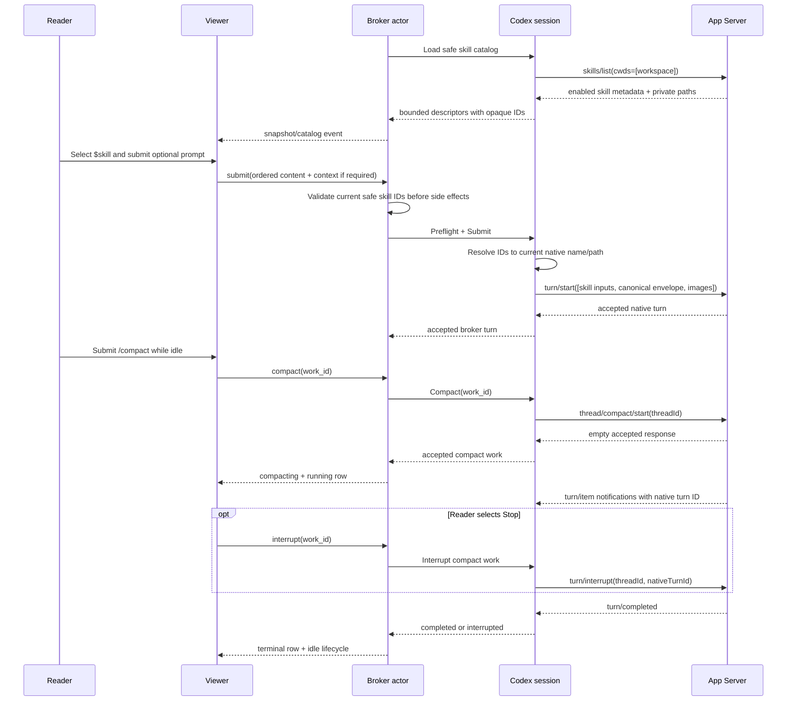
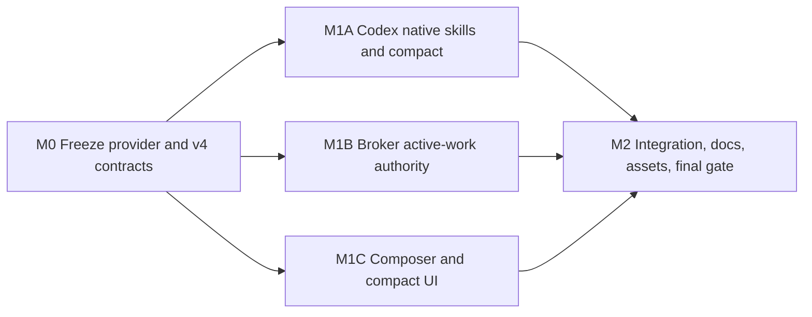

# Codex Page Agent Skills and Compact Plan

## Outcome

The Codex Page Agent exposes the enabled skills reported by the live Codex App Server and lets a reader invoke one or more of them explicitly from the composer with Codex-style `$` completion. It also supports the one approved slash command, `/compact`, through App Server's native manual-compaction method.

While Codex is working, Page Agent preserves an editable next draft but never queues it: Send and Enter submission are blocked, skill and image selection are unavailable, and a prominent Stop control replaces Send. Manual compaction has a clear Codex-like running and terminal UI and can be stopped. Pi retains its existing queue behavior.

This is a pre-production in-place extension of Page Agent API v4. The API version, WebSocket subprotocol, public publishing API, and durable state schema do not advance.

## Requirements

### Skills

- **R1 — Live native catalog.** After explicit Codex connection, load skills through stable App Server `skills/list` using the native thread's actual working directory. Show enabled skills only. Refresh live sessions after `skills/changed` without blocking the App Server read loop.
- **R2 — Codex-style selection.** Typing `$` at a token boundary opens a searchable skill menu. Arrow keys navigate, Enter or Tab selects, and Escape dismisses. A selected skill is a non-editable `$skill-name` token in the existing rich composer. Multiple distinct skill tokens are allowed.
- **R3 — Explicit native invocation.** A selected skill is sent as App Server `UserInput::Skill { name, path }`, not as prompt-text emulation. It may be combined with text, page references, and images. A skill token counts as input, so a skill-only turn is valid and still carries any required initial or replacement Page Agent context envelope.
- **R4 — Safe catalog surface.** The browser receives only a session-scoped opaque skill ID, native name, optional display name, bounded short description, and scope. Skill bodies, paths, load errors, dependencies, icons, URLs, and default prompts never cross the provider boundary or enter browser storage, durable state, logs, or the canonical envelope.
- **R5 — Drift and failure.** Validate skill identity against the broker's current safe catalog before claiming images or preparing context and again against the adapter's native catalog before `turn/start`. Removed, disabled, changed, duplicate, or stale skills fail before native submission, preserve the draft, and prompt a catalog refresh. A catalog failure disables only skill selection; ordinary Codex turns and manual compaction remain available.

### Manual compaction

- **R6 — One slash command.** For Codex, the slash popup contains only `/compact`, described as summarizing the conversation to prevent hitting the context limit. Selection inserts `/compact`; Enter or Send executes it. Only the exact command plus trailing whitespace is valid.
- **R7 — Dedicated native operation.** `/compact` maps to stable `thread/compact/start`. It is not a user prompt and cannot be combined with text, skill tokens, references, images, or page-context delivery. It is available only when the Codex conversation is idle.
- **R8 — Clear compact UI.** Native acceptance clears the `/compact` draft and creates one update-in-place timeline row. Running shows `Compacting context…` with an active indicator and Stop. Terminal text is `Context compacted`, `Compaction stopped`, or `Compaction failed`. Status changes use the existing live region and accessible state labels.
- **R9 — Compact interruption.** Manual compaction is active work with its own opaque broker work ID and native Codex turn ID. Stop uses stable `turn/interrupt`. A Stop received after broker acceptance but before native turn correlation is deferred and sent exactly once when the native turn ID arrives.

### Busy and Stop behavior

- **R10 — No Codex queue admission.** A Codex conversation admits exactly one active normal turn or manual compaction. While either is active, the browser disables Send and intercepts Enter without sending a command or showing a normal rejection. The broker independently rejects stale, multi-tab, or handcrafted submissions and compaction requests. Pi queue admission and editing remain unchanged.
- **R11 — Preserve the next draft.** The Codex editor remains writable while work runs. Text edits and model-draft changes are retained, but skill completion, image attachment, `/compact`, and submission are unavailable until idle. Existing selected attachments or tokens remain visible and are not submitted early.
- **R12 — Prominent Stop.** While Codex work is active, the rightmost primary Send control is replaced by Stop. Activation changes the shared active-work state to stopping, labels the control `Stopping…`, blocks duplicate interruption commands, and preserves the draft. All attached tabs receive the same state. Normal turns and manual compaction are both interruptible.

### State, security, and compatibility

- **R13 — Typed active work.** Browser snapshots and lifecycle events represent active work as a closed `turn | compact` kind with an opaque work ID and `running | stopping` state. A lifecycle is internally consistent with the active-work kind and never labels compaction as a user message.
- **R14 — Replay and recovery.** Skill-catalog and manual-compaction events are replayable for the broker actor's existing lifetime. Compact acceptance, completion, interruption, and ambiguous writes are never automatically replayed after App Server exit or broker restart. Recovery resumes current native thread truth without manufacturing a completed or pending browser operation.
- **R15 — Multi-tab authority.** The conversation actor serializes submit, compact, and Stop races. Command-ledger idempotency applies to compact commands. Only the advertised active work ID may be interrupted, and the first valid Stop transition wins.
- **R16 — Existing trust boundary.** Enabled skill names, descriptions, and scopes are visible only after explicit Codex connection and remain memory-only. A trusted page origin can observe this safe catalog, as it can already observe bounded tool and approval details. App Server configuration, skill enablement, approval policy, sandbox, and tools remain authoritative and unchanged.
- **R17 — Stable App Server APIs.** Keep `experimentalApi: false`. Target stable Codex CLI 0.146.1 contracts: `skills/list`, `skills/changed`, `UserInput::Skill`, `thread/compact/start`, context-compaction item notifications, turn lifecycle notifications, and `turn/interrupt`. If skills are unsupported or malformed, disable skills locally. If compact is unsupported, reject it non-destructively, disable it for that runtime, and retain normal messaging.
- **R18 — In-place v4.** Extend current strict Page Agent v4 command, event, codec, fixture, and documentation shapes in place. Keep `api_version: "4"`, `agent-whiteboard.v4`, existing HTTP paths, and durable schema 2. Do not add v3/v5 negotiation, compatibility readers, or migration code.
- **R19 — Scope discipline.** Do not add other slash commands, implicit `$name` prompt parsing, skill management/configuration, Pi skills, Pi queue changes, durable drafts/catalogs/compaction, or public API changes.

### Acceptance examples

1. Typing `$` in an idle Codex composer lists enabled App Server skills without revealing paths. Selecting `$review-helper`, entering `check this page`, and sending produces native skill plus text-envelope input in one turn.
2. Selecting two skills and no text is sendable. If initial page context is pending, the same turn atomically carries the complete canonical context envelope.
3. If `skills/changed` removes a selected skill, its token is marked unavailable and Send stays disabled until it is removed or reselected; no native turn starts.
4. Selecting `/compact` inserts the command. Enter starts native manual compaction, shows `Compacting context…`, sends no whiteboard context, and ends with `Context compacted`.
5. Stop during compaction changes every attached tab to `Stopping…`, interrupts the native compact turn once, preserves the text draft, and ends with `Compaction stopped`.
6. While a normal Codex turn runs, typing a next draft is allowed, but Enter sends nothing and Send is disabled. After completion or interruption, the preserved draft becomes sendable.
7. Under the same conditions, Pi continues accepting and rendering its queued follow-up.

## Design

### Approach

Extend the existing strict provider, broker, and browser contracts with typed skills and active work. The Codex adapter remains the sole owner of App Server paths and native operation correlation; the broker remains the authority for admission, multi-tab state, context delivery, and replay; the browser receives only safe semantic descriptors.

Text emulation is excluded because it cannot guarantee explicit skill invocation and cannot invoke manual compaction. Separate Codex-only network endpoints are excluded because they would duplicate the broker's validation, origin security, lifecycle, replay, and command-ledger behavior.

### Contract model

#### Skill input

Add a third message-part kind beside text and page reference:

```text
SkillInvocation
  id: session-scoped opaque broker-safe ID
  name: bounded native skill name

MessagePart
  type: text | reference | skill
```

The safe catalog descriptor is:

```text
SkillDescriptor
  id: opaque ID
  name: native name
  display_name: optional display name
  description: bounded short description
  scope: user | repo | system | admin
```

Message content allows at most 64 total parts, 16 page references, and 16 distinct skill invocations. Duplicate skill IDs are invalid. Skill ID and name must agree with the current catalog. Preserve the existing 64 KiB semantic message limit; safe skill identity counts toward it.

The visible catalog permits at most 512 skills, 512-byte names/display names, 2 KiB descriptions, and 512 KiB aggregate encoded catalog data. Exceeding structural or aggregate limits makes the skill feature unavailable rather than returning a partial list. App Server load-error entries are bounded and ignored without exposing their text or paths; malformed catalog structure fails the feature closed.

The canonical Page Agent envelope stores safe skill identity in ordered reader content. For Codex submission, the adapter resolves selected IDs and emits distinct native skill inputs in first-appearance order before the canonical text envelope; existing native image ordering remains unchanged. History projection finds and parses the canonical text input regardless of preceding skill inputs, so accepted skill tokens remain displayable without retaining native paths.

Pi rejects any message containing a skill part. Provider-neutral validation accepts the closed shape; provider-specific broker/session validation owns availability.

#### Active work and v4 wire shape

Replace the browser's turn-only active identifier with:

```text
ActiveWork
  work_id: opaque ID
  kind: turn | compact
  state: running | stopping
```

A snapshot contains nullable `active_work`, Codex `skills_state` (`ready | unavailable`), a safe skill array, and `supports_compact`. Pi requires no active compact work, an empty skill array, null skill state, and false compact support.

Lifecycle values add `compacting`. `responding` requires active `turn`; `compacting` requires active `compact`; ready/interrupted/unavailable require no active work. Interrupt commands carry `work_id`. Normal turn work IDs remain the existing broker turn IDs. A compact command carries a browser-generated work ID in an otherwise empty semantic payload so retries, events, Stop, and multi-tab state correlate without native identifiers.

Add a replayable skill-catalog event and one update-in-place compaction event keyed by work ID with `running | stopping | completed | interrupted | failed`. Browser copy is derived from status; native or provider prose is not forwarded.

Provider-neutral optional interfaces expose safe skill catalogs and manual compact operations without forcing Pi to implement them. Provider events report safe catalog replacement and compact terminal state. The normal Session interface continues to own the event channel and shutdown.

### Native Codex flow



`skills/changed` has no thread ID. The runtime treats it as provider-wide invalidation, coalesces refresh work, and schedules per-session reloads outside the JSONL reader. Unchanged `(scope,name,path)` entries retain their session IDs; removed or changed entries disappear. A session refresh cannot publish after shutdown or overwrite a newer generation.

Manual compaction is mutually exclusive with normal submission inside the Codex session even if the broker is bypassed. The session buffers compact notifications that arrive before RPC acceptance is committed, captures the native turn ID from stable turn/item notifications, and uses `turn/completed` as the terminal authority. Context-compaction items during an ordinary turn remain automatic-compaction activity and do not become manual active work.

The stable 0.146.1 App Server implementation creates manual compaction as a cancellable session task with its own turn ID. Tagged core source routes every `CompactTask` exit through the common task finalizer: success emits `TurnComplete`, cancellation emits `TurnAborted`, and an emitted terminal error is retained on the turn before completion. Tagged App Server source maps those paths to exactly one `turn/completed` with the same turn ID and status `completed`, `interrupted`, or `failed`. An early Stop remains pending until that ID is captured; if compact start fails first, no interrupt is sent and both commands resolve consistently.

### Broker and browser flow

The broker validates Codex skill IDs before image claim, page-reference/context conversion, prepared commit, queue mutation, or provider dispatch. The adapter repeats validation immediately before native input construction. A catalog change between checks produces a closed skill-unavailable failure and no native call.

For Codex, `commandSubmit` accepts only when no active work and no queued item exist. The queue code remains present for Pi, but a Codex queue is an invalid actor state. A reconnect snapshot, server validator, and actor tests enforce this invariant.

The browser prevents ordinary busy-state rejection: Send is disabled, the editor's Enter handler does not dispatch, and `/`/`$` completion and image attachment do not activate while Codex work runs. Shift+Enter continues inserting a newline. The broker guard handles stale tabs and nonconforming clients without changing the visible normal path.

Compaction rows are actor-lifetime activity, not durable transcript messages. Replay and reconnect update the same row by work ID. Broker restart does not recreate a historical row or replay a compact request; the resumed native thread already reflects whatever compaction App Server completed.

### Privacy and failure boundaries

- Explicit Codex connection remains the disclosure boundary for safe skill metadata.
- Never serialize, hash into browser-visible values, log, or render native skill paths. Opaque IDs come from the existing ID generator and map to private session entries.
- Render every native catalog string with text-only DOM APIs. Ignore skill icon and remote URL fields; Page Agent performs no catalog-driven network fetch.
- Map stale skills, unsupported compact, malformed catalog, and native operation failures to closed provider/browser errors without raw App Server text.
- A malformed skill catalog does not stop an otherwise valid Codex session. Malformed turn/compact lifecycle or contradictory native correlation remains protocol-incompatible and fails the affected session closed.
- A runtime crash interrupts active Codex work without replay and can affect all Codex sessions sharing that App Server. Pi remains isolated.
- No new durable state, browser local-storage key, configuration setting, or environment override is added.

## Execution Map



M0 is a sequential shared-contract barrier. After it is complete, M1A, M1B, and M1C are pairwise parallel-safe because they consume frozen shapes, own disjoint source and test paths, and do not generate shared assets. If they run concurrently in one worktree, execution must use a validated writable cohort and separate Go build-cache directories for M1A and M1B. Separate Git worktrees are also safe. M2 starts only after all three lanes are quiescent and exclusively owns shared fixtures, documentation, generated browser output, and broad test resources.

| Lane | Outcome | Depends on | Exclusive ownership | Reserved/shared surfaces and mutable resources | Focused validation | Parallel with |
| --- | --- | --- | --- | --- | --- | --- |
| M0 | Provider-neutral skill/compact contracts and strict in-place v4 wire | Approved design | `internal/agent/provider/**`, `internal/agent/protocol/**`, this plan | Broker, Codex adapter, viewer, browser fixtures, dist assets reserved; no generated output | `go test ./internal/agent/provider ./internal/agent/protocol` | None; barrier |
| M1A | Safe native skill catalog/invocation plus cancellable manual compaction | M0 | `internal/agent/codex/**` | Browser/broker conversions reserved; dedicated `GOCACHE` if concurrent | `go test ./internal/agent/codex`; `go test -race ./internal/agent/codex` | M1B, M1C |
| M1B | Broker catalog authority, typed active work, no Codex queue, multi-tab Stop | M0 | `internal/agent/broker/**` | Viewer and adapter internals reserved; dedicated `GOCACHE` if concurrent | `go test ./internal/agent/broker`; `go test -race ./internal/agent/broker` | M1A, M1C |
| M1C | `$` completion, skill tokens, blocked busy submission, prominent Stop, compact row | M0 | `internal/whiteboard/assets/src/message-editor.js`, `message-editor.test.js`, `viewer.js`, `viewer.test.js`, `viewer.css`, and a narrowly scoped new source/test module if needed | `tests/browser/**`, dist assets, manifest reserved to M2; no asset build | `pnpm test` | M1A, M1B |
| M2 | Hermetic end-to-end flow, current docs, generated assets, release evidence | M1A, M1B, M1C | `internal/agent/server/**` as needed, `tests/browser/**`, `tests/integration/**`, `README.md`, current `docs/**`, `skills/agent-whiteboard/**`, `internal/whiteboard/assets/dist/**`, `internal/whiteboard/assets/manifest.json` | Exclusive Playwright server/profile/ports and asset generation; all feature lanes quiescent | affected integration/browser checks, then final gate | None; integrator |

The task worktree starts clean at revision `68ddc0b4a2da961c4ff825b048a6edc055001136` on branch `feat/codex-page-agent-slash-skills`. Execution must preserve the base checkout and perform all plan and implementation writes in `/tmp/pi_worktrees/agent-whiteboard/codex-page-agent-slash-skills` or deliberate child worktrees used for isolated lanes.

## Milestones

### M0 — Freeze provider and Page Agent v4 contracts

**Covers:** R3–R5, R7–R9, R13–R18

**Deliverable**

Pure Go contracts define safe skill identity, optional provider capabilities, typed active work, compact commands/events, strict limits, and provider-specific validity before dependent implementation begins.

**Implementation**

1. Extend provider and protocol ordered message content with a closed skill part and safe invocation type. Update normalization, cloning, semantic byte accounting, canonical envelope build/parse, history item validation, JSON strictness, and image/reference coexistence. Pin 16-skill and catalog bounds in tests.
2. Add safe skill catalog types, clone/validation behavior, skill-unavailable and compact-unsupported closed errors, and optional session interfaces for catalog access and manual compact operations. Add provider events for catalog replacement and compact terminal state without native references.
3. Replace turn-only active browser state with the approved `ActiveWork` shape. Extend lifecycle validation, snapshots, provider capability fields, skill catalog event, compaction event, compact command, generalized interrupt payload, event/replay bounds, and strict required/null/duplicate/unknown-field handling while retaining API version 4.
4. Include skill content, compact work IDs, and generalized interrupt IDs in command fingerprints and clone/zero paths. Conflicting retries with another skill or work ID must not alias.
5. Keep Pi strict: skill parts, compact commands, nonempty skill catalogs, compact capability, and compact active work are invalid for Pi.

**Validation**

```sh
go test ./internal/agent/provider ./internal/agent/protocol
```

### M1A — Implement native Codex skills and manual compaction

**Covers:** R1, R3–R9, R16–R17
**Depends on:** M0

**Deliverable**

A Codex session exposes a safe live skill catalog, constructs explicit native skill input, starts and stops manual compaction, and normalizes all lifecycle without exposing native paths or IDs.

**Implementation**

1. Add bounded DTO parsing for `skills/list { cwds: [workspace], forceReload: false }`. Require one matching workspace entry, validate scope/name/enabled/interface metadata and absolute normalized private paths, ignore bounded load errors, omit disabled skills, reject conflicting identities and aggregate overflow, and preserve opaque IDs for unchanged entries. Safe display name uses `interface.displayName` then native name; safe description uses `interface.shortDescription`, legacy `shortDescription`, then required `description`, with the approved bounds applied before publication.
2. Load the initial catalog for create/resume without modifying native configuration. Implement provider-wide `skills/changed` invalidation with coalesced, generation-checked per-session refresh outside `readLoop`. A feature-local load failure emits unavailable catalog state and leaves the session usable.
3. Resolve submitted skill ID/name pairs under synchronization during preflight and submit. Extend native turn input with `{type:"skill",name,path}` in selected order, followed by the canonical envelope and existing images. Reject stale resolution before `turn/start`; never copy paths into provider events, logs, history envelope, or errors.
4. Add compact session state mutually exclusive with normal turns. Call ordered `thread/compact/start`, buffer early turn/item notifications until acceptance, capture the native compact turn ID, classify context-compaction items as manual or automatic, and use `turn/completed` for completed/interrupted/failed terminal events.
5. Generalize interruption so normal accepted turns and compact work both call `turn/interrupt` with exact native correlation. Defer one early compact interrupt until native ID capture; resolve pending interactions and shutdown under existing cancellation rules.
6. Update history projection to find the canonical text envelope among skill inputs and preserve safe skill tokens. Automatic compaction in a normal turn remains ordinary activity.
7. Add scripted tests for skill-only and mixed inputs, duplicate/stale/removed skills, disabled entries, catalog bounds, `skills/changed` coalescing, notification-before-response races, compact acceptance and each terminal state, early Stop, runtime exit, shutdown, and concurrent sessions.

**Validation**

```sh
go test ./internal/agent/codex
go test -race ./internal/agent/codex
```

Use focused repeat counts only for a named ordering test if normal and race runs reveal nondeterminism.

### M1B — Enforce broker active-work and no-queue authority

**Covers:** R5, R7–R15, R17–R19
**Depends on:** M0

**Deliverable**

The conversation actor validates safe skills, admits no Codex follow-up while busy, owns compact and Stop races, and publishes replayable active-work/catalog state across tabs while preserving Pi queues.

**Implementation**

1. Load the current session's safe skill catalog and optional compact capability after Codex create/resume. Publish strict snapshot and catalog replacement state to every attachment; catalog unavailability does not make the provider unavailable.
2. Convert safe skill parts after checking provider, current ID/name agreement, duplicate limits, page-reference consistency, and catalog state. Perform this before image claim, page context conversion, prepared commit, or provider dispatch. Pass safe invocation identity into the provider request for adapter revalidation.
3. Generalize active turn state to an actor-owned active-work model while retaining normal turn acceptance, durable context preparation, provider settings, interaction, and recovery invariants. A Codex submit is accepted only when no active work and no queue; a Codex queue is invalid. Pi continues through the existing FIFO queue path unchanged.
4. Add compact command handling and worker results. Require Codex, compact capability, idle lifecycle, verified settings/session readiness, empty queue, and no prepared commit or competing worker. Publish accepted running state and one compaction event; compact never changes context revision or durable mappings.
5. Generalize Stop to the advertised work ID. Publish shared stopping state before the provider worker, reject duplicates, and resolve normal turn or compact terminal events exactly once. Command ledger, replay, disconnect, shutdown, handoff, and runtime-failure paths must abandon or complete waiters consistently.
6. Map skill unavailable and compact unsupported to stable browser errors. On compact method-not-found, update runtime capability so later tabs no longer offer it. Never forward native errors.
7. Cover malicious busy submit/compact, two-tab simultaneous submit/compact/Stop, idempotent retries, early Stop, reconnect snapshots, catalog refresh during submit, pending page context across compact, native failure/unknown acceptance, actor shutdown, archive/New restrictions, and Pi queue regression. Add hermetic restart cases after accepted compact and after acceptance-unknown compact; each must prove zero second `thread/compact/start` calls, no reconstructed active or terminal compaction row, no durable compact state, and a fresh snapshot derived only from resumed native thread truth.

**Validation**

```sh
go test ./internal/agent/broker
go test -race ./internal/agent/broker
```

### M1C — Build the Codex composer and compact UI

**Covers:** R2–R3, R6, R8, R10–R13, R16, R18–R19
**Depends on:** M0

**Deliverable**

The real Page Agent composer supports accessible `$` skill completion and `/compact`, preserves a next Codex draft without queueing, and shows a prominent Stop plus clear compaction lifecycle.

**Implementation**

1. Extend the message editor's model, DOM reader/renderer, caret normalization, deletion, paste, byte accounting, and public helpers for non-editable skill tokens without regressing page-reference tokens, IME, Unicode offsets, or plain-text paste.
2. Add one bounded anchored completion surface reused for `$` skills and the single `/compact` command. Implement token-boundary detection, search, keyboard/pointer selection, Escape, focus behavior, safe `textContent` rendering, menu containment, themes, reduced motion, and mobile drawer geometry.
3. Reconcile selected skill tokens against every safe catalog replacement. Retain unchanged tokens, mark missing tokens unavailable, block Send, and provide an accessible remove/reselect path. Catalogs and draft tokens remain controller/tab memory only.
4. Recognize only `/compact` with trailing whitespace and no other content or attachments. Submit a compact command with a new work ID; clear only after acceptance. Render one keyed compaction row with active indicator and the exact approved running/completed/interrupted/failed copy.
5. For Codex busy state, keep text editing and Shift+Enter available while disabling Send, Enter dispatch, image addition, `$`/`/` completion, and compact. Do not send a rejected command or show a queue/error toast in the normal path. Leave model draft controls available for the next turn.
6. Replace the rightmost Send control with Stop for active turn or compact work. Reflect shared running/stopping state, prevent duplicate clicks, preserve the draft, and restore Send when terminal. Keep Pi's existing queue chip, queue editors, Send, and Stop behavior.
7. Update strict v4 JavaScript command/event codecs and immutable state application for skills, active work, compact updates, catalog drift, replay, and multi-tab events.
8. Test observable editor and rendered behavior: skill-only content, multiple skills, caret/deletion, duplicate prevention, keyboard completion, invalidation, exact compact parsing, disabled Enter/Send, draft preservation, stopping, activity updates, accessibility, narrow widths, and Pi regression.

**Validation**

```sh
pnpm test
```

### M2 — Integrate transport, browser workflows, docs, and generated assets

**Covers:** R1–R19
**Depends on:** M1A, M1B, M1C

**Deliverable**

One coherent v4 viewer/broker build proves native skills, manual compaction, no Codex queue, and Stop behavior end to end and documents the actual trust and compatibility boundaries.

**Implementation**

1. Extend deterministic server/browser fixtures with bounded safe skill catalogs, `skills/changed`, native-like skill capture, manual compact lifecycle, delayed native turn correlation, interruption, method unsupported, malformed catalog, and multi-tab work races. Use temporary state, local scripted processes, ephemeral ports, and no real user Codex home or public network.
2. Add browser flows for `$` menu keyboard/pointer use, skill-only and mixed messages, multiple skills, invalidation, private-path absence, exact `/compact`, running and terminal compact rows, Stop on turn and compact, editable busy draft with blocked Enter/Send, reconnect/replay, mobile/desktop layout, dark/light themes, and assistive labels.
3. Add explicit Pi regression coverage showing an active Pi turn still accepts, displays, edits, and dispatches its queued follow-up while Codex does not.
4. Update current README, HTTP protocol, configuration, security, hosted-provider smoke, and bundled Agent Whiteboard skill guidance. Document explicit connection disclosure of safe skill metadata, native skill/compact authority, no Codex queue, draft/Stop behavior, App Server 0.146.1 stable contract, graceful feature-local degradation, actor-lifetime compaction UI, and unchanged Pi behavior.
5. Rebuild bundled browser assets once source and focused browser tests pass. Verify manifest integrity and avoid editing historical plans other than this combined plan.
6. Run the affected server/integration/browser checks, inspect the complete diff for path/native-ID leakage and unrelated changes, then run the final gate.

**Validation**

```sh
go test ./internal/agent/server ./tests/integration/...
pnpm test
pnpm run check:assets
pnpm exec playwright test tests/browser/local-agent-sidebar.spec.js
```

## Validation

### During implementation

Use each milestone's focused checks before its handoff. Every executable behavior receives tests at the stable provider, strict JSON, broker actor, editor/state, or rendered browser boundary. Tests must not assert documentation wording or private helper structure.

### Milestone review boundaries

- Review M0 before dependent lanes for contract completeness, strictness, provider neutrality, and path/identifier privacy.
- Review the integrated M1A/M1B boundary for compact notification ordering, exactly-once Stop, catalog-generation races, no-side-effect skill validation, and process failure.
- Review M1C/M2 for keyboard/accessibility behavior, normal-path blocked submission, Pi regression, and absence of native paths in browser frames and DOM.

### Final gate

After integration, documentation, and deterministic asset generation:

```sh
go test ./...
go test -race ./...
go vet ./...
pnpm test
pnpm run check:assets
pnpm run test:browser
git diff --check
```

Reuse valid focused evidence when its source, fixture, dependency, or environment has not changed. Run high repeat counts only against a narrow named race-sensitive test that first demonstrated instability.

### Manual native smoke

With an authenticated local Codex 0.146.1+ installation, a disposable Agent Whiteboard state home, and a non-sensitive test skill:

1. Connect Codex and confirm enabled native skills appear with safe metadata but no local path.
2. Submit the test skill alone, then with text and page context, and confirm native skill behavior and Page Agent history.
3. Start a long turn, verify Enter and Send do not queue, prepare a text draft, stop the turn, and confirm the draft remains sendable.
4. Run `/compact`, observe `Compacting context…` and `Context compacted`, then repeat with Stop and observe `Compaction stopped`.
5. Switch to Pi during an active Pi turn and confirm its queue behavior is unchanged.

This smoke supplements hermetic tests and is not part of ordinary CI because it depends on local authentication and native user configuration.

## Assumptions and Risks

- Stable Codex CLI 0.146.1 schema and tagged-source evidence establishes `skills/list`, `skills/changed`, explicit `UserInput::Skill`, `thread/compact/start`, context-compaction item lifecycle, and manual compaction as a cancellable task with a native turn ID. Core `tasks/mod.rs` emits `TurnComplete` or `TurnAborted` for every compact task exit; App Server `bespoke_event_handling.rs` translates these to one correlated `turn/completed` with completed/failed/interrupted status. If execution finds materially different stable behavior, stop rather than enabling experimental APIs or emulating text.
- The conversation workspace determines App Server repo-scope skill discovery. Page Agent exposes exactly the effective enabled catalog returned for that workspace; it does not infer the whiteboard creator's repository or add extra roots.
- Safe skill metadata is new information available to a trusted connected page origin. Explicit connection, memory-only handling, bounded fields, and omission of bodies/paths/errors/dependencies/icons limit but do not remove that trust implication.
- `skills/changed` is provider-wide while skill results are workspace-specific. Cache invalidation and per-session generation checks are a concurrency review boundary.
- Manual compaction is not durable broker work. A crash after native acceptance can leave the native thread compacted while Page Agent reports an unknown/interrupted operation; automatic replay would be less safe than reconnecting to thread truth.
- Existing turn Stop plumbing is present, but its UI is currently secondary and Codex queue admission is intentional. This feature redesigns the Codex-only browser/actor path without deleting shared Pi queue infrastructure.
- Keeping API v4 in place is approved because the product is pre-production. Viewer and broker still deploy together; mixed old/new v4 components are unsupported.

## Deferred Work

- Slash commands other than `/compact`, including review, plan, model, shell, navigation, and local-only CLI actions.
- Text fallback for unknown slash commands or `$skill` names.
- Skill enable/disable, installation, editing, extra roots, bodies, dependencies, icons, URLs, or default-prompt injection.
- Pi skills, Pi slash commands, or removal of Pi queueing.
- Durable unsent drafts, skill catalogs, compact activity, or queue recovery.
- Long-term transcript projection of historical compaction rows across broker restarts.
- App Server experimental APIs or a compatibility layer for pre-skill/pre-compact Codex versions.
