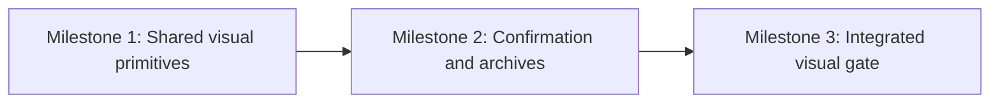

# Page Agent UI Consistency Plan

## Outcome

Bring Page Agent’s remaining status, interruption, compaction, New conversation, confirmation, model-menu, and Archives surfaces into one coherent visual language. New states must feel native to the existing pane, remain accessible by keyboard and assistive technology, and work in desktop, narrow, light, and dark layouts.

## Requirements

- **R1 — Shared passive notice pattern.** Passive timeline events use one compact pattern with an icon, concise title, and bounded supporting text. Response interruption uses a soft rose treatment with a stop icon; it remains visible but not alarming. Compaction running, completed, stopped, and failed use the same family with state-appropriate neutral, success, soft-red, or error accents. Passive blocked, retry, and error activity must not dominate the transcript with oversized saturated cards.
- **R2 — Active Stop control.** While turn or compaction work is active, the composer uses the compact icon-only Stop action already aligned with Send. The control retains accessible `Stop` and `Stopping…` names, visible disabled/stopping behavior, and no text-label layout shift.
- **R3 — Broker status clarity.** Connection settings present one structured status card containing the icon, strong state label, concise explanation, and quiet retry action. Remove the duplicated explanatory paragraph outside the card. Wrong-port text names the selected port. Pointer focus remains visually quiet while keyboard focus remains visible.
- **R4 — Focus modality.** Capture pointer versus keyboard modality at the external Page Agent launcher and all drawer interactions. Pointer-open and programmatic view transitions place focus without painting a keyboard ring; keyboard-open and the first real Tab/Shift+Tab traversal show the project’s custom indicator. Focus placement and computed indicator state must be correct in both docked and narrow-modal layouts.
- **R5 — Model menu anchoring.** The model popup stays visually anchored to its pill, remains contained inside the drawer, and uses the same width and density principles as the completion panel in desktop and narrow layouts.
- **R6 — Styled confirmations.** New conversation, archive restore, and archive delete use a Page Agent confirmation surface rather than `window.confirm()`. The dialog is the sole keyboard owner while open: Escape cancels only it and consumes the event; Tab and Shift+Tab cycle only its controls in docked and narrow-modal drawer layouts; the remaining drawer is inert to pointer and assistive-technology traversal without hiding the dialog. It has `role="dialog"`, `aria-modal="true"`, an accessible title and description, initial focus on Cancel, background pointer blocking, duplicate-submission protection, and deterministic cleanup on drawer close, provider/view change, viewport-mode change, and destroy. Closing restores the still-connected invoker or a stable fallback control. Copy and hierarchy are:
  - New: “Start a new conversation?” / “The current conversation will remain available in Archives.” / Cancel / Start new.
  - Restore: “Restore this conversation?” / “The current conversation will be archived first.” / Cancel / Restore.
  - Delete: “Delete this archive permanently?” / “This conversation cannot be recovered.” / Cancel / Delete, with a restrained destructive treatment.
- **R7 — Archive list.** Remove the duplicated Archives heading. Each archive is a compact card/list row with provider identity, model when present, human-readable updated time, optional bounded preview, a clear Restore action, and a secondary Delete action. Narrow layouts stack cleanly without raw timestamp wrapping or action crowding.
- **R8 — Archive loading and empty states.** Opening or refreshing Archives first shows an accessible loading status and never falsely announces emptiness. A successfully returned empty first page shows a restrained icon, “No archived conversations,” and a short explanation. Pagination loading retains existing rows; refresh replaces them only after the authoritative response.
- **R9 — Compatibility.** Preserve Page Agent API v4, provider behavior, command payloads, archive semantics, security boundaries, browser-storage boundaries, and deterministic bundled assets.
- **R10 — Visual proof.** Validate all affected states in real Chromium at desktop and narrow widths in light and dark modes. Automated DOM assertions do not replace screenshot review.

## Design

### Approach

Extend established Page Agent primitives instead of adding another design system:

- Context-card surfaces provide the radius, border, background, and spacing reference for broker state and archive rows.
- Compact timeline notices provide one passive-state family; only required-action cards remain visually substantial.
- The existing drawer owns an accessible confirmation overlay so confirmation styling and focus behavior remain local and consistent.
- Browser-native time parsing is used only to format already-validated RFC3339 timestamps for display; wire values remain unchanged.

### State presentation

| State | Presentation |
| --- | --- |
| Response stopped | Thin soft-rose notice, muted stop icon, title and short text |
| Compaction running/stopping | Compact neutral/informational notice with animated icon |
| Compaction completed | Compact success notice |
| Compaction stopped | Compact soft-rose notice |
| Compaction failed / passive error | Compact error notice |
| Blocked request | Compact soft-amber/rose notice; expandable detail only when useful |
| Broker ready/offline/checking | One context-style status card containing all state copy and retry action |
| Approval/elicitation | Existing substantial interactive card; unchanged except consistency fixes required by shared styling |

### Confirmation flow

A single local confirmation controller renders one modal surface outside the archive subtree that normal rendering replaces. It accepts a descriptor for title, description, action label, tone, semantic action key, and stable archive identity when applicable. While open it is the only keyboard owner: confirmation Escape and Tab handling precede and consume the drawer’s ordinary handlers, and the remainder of the drawer is inert. Initial focus goes to Cancel.

Closing restores the invoker only when it remains connected and focusable. Otherwise it resolves a stable fallback in order: the corresponding archive action for the same archive when still present, the Archives back button/header control, then the drawer close control. A render or broker event may replace/archive-remove rows without detaching the confirmation itself. Drawer close, provider/view change, viewport-mode change, and destroy cancel and clean up the confirmation.

Cancel and Escape send no command and mutate no draft, attachment, archive, or conversation state. Confirm disables the dialog actions before sending exactly one existing command. New sends one unchanged `new` command with the current Codex settings and clears draft attachments only after explicit confirmation. Restore sends one unchanged `archive_restore` through the existing handoff path. Delete sends one unchanged ordinary `archive_delete` command and never gains handoff semantics.

### Archives

The header remains the only “Archives” title. Controller-local archive-view state distinguishes `loading`, `loaded`, and `loading-more`; an empty array is not treated as authoritative empty until a first-page history response succeeds. The body contains loading, populated rows, or one empty state. Archive rows format dates for humans while preserving exact timestamps in accessible/title metadata where useful. Delete remains available but visually secondary to Restore.

## Execution Map



| Milestone | Outcome | Exclusive ownership | Shared or reserved surfaces | Validation | Why sequential |
| --- | --- | --- | --- | --- | --- |
| M1 | Consistent passive states, broker card, focus, and model popup | `internal/whiteboard/assets/src/viewer.js`, `viewer.css`, focused JS/browser tests | Generated assets reserved until milestone gate | Focused Vitest and Playwright state cases | M2 edits the same renderer, CSS, focus model, and browser fixture surface |
| M2 | Styled confirmations and complete Archives UI | Same renderer/CSS plus browser fixture/spec | Generated assets and archive command fixture | Focused confirmation/archive Vitest and Playwright cases | Requires M1 primitives and has exact write collisions |
| M3 | Deterministic assets and visual integration | Generated asset outputs and integrated browser specs | Live browser screenshots and demo runtime | Full JS/assets/browser checks plus targeted Go checks | Must consume final integrated sources |

The work is intentionally single-owner and sequential: both behavior slices modify the same `viewer.js` render/focus lifecycle, `viewer.css` component rules, `viewer.test.js`, `local-agent-sidebar.spec.js`, and generated asset outputs. Parallel writers would collide on the same state-render and deterministic-build surfaces.

## Milestones

### Milestone 1: Shared visual primitives

**Covers:** R1–R5, R9

**Deliverable**

Passive state notices, broker state, active Stop, initial focus, and model popup all match existing Page Agent patterns across light/dark and desktop/narrow layouts.

**Implementation**

1. Introduce one compact notice renderer and state/tone classes for interruption, compaction, blocked, retry, and passive error events without changing event contracts.
2. Consolidate broker state copy into its card and remove duplicate guidance outside it.
3. Preserve the icon-only Stop control and accessible stopping state.
4. Track input modality so initial/programmatic focus is quiet and keyboard focus remains visible.
5. Re-anchor and constrain the model menu using existing drawer/composer geometry.

**Validation**

- Focused `viewer.test.js` cases for notice structure, state text, focus modality, and popup state.
- Focused Chromium cases for responding/Stop/interrupted, compaction states, broker states, model popup containment, and focus modality sequences: pointer-open, keyboard-open, Tab, Shift+Tab, and programmatic transitions to settings/Archives.
- Assert both active element and computed focus indicator.
- Screenshot review in desktop light, desktop dark, narrow light, and narrow dark layouts.

### Milestone 2: Confirmation and Archives

**Covers:** R6–R9

**Depends on:** M1 visual and focus primitives

**Deliverable**

New, Restore, and Delete use accessible Page Agent confirmations; Archives has polished populated and empty states.

**Implementation**

1. Add the drawer-local confirmation surface outside replaceable view subtrees, with sole keyboard ownership, inert background, accessible dialog semantics, cleanup hooks, stable fallback focus restoration, and one-shot submission.
2. Replace native confirmations for New, Restore, and Delete while preserving exact command types, payloads, handoff distinction, settings capture, and post-confirm-only draft cleanup.
3. Add controller-local archive loading state driven by first-page versus pagination history commands and authoritative responses.
4. Extend the browser fixture with deterministic populated, empty, delayed first-page, and delayed pagination archive responses.
5. Render archive rows with provider/model identity, human-readable time, bounded preview, Restore, and secondary Delete.
6. Remove the duplicate heading and render accessible loading and useful empty states.
7. Ensure narrow stacking and dark-theme contrast follow adjacent components.

**Validation**

- Unit tests for confirmation open/cancel/confirm/focus behavior, render while open, invoker removal, cleanup, duplicate activation, and archive loading/populated/empty rendering.
- For Cancel and Escape in every flow, assert zero `new`, `archive_restore`, or `archive_delete` commands and no draft/state mutation.
- For confirm in every flow, assert exactly one unchanged API-v4 command and payload; New preserves current Codex settings and performs draft cleanup only after confirmation; Restore retains handoff behavior; Delete remains non-handoff.
- Chromium tests in docked and narrow-modal layouts for forward/reverse focus cycling, Escape priority, pointer blocking, background inertness, fallback focus after archive removal, and provider/view/drawer cleanup.
- Chromium archive tests for loading → populated, loading → empty, refresh, and pagination loading without false empty-state announcements.
- Verify native `window.confirm()` is no longer used for these flows.

### Milestone 3: Integrated visual gate

**Covers:** R10 and final R9 compatibility

**Depends on:** M2

**Deliverable**

The integrated Page Agent state matrix is visually reviewed and all deterministic outputs are synchronized.

**Validation**

```sh
pnpm test
pnpm run build
pnpm run check:assets
pnpm run test:browser
go test ./internal/agent/codex ./internal/agent/server
git diff --check
```

Capture and inspect the matrix below. Store screenshots under `/tmp/pi-temporary-files/page-agent-ui-consistency/` and record a pass/fail checklist in the execution handoff; screenshots are evidence, not repository artifacts.

| Surface | Desktop light | Desktop dark | Narrow light | Narrow dark |
| --- | --- | --- | --- | --- |
| Broker checking/ready/offline + pointer/keyboard focus | Required | Required | Required | Required |
| Connected empty + skill/model menus | Required | Required | Required | Required |
| Responding/Stop/Stopping/disabled + response stopped | Required | Required | Required | Required |
| Compaction running/stopping/completed/stopped/failed | Required | Required | Required | Required |
| Blocked/retry/error + approval card regression | Required | Required | Required | Required |
| New confirmation cancel/confirm/focus | Required | Required | Required | Required |
| Archives loading/populated/empty/loading-more | Required | Required | Required | Required |
| Restore/Delete confirmations and destructive tone | Required | Required | Required | Required |

## Assumptions and Risks

- Existing validated archive timestamps are suitable for local browser formatting; no locale preference or durable format is added.
- The confirmation surface is local UI state only and must never enqueue or send a command until explicit confirmation.
- Visual consolidation must not weaken blocked/error semantics or hide actionable guidance.
- The confirmation’s own capture-phase keyboard handling is authoritative while open; the existing outer drawer trap is bypassed for consumed Escape/Tab events in both docked and narrow-modal layouts.
- If inert background behavior or exclusive keyboard ownership cannot be established with meaningful Chromium evidence, implementation must stop for a design reassessment rather than ship an inaccessible modal.

## Deferred Work

- Renaming or changing broker/archive protocol fields.
- Search, sorting, pinning, bulk archive actions, or archive titles generated by providers.
- A repository-wide design-system extraction beyond the Page Agent patterns needed here.
