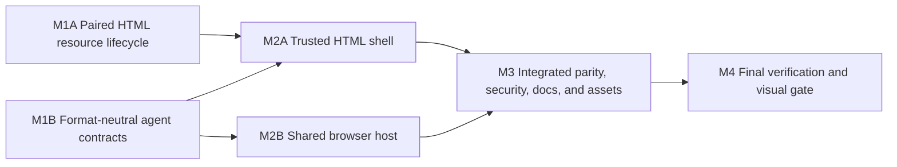

# HTML Page Agent Parity Plan

## Outcome

Standalone HTML whiteboards gain the same application-owned Page Agent experience as Markdown whiteboards while publisher-supplied HTML remains isolated in its existing opaque-origin sandbox. Creators publish exact HTML together with required creator notes; readers can use the complete current Pi and Codex conversation experience from the supported HTML capability URL without granting submitted scripts access to Page Agent, browser preferences, broker traffic, credentials, or loopback authority.

HTML parity includes the current shared drawer, ordinary image attachments, provider isolation, model settings, Codex skills, manual `/compact`, Codex busy-draft and no-queue behavior, Pi queueing, Stop, normalized activity, approvals and elicitation, archives, reconnect, confirmations, focus behavior, and responsive light/dark presentation. Rendered HTML text, section, and image references are deliberately deferred because the trusted wrapper cannot authoritatively inspect an opaque child.

## Requirements

### R1 — Paired HTML source and creator notes

- Every HTML create and update requires exact non-empty UTF-8 standalone HTML in multipart field `file` and non-empty UTF-8 creator notes Markdown in multipart field `context`.
- Existing HTML structural validation remains in force. Creator notes use the existing creator-context validation and independent configured limit, 1 MiB by default; HTML source uses the existing whiteboard source limit, 10 MiB by default.
- Source and notes validate, publish, replace, expire, and delete atomically. There is no operation that preserves or replaces only one member of the pair.
- Filesystem schema 2 becomes the paired-whiteboard schema for Markdown and HTML: a generation contains one `.md` or `.html` source and one matching creator-context `.md` artifact. Schema-1 HTML compatibility and migration are out of scope because this feature is pre-production. Existing Markdown compatibility remains unchanged.
- Public Go HTML operations continue using `Source` and `Context` and now require both.

### R2 — Symmetric HTML APIs and CLI

- `POST /api/v1/whiteboards/html` and `PUT /api/v1/whiteboards/html/{id}` require exactly one `file` and one `context` part plus the existing optional expiration field.
- Add `GET /api/v1/whiteboards/html/{id}` returning the validated resource, exact `html`, and exact `context` strings.
- `agent-whiteboard create html` and `update html` require `--context FILE` under the same file-safety rules as Markdown.
- Add JSON-only `agent-whiteboard --json get html -- ID`, returning exact `html` and `context` fields. Human-mode retrieval remains unsupported.
- Creator notes have the same bearer-capability exposure and expiration/deletion lifecycle as source. Stable errors never echo source, notes, paths, or request bodies.

### R3 — Format-neutral canonical context

- Replace Markdown-shaped Page Agent context fields with a format-neutral exact source field across the embedded viewer payload, strict browser protocol, broker conversions, provider model, provider envelope, and history projection.
- A contextual Page Agent v4 submission has `source`, `creator_context`, title, URL, resource metadata including `kind`, and digest. Resource kinds admit `markdown` and `html`.
- Keep Page Agent API version `4`, WebSocket subprotocol `agent-whiteboard.v4`, existing HTTP paths, and durable state schema 2. Viewer and broker deploy together; mixed old/new v4 browser components are unsupported.
- Preserve the existing Markdown digest byte-for-byte under `agent-whiteboard-context-v1`. Use the separate domain `agent-whiteboard-html-context-v1` over exact HTML and creator-note bytes so kinds cannot collide and existing Markdown conversation mappings do not observe a false same-timestamp revision.
- Conversation identity remains exact origin, resource kind, capability ID, and provider. Markdown and HTML with the same capability bytes cannot share state.
- Existing provider envelope v1/v2 revisions remain parseable for current Markdown history. New turns use `agent-whiteboard-turn-v3` / `end-agent-whiteboard-turn-v3` with a `page-source-untrusted` field; application instructions refer to untrusted page source rather than Markdown source.

### R4 — Context consent and revision semantics

- Opening the wrapper or drawer makes only the existing bounded broker status request when Page Agent is enabled. Selecting a provider is silent. Connect carries resource metadata and digest but no HTML or notes.
- The first ordinary or Codex skill-only reader turn that needs context sends complete exact HTML plus complete notes once. A changed resource sends one complete replacement on the next qualifying turn. No diffs, truncation, extraction, DOM snapshot, or script-generated state are substituted.
- `/compact` is never a contextual turn. If context is pending, compaction leaves it pending for the next qualifying reader turn.
- Context acceptance, unknown delivery, reconnect, revision ordering, context-size failure, and replacement commit semantics remain shared with Markdown.
- Page context, notes, metadata, skills, images, and reader content remain untrusted model input under the user's effective provider configuration, approval policy, sandbox, tools, MCP servers, skills, hooks, apps, and project instructions.

### R5 — Trusted outer shell and opaque child

- The supported HTML capability URL remains an application-owned top-level wrapper. Exact submitted bytes remain available only at `/content` and render only in one `credentialless` iframe with `sandbox="allow-scripts"` and `referrerpolicy="no-referrer"`.
- With Page Agent disabled, HTML retains the current static full-viewport wrapper, current outer and inner security policies, and zero broker requests.
- With Page Agent enabled, the trusted wrapper receives bundled viewer styles and a hash-authorized bundled script, the required literal-loopback HTTP/WebSocket `connect-src`, same-origin `frame-src`, and private image-preview sources. It retains `frame-ancestors 'none'`, X-Frame-Options denial, no forms, objects, workers, popups, downloads, top navigation, or publisher-origin authority for the child.
- Publisher bytes are never interpolated as executable outer markup. Exact source and notes, when needed by the enabled application shell, are JSON-escaped in a non-executable payload.
- `/content` remains exact, agent-free, opaque-origin, no-referrer, credentialless under the supported wrapper, and network-denied by its current inner policy.
- The parent ignores child `postMessage` traffic and never transfers MessagePorts, preferences, capability metadata beyond the iframe URL already required for rendering, conversation IDs, broker events, staged-image identifiers, credentials, or authority into the child.
- A hostile child that self-navigates to an agent-capable same-origin response must remain sandbox-inherited and unable to produce the trusted publishing Origin at the broker. The actual outer `frame-ancestors` policy remains an additional defense rather than the sole invariant.

### R6 — HTML application chrome and layout

- When Page Agent is enabled, the trusted wrapper presents a small application bar above the iframe. The existing theme control is on the left and the Page Agent launcher/status is on the right. The theme changes application chrome only; submitted HTML retains its own styling.
- The iframe occupies the remaining viewport. Opening the docked drawer reflows the iframe area; narrow layouts use the existing modal overlay and focus trap. Submitted HTML cannot cover the application bar or drawer.
- The iframe is emitted server-side and remains usable if Page Agent JavaScript fails to initialize. Agent bootstrap failure must not replace or erase the submitted document.
- A bounded display title is derived without executing submitted HTML from its `<title>` text, with `Standalone whiteboard` as fallback. It is presentation metadata and not part of the source digest.
- Application-owned controls reuse the current viewer/Page Agent visual language and remain usable at 320 px and wider in light and dark modes.

### R7 — Complete shared Page Agent behavior

From an agent-enabled HTML capability URL, readers receive the current shared Page Agent implementation rather than an HTML-specific fork:

- explicit broker consent, trust/port guidance, HTTP fallback and WebSocket transport;
- Pi and Codex provider isolation, provider switching, history, reconnect, replay, New, and archives;
- text and ordinary picker/paste image input, previews, limits, retry/release, model image capability handling, and private loopback staging;
- Pi active-turn follow-up queue, queue editing/removal, and Stop;
- Codex model/effort/speed controls, safe live skill catalog, `$` completion and atomic skill tokens, skill-only turns, preserved busy draft without queue admission, `/compact`, typed active work, primary Stop/Stopping, and compaction lifecycle;
- streaming, normalized visible activity, tool activity, blocked/error/interruption notices, stable command/file/permission approvals, MCP elicitation, and first-valid-response multi-tab behavior;
- current accessible connection status, completion/model menu containment, input modality, styled confirmations, archive loading/populated/empty/pagination states, and focus restoration.

All broker/provider feature data remains in the trusted parent. Newly connected Codex safe skill metadata and opaque compact work IDs never enter the child.

### R8 — HTML reference boundary

- HTML does not expose rendered text selection actions, section actions, rendered-image reference actions, reference insertion, or source navigation.
- HTML conversations reject page-reference message parts. They continue to accept text, ordinary images, and Codex skills under existing provider-specific rules.
- Markdown inline text, section, and rendered-image references remain unchanged.
- No DOM extraction, source inspector, screenshot, OCR, annotation, cropping, or child bridge is introduced.

### R9 — Failure isolation and security presentation

- Broker unavailable, wrong port, Local Network Access denial, untrusted origin, incompatible API, provider startup/auth/model failure, stale skill, unsupported compact, approval failure, oversized context, malformed revision, reconnect, and delivery-unknown behavior reuse existing Page Agent handling.
- A Page Agent feature failure neither reloads nor replaces the child, silently drops notes, broadens provider authority, creates a replacement conversation, or retries an uncertain model operation.
- The real application bar and drawer remain outside and visually above the iframe. Submitted HTML may imitate controls inside its own surface, but cannot operate the actual controls or enter fullscreen.
- Browser storage remains limited to the current theme and Page Agent preferences. HTML source, notes, capability/resource metadata, consent, conversations, messages, skills, requests, output, approvals, and credentials are never preferences.

### R10 — Documentation and compatibility

- Update README, HTTP/CLI/Go/storage/security/configuration documentation, examples, exported comments, hosted-provider guidance where affected, and the bundled Agent Whiteboard skill.
- Generalize Markdown-only Page Agent wording where behavior now applies to both kinds, while explicitly preserving the HTML reference deferral and opaque-child boundary.
- Update every runnable HTML create/update example to include creator notes and keep commands accurate.
- Do not add compatibility code for schema-1 HTML, API v5, theme injection into submitted HTML, a new provider feature, or unrelated viewer restructuring.

### Acceptance examples

1. A creator publishes HTML and notes through the CLI. The supported URL renders exact HTML in the sandbox, exposes an application-owned Page Agent launcher, and JSON retrieval returns both exact strings.
2. Opening and connecting sends no HTML or notes. The reader selects a Codex skill and submits it without text; that first turn carries exact HTML and notes plus native skill input. Reconnect does not resend unchanged context.
3. Before any contextual turn, the reader runs `/compact`; no source or notes are sent and the next ordinary turn still carries initial context.
4. While Codex responds on an HTML board, a draft remains editable but Enter and Send do not queue it; Stop preserves the draft. Pi continues its existing queue behavior.
5. Updating HTML and notes atomically advances `updated_at` and digest. The next qualifying turn sends a complete replacement exactly once.
6. A submitted script attempts parent access, storage, fetch, WebSocket, `postMessage` impersonation, and self-navigation to an enabled wrapper. It obtains no trusted broker request, parent data, preferences, cookies, referrer, credentials, or Page Agent identifiers.
7. With Page Agent disabled, the same HTML URL uses the static wrapper and performs no localhost request.

## Design

### Approach

Use one application-owned shell and one shared Page Agent controller. Markdown keeps its sanitized rendered host and reference controller; HTML uses a server-emitted sandboxed iframe host and deliberately installs no reference controller. A format-neutral canonical source contract removes format branching from broker and provider behavior while retaining kind-specific validation, digesting, rendering, and references.

A separate HTML drawer was rejected because it would duplicate security-sensitive transport, state, focus, accessibility, and provider behavior. Putting Page Agent inside submitted HTML or accepting a child bridge was rejected because publisher scripts control that environment and opaque `Origin: null` messages cannot establish authority. Converting HTML to Markdown or rendered text was rejected because it loses exact context and cannot represent script-generated behavior authoritatively.

### Component boundaries

#### Whiteboard domain and filesystem

The whiteboard domain owns kind-specific source validation and shared creator-note validation. The filesystem owns paired source/context generation publication for both document kinds and retains existing atomic commit, expiration, cleanup, and symlink/permission safeguards. HTML schema-1 records are not accepted as valid paired resources.

#### HTTP, CLI, and public Go API

Adapters expose the paired contract without leaking storage layout. HTML retrieval validates response kind/path and exact required fields just as Markdown retrieval does. Context limits and sanitized errors remain shared.

#### Canonical digest and Page Agent contracts

The root agent digest package owns kind-aware canonical digest calculation while retaining the existing Markdown function/domain behavior. Protocol, provider, state identity, and broker conversion layers admit both resource kinds and use a format-neutral source field. Inline reference validators remain explicitly Markdown-only.

The strict browser Page Agent v4 contextual payload is:

```json
{
  "revision": "initial | replacement",
  "source": "exact source",
  "creator_context": "exact creator notes",
  "title": "bounded display title",
  "url": "supported capability URL",
  "resource": {
    "kind": "markdown | html",
    "id": "capability ID",
    "created_at": "RFC3339",
    "updated_at": "RFC3339",
    "expires_at": null
  },
  "digest": "64 lowercase hex characters"
}
```

Enabled viewer JSON uses root `kind` and `source`, plus `context` and the existing `local_agent` metadata. Disabled Markdown also carries `kind` and `source`; disabled HTML uses no application script or source payload and retains the static wrapper.

#### Provider envelope

New builds use a format-neutral envelope revision with `page-source-untrusted`; parsers continue to recognize prior Markdown envelope revisions for native history projection and resume. Context-bearing provider requests carry source bytes and kind. Continuations carry no source. Image and safe skill native inputs remain outside or alongside the canonical text envelope according to current adapter contracts.

#### Browser hosts

The browser entry validates a closed kind-aware payload and selects one host:

- Markdown renders and sanitizes source, derives the semantic index, mounts the shared drawer, and installs the Markdown context-reference controller.
- HTML preserves the server-emitted iframe, mounts theme/application chrome and the same drawer, and installs no reference controller.

The drawer receives kind-specific display labels and otherwise consumes the same transport, state, composer, model controls, feature catalogs, activity, confirmation, archive, and focus code. Agent bootstrap errors are host-local: Markdown retains its current render error, while HTML leaves the iframe intact and reports no false agent authority.

### Important flow

```mermaid
sequenceDiagram
    participant C as Creator
    participant S as Publishing server
    participant W as Trusted HTML wrapper
    participant H as Opaque HTML iframe
    participant B as Loopback broker
    participant P as Pi or Codex

    C->>S: Create HTML(file + context)
    S->>S: Validate and atomically publish paired generation
    W->>S: GET supported HTML capability URL
    S-->>W: App bar + iframe + inert source/context payload
    H->>S: GET /content without credentials or referrer
    S-->>H: Exact HTML + opaque sandbox policy
    W->>B: Status only
    Note over H,B: No channel or authority crosses this boundary
    W->>B: Connect(resource + kind-aware digest)
    B-->>W: Conversation snapshot; context pending or unchanged
    W->>B: First qualifying submit(content + exact source/context)
    B->>B: Recompute digest and validate revision/kind
    B->>P: Canonical untrusted page-source envelope + native inputs
    P-->>B: Accepted/stream/activity/interactions
    B-->>W: Strict normalized events
```

### Security invariants

- Only the top-level application wrapper owns localStorage, broker transport, conversation identity, feature catalogs, interaction decisions, and staged-image authority.
- The child keeps sandbox inheritance across self-navigation. Broker authorization continues to require a canonical admitted publishing Origin; `Origin: null` is rejected.
- Exact HTML present in inert outer JSON is escaped by the Go JSON encoder and never written as executable markup. The child cannot read the parent.
- Agent-enabled outer CSP is the union of the trusted Markdown viewer's required Page Agent sources and the standalone wrapper's required self frame source, while retaining restrictive defaults and ancestry denial. The inner CSP is unchanged.
- Application controls occupy their own layout region and z-order rather than trusting publisher CSS or markup.

## Execution Map



M1A and M1B are the first parallel-safe wave: they own disjoint code and tests, require no shared generated output, and consume only the approved contract. M2A and M2B are the second parallel-safe wave after the contracts they consume are fixed. Browser fixtures, generated assets, integration tests, current documentation, examples, and broad validation are reserved to the exclusive M3 integrator.

| Lane | Outcome | Depends on | Exclusive ownership | Shared or reserved surfaces | Mutable resources | Focused validation | Parallel with |
| --- | --- | --- | --- | --- | --- | --- | --- |
| M1A | Paired HTML lifecycle and retrieval | Approved design | `internal/whiteboard/{model,service,handler}*`, HTML/handler/service tests; paired whiteboard portions of `internal/store/**`; HTML client portions of `internal/webapi/**`; HTML commands/output in `internal/cli/**`; `pkg/agentwb/**` tests/comments as needed; all configured `internal/testutil/mock_*.go` outputs for one exclusive Mockery regeneration | `internal/whiteboard/{viewer,standalone}.go`, browser assets, `tests/browser/**`, docs, examples, and browser generated assets reserved | Dedicated Go cache and exclusive `go run github.com/vektra/mockery/v3@v3.7.1`; no server process | regenerate configured mocks once and confirm only the expected CLI mock changes semantically; `go test ./internal/whiteboard ./internal/store ./internal/webapi ./internal/cli ./pkg/agentwb` plus affected integration package tests | M1B |
| M1B | Kind-aware digest, source protocol, state identity, broker/provider envelope | Approved design | `internal/agent/context_digest*`, `internal/agent/protocol/**`, `internal/agent/provider/**`, resource/context conversion and reference matching in `internal/agent/broker/**`, resource identity validation in `internal/agent/state/**`, affected Pi/Codex envelope/history tests | Browser assets, whiteboard renderer/handler, fixtures, docs, generated assets reserved | Dedicated Go cache if concurrent; no live provider | `go test ./internal/agent/protocol ./internal/agent/provider ./internal/agent/state ./internal/agent/broker ./internal/agent/pi ./internal/agent/codex` | M1A |
| M2A | Server-rendered enabled HTML shell and exact security headers | M1A, M1B | `internal/whiteboard/viewer.go`, `internal/whiteboard/standalone.go`, targeted renderer/CSP/title tests, the already-owned `handler.go` integration points after M1A | Asset source and generated output reserved to M2B/M3; browser fixtures reserved to M3 | Dedicated Go cache; no browser server | `go test ./internal/whiteboard` | M2B |
| M2B | Kind-aware shared browser bootstrap, app bar, labels, layout, and no-reference HTML host | M1B | `internal/whiteboard/assets/src/viewer.js`, `viewer.css`, `viewer.test.js`, and narrowly required existing source test modules | Go renderer, `tests/browser/**`, dist bundle, manifest, docs reserved | Node test cache only; no asset build | `pnpm test` | M2A |
| M3 | End-to-end integration, hostile-child proof, docs, examples, deterministic assets | M2A, M2B | `tests/browser/**`, affected `tests/integration/**`, `README.md`, current `docs/**`, `skills/agent-whiteboard/**`, `internal/whiteboard/assets/dist/**`, `internal/whiteboard/assets/manifest.json`, final cross-lane fixes | Exclusive ownership of browser fixtures, generated files, documentation, examples, and integration decisions | One Playwright worker; ephemeral ports and temporary roots; exclusive asset build | affected Go integration/server tests, `pnpm test`, `pnpm run build`, `pnpm run check:assets`, focused Playwright suites | None |
| M4 | Complete verified release candidate | M3 | Controller-owned verification and necessary narrow corrections | No concurrent writers; repository-wide caches and browser runtime exclusive | Normal Go cache, one race gate, one Playwright suite | final gate below plus visual matrix | None |

Pairwise overlap rejected outside the two named waves because `handler.go` is shared by creator API and wrapper rendering, `viewer.js`/`viewer.css` share one drawer lifecycle and layout, `tests/browser/fixture.js` is the single transport/resource simulator, and asset generation rewrites shared dist/manifest outputs. Those surfaces require sequential ownership.

## Milestones

### Milestone 1A: Paired HTML resource lifecycle

**Covers:** R1, R2, creator-facing parts of R10

**Deliverable**

HTML source and creator notes form one exact atomic resource across domain, storage, Go, HTTP, and CLI, including machine retrieval.

**Implementation**

1. Generalize creator-context validation and multipart handling so both whiteboard kinds require the pair while retaining kind-specific source validation and exact independent limits.
2. Generalize schema-2 paired filesystem generation, filename validation, commit/rollback inspection, cleanup, replacement, expiration, and metadata validation for `.md` and `.html` source. Reject schema-1 HTML as unsupported state without adding migration behavior; preserve existing legacy Markdown behavior.
3. Add symmetric HTML client create/update pair methods or a format-neutral paired client boundary, strict HTML response decoding, retrieval route, and resource path/kind validation.
4. Require `--context` for HTML create/update, add JSON-only `get html`, and keep regular-file/symlink/error handling aligned with Markdown.
5. Expand the CLI `Client` interface as required, then run the pinned repository Mockery command `go run github.com/vektra/mockery/v3@v3.7.1` under M1A's exclusive ownership of every configured `internal/testutil/mock_*.go` output. Inspect generated changes and stop if any output other than `mock_client.go` changes semantically without an M1A-owned interface change.
6. Update public Go comments and behavior tests without changing the already-generic source/context data model.
7. Add unit and integration coverage for valid exact bytes, missing/empty/invalid/oversized context, multipart duplicates/unknown fields, atomic replacement, interrupted writes, expiration/delete, retrieval, and sanitized errors.

**Validation**

```sh
go run github.com/vektra/mockery/v3@v3.7.1
go test ./internal/whiteboard ./internal/store ./internal/webapi ./internal/cli ./pkg/agentwb
go test ./tests/integration/... -run 'HTML|Whiteboard|CLI|API'
```

Use actual test names discovered in the package rather than broad repeat counts. The second command may be narrowed differently if the package's stable names do not match the expression.

### Milestone 1B: Format-neutral Page Agent contracts

**Covers:** R3, R4, R8, contract portions of R7 and R9

**Deliverable**

Strict browser/provider-neutral models, kind-aware digesting, state identity, broker conversion, and provider envelopes correctly support exact Markdown or HTML source without weakening Markdown references or current Codex skill/compact behavior.

**Implementation**

1. Add kind-aware digest calculation with exact existing Markdown output and a separate HTML domain. Cover cross-kind separation, empty/invalid kind handling, exact control bytes, and compatibility fixtures.
2. Admit Markdown and HTML resource kinds in protocol, provider, state, and broker conversion validation. Preserve exact origin/resource/revision checks and kind in durable identity.
3. Replace contextual `markdown` fields with `source` across Page Agent command models, clone/zero paths, size accounting, fingerprints where applicable, conversion, queue/context ownership, and provider request models. Keep Markdown-specific reference excerpts named and validated as Markdown.
4. Ensure HTML message content rejects reference parts before image claim, prepared context commit, queue mutation, or provider submission while continuing to admit text, ordinary images, and valid Codex skills.
5. Add a format-neutral provider envelope revision and instructions, retain prior Markdown envelope parsing/history projection, and ensure native skill/image ordering and compact behavior remain unchanged.
6. Extend broker observation, replacement, reconnect, recovery, archive, provider isolation, and context acceptance tests across both kinds, including skill-only initial HTML context and pending-context `/compact`.
7. Preserve strict v4 duplicate/unknown/null/limit checks and Pi-versus-Codex feature invariants.

**Validation**

```sh
go test ./internal/agent/protocol ./internal/agent/provider ./internal/agent/state ./internal/agent/broker
go test ./internal/agent/pi ./internal/agent/codex
go test -race ./internal/agent/broker
```

Run the race detector once at this milestone because broker context/state ownership changed. Repeat only a named race-sensitive test if evidence requires it.

**Risk**

Provider envelope history compatibility and same-timestamp revision behavior are review boundaries. A result that requires changing the existing Markdown digest, dropping current Markdown history, or advancing API v4 is a material design mismatch and must stop execution.

### Milestone 2A: Trusted HTML application shell

**Covers:** R5, server-side R6, server-side R9
**Depends on:** M1A and M1B

**Deliverable**

The server emits either the unchanged static disabled wrapper or an enabled trusted shell containing the app bar, inert exact context payload, and exact opaque child with security policies suited to Page Agent.

**Implementation**

1. Extend the existing renderer boundary to render a kind-aware viewer payload and an agent-enabled standalone shell without duplicating bundled assets or Page Agent logic.
2. Keep the iframe server-emitted, exact, credentialless, no-referrer, and sandboxed. Render publisher bytes only through `/content`; JSON-escape enabled context payload data.
3. Derive a bounded HTML display title through non-executing parsing with deterministic whitespace/truncation and fallback behavior.
4. Build conditional CSP: disabled HTML retains current outer policy; enabled HTML permits the trusted hashed script, Page Agent styles, literal-loopback connect/WebSocket sources, same-origin child frame, and private image previews while retaining restrictive defaults and ancestry denial. Inner headers remain byte-for-byte equivalent unless a proven test-only normalization is required.
5. Wire the already-loaded paired `Whiteboard` into enabled rendering and preserve HEAD/404/kind/expiration/cache/public-header behavior.
6. Add structural tests for exact iframe attributes and one child, safe hostile-source JSON encoding, no executable publisher bytes, conditional CSP, title, disabled no-script wrapper, partial-writer behavior, and unchanged `/content` bytes/headers.

**Validation**

```sh
go test ./internal/whiteboard
```

### Milestone 2B: Shared browser host and HTML chrome

**Covers:** browser portions of R3, R4, R6–R9
**Depends on:** M1B

**Deliverable**

The bundled browser source validates and boots either Markdown or HTML, mounts the exact shared current Page Agent drawer, preserves the server-rendered HTML child, and exposes no HTML reference affordance.

**Implementation**

1. Make viewer payload validation kind-aware and strict, using `kind` and `source` while preserving size, resource metadata, digest, and local-agent checks.
2. Separate shared theme/Page Agent bootstrap from the Markdown renderer/reference controller. Markdown behavior remains unchanged; HTML locates the trusted app bar and server-emitted iframe, mounts shared controls, and installs no context-reference controller.
3. Make context creation and disclosure labels kind-aware: `Page Markdown` or `HTML source`, shared creator notes, kind-preserving resource metadata, exact source, and generic consent copy.
4. Preserve every current drawer feature added through `c35549e`, including safe Codex skills, `/compact`, typed active work, Codex busy drafts, Pi queueing, Stop, confirmations, archives, connection states, focus modality, and model/completion menu geometry.
5. Ensure HTML bootstrap failure does not replace the iframe. Disabled HTML runs no viewer script. Theme state affects only trusted application chrome.
6. Add CSS for a reserved app bar, remaining-viewport iframe surface, docked body reflow, modal overlay, z-order, 320 px behavior, light/dark states, reduced motion, and iframe focus boundaries using existing design tokens.
7. Add JS unit tests for strict payload kinds, exact context commands, skill-only first context, compact pending context, no references/navigation on HTML, app-bar labels, shared drawer identity, iframe preservation on failure, and Markdown regression.

**Validation**

```sh
pnpm test
```

**Risk**

Do not copy `createAgentDrawer`, transport, state, composer, or feature controls into an HTML-specific implementation. A need to inspect or message the child is a design mismatch and must stop execution.

### Milestone 3: Integrated parity, security, documentation, and assets

**Covers:** R5–R10 and all acceptance examples
**Depends on:** M2A and M2B

**Deliverable**

Real browser and process workflows prove complete shared Page Agent behavior on HTML, the hostile-child authority boundary, synchronized generated assets, and current user/agent guidance.

**Implementation**

1. Extend the browser fixture with paired HTML publication, agent-enabled and disabled wrappers, exact context capture, and hostile submitted scripts while reusing the current broker feature simulator.
2. Parameterize host-independent Page Agent workflows or add an equivalent compact parity matrix so HTML exercises consent, exact initial/replacement context, WebSocket/fallback, attachments, Pi queue, Codex settings/skills/compact/busy draft/Stop, streaming/activity/interactions, provider isolation, archives/reconnect, confirmations, focus, and desktop/narrow behavior without duplicating the product implementation.
3. Add HTML-specific Playwright cases for app-bar provenance, iframe reflow, theme affecting chrome only, no reference controls, direct `/content`, disabled broker silence, parent/child/postMessage isolation, and iframe survival after agent bootstrap failure.
4. Convert the bounded self-navigation probe into a hermetic Chromium regression using actual production headers. Assert no request accepted with the trusted publishing Origin and no credential/referrer leakage; retain existing standalone security cases.
5. Update storage, HTTP, CLI, Go API, security, configuration, README, examples, hosted smoke guidance where affected, and bundled skill instructions. State exact source+notes exposure, complete Page Agent parity, current Codex features, HTML reference deferral, and opaque-child separation.
6. Update runnable HTML examples and integration fixtures to supply non-sensitive creator notes. Do not add prose-content assertions whose primary purpose is checking wording.
7. Build deterministic browser assets once source and focused tests pass; verify manifest and third-party notices remain correct.
8. Run an integrated review focused on source/context kind consistency, child authority, provider history compatibility, and absence of duplicated drawer code or native/path leakage.

**Validation**

```sh
go test ./internal/agent/server ./internal/whiteboard ./internal/webapi ./internal/cli ./tests/integration/...
pnpm test
pnpm run build
pnpm run check:assets
pnpm exec playwright test tests/browser/local-agent-sidebar.spec.js tests/browser/standalone-html-security.spec.js
git diff --check
```

### Milestone 4: Final verification and visual gate

**Covers:** complete R1–R10
**Depends on:** M3

**Deliverable**

The feature branch contains only intentional, reviewed changes and has current evidence for all required behavior and security claims.

**Validation**

Run the repository-required final gate once after the integrated state is stable:

```sh
go test ./...
go test -race ./...
go vet ./...
pnpm test
pnpm run check:assets
pnpm run test:browser
git diff --check
```

Inspect the final diff and status for unrelated or generated scratch files. Reuse valid focused evidence rather than rerunning it when no relevant input changed.

Capture screenshots under `/tmp/pi-temporary-files/html-page-agent-parity/` and inspect, at minimum:

| HTML Page Agent surface | Desktop light | Desktop dark | Narrow light | Narrow dark |
| --- | --- | --- | --- | --- |
| App bar + closed launcher + iframe | Required | Required | Required | Required |
| Connected empty + context disclosure | Required | Required | Required | Required |
| Codex skill/model menus | Required | Required | Required | Required |
| Responding + Stop/Stopping + preserved draft | Required | Required | Required | Required |
| Compaction running/terminal | Required | Required | Required | Required |
| Approval/elicitation + passive notices | Required | Required | Required | Required |
| New/Restore/Delete confirmations | Required | Required | Required | Required |
| Archives loading/populated/empty | Required | Required | Required | Required |
| Broker/context failure | Required | Required | Required | Required |

Automated assertions are required but do not replace the visual review. Screenshots are temporary evidence, not repository artifacts.

## Validation

### Feedback mode during implementation

Use behavior-first feedback for each executable slice. Add or update a test at the most stable boundary before or with implementation, run the smallest command that can disprove the behavior, then perform structural cleanup while focused checks remain green. Mechanical renames may use compiler/test feedback rather than artificial unit tests, but every changed observable contract requires meaningful regression coverage.

### Review boundaries

- Review M1A paired-generation commit/rollback and public exact-byte behavior before shell work consumes it.
- Review M1B kind/digest/envelope/history and HTML reference rejection before browser integration.
- Review the integrated M2 shell/host boundary for CSP, inert payloads, child independence, shared drawer reuse, focus, and layout.
- Review M3 at the complete browser/security boundary, including the latest Codex features from `c35549e`.
- Corrective reviews remain targeted. Minor findings do not reopen a passed milestone; after two unsuccessful closure attempts, stop for reassessment.

### CI and platform boundaries

Ordinary tests remain hermetic and require no public network, credentials, real provider home, or fixed ports. Existing macOS/Linux platform-specific checks and authenticated provider smoke remain supplemental; HTML introduces no new native provider operation, so lack of authenticated Codex or Pi is not a completion blocker. Browser support remains the project's current Chromium scope.

## Assumptions and Risks

- `c35549e` is the approved implementation baseline. It includes current Codex skills, manual compaction, active-work, no-queue, confirmation, archive, focus, and visual contracts that HTML must inherit.
- A Chromium probe established the worst-case premise: a sandboxed child self-navigating to a loopback-capable same-origin response sent `Origin: null`, no Referer, and no cookie. The permanent test must use production policies; inability to reproduce the rejection requires security-design reassessment, not a relaxed broker check.
- Adding loopback-capable CSP to the trusted wrapper does not grant it to the child because sandbox origin inheritance and exact broker Origin admission remain authoritative. Outer ancestry denial is additional defense.
- HTML `<title>` parsing is bounded presentation logic. It must never execute source, initiate fetches, or affect canonical digest/revision identity.
- Existing Markdown digest and provider envelope history remain compatibility commitments. HTML schema-1 is not.
- The complete shared browser controller is large and stateful. Splitting it into format hosts is permitted only to isolate rendering/bootstrap responsibility; unrelated design-system or controller decomposition is excluded.
- If repository changes after `c35549e` materially alter Page Agent wire shape, drawer behavior, or security policy before integration, execution must rebase and reassess affected milestones rather than silently overwrite them.

## Deferred Work

- Rendered HTML text, section, or image references.
- A trusted HTML source inspector and source-line references.
- Child `postMessage` integration, voluntary publisher SDK, DOM extraction, screenshots, OCR, cropping, annotations, or visual capture.
- Theme injection or automatic restyling of submitted HTML.
- Schema-1 HTML migration or fallback to source-only Page Agent context.
- Page Agent API v5 or mixed old/new v4 negotiation.
- Additional slash commands, provider capabilities, skill management, durable drafts/catalogs/compaction, or changes to Pi queue semantics.
- Unrelated viewer, broker, provider, or design-system refactors.
