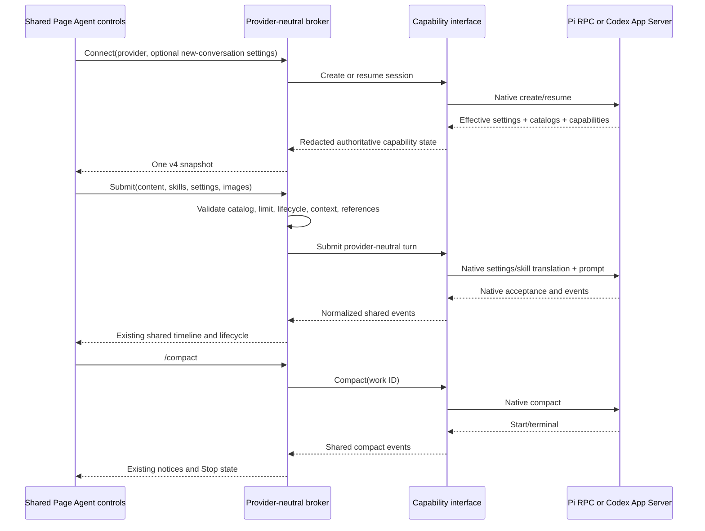
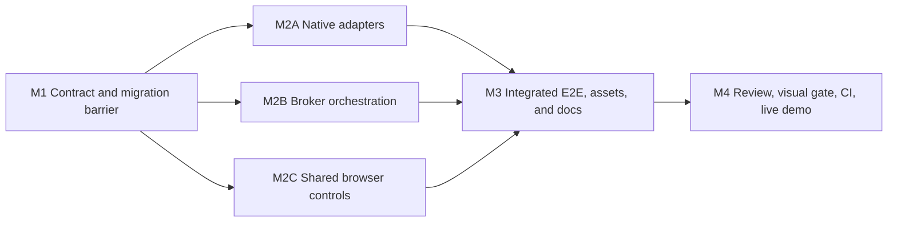

# Provider Control Parity Plan

## Outcome

Page Agent presents one shared model, reasoning, skill, compaction, interaction, and activity experience for Pi and Codex on both Markdown and HTML whiteboards. Provider selection changes the native capability source and translation adapter, not the browser component or broker workflow.

Pi uses its configured RPC model catalog, reasoning metadata, skill commands, compaction, and extension interaction protocol. Codex retains its existing App Server sources. The implementation removes provider-name branching from shared control logic, keeps provider differences behind small injected capability interfaces, and preserves the opaque HTML sandbox and all existing context, queue, archive, transport, and security contracts.

## Requirements

### R1 — One shared control implementation

- Pi and Codex use the existing Page Agent drawer, model pill and popup, message editor, skill picker and tokens, `/compact` command, compaction notices, Stop action, interaction cards/forms, archives, and timeline.
- HTML and Markdown continue calling the same drawer implementation. HTML adds no provider-specific UI and retains no page-reference controls.
- Provider-specific differences are capability data and adapter behavior, not copied DOM, CSS, state reducers, event handlers, command paths, or broker actors.
- Browser code receives an injected bounded provider-capability descriptor and authoritative provider state. It does not infer feature support from provider names.

### R2 — Polymorphism, interfaces, and dependency injection

- Go shared orchestration depends on small provider capability interfaces for settings/catalog control, skills, compaction, interactive responses, and busy-turn admission.
- Pi and Codex implement those interfaces in their adapters. The broker does not type-assert concrete adapter types or call adapter packages.
- Existing injected launchers, clocks, ID generators, stores, and native clients remain the test boundaries. New Pi RPC behavior is tested through injected managed children/RPC fixtures rather than ambient processes.
- Browser shared controls receive provider capabilities and provider-scoped state through the existing drawer/controller construction path. Provider sources do not instantiate alternative controls.
- Provider-name checks remain permitted only where identity itself is the behavior, such as display labels, native adapter selection, and provider-scoped persistence keys. They are prohibited for deciding whether shared settings, skills, compaction, interactions, or busy-turn queue admission exist.

### R3 — Pi model and reasoning source

- Pi model options come from RPC `get_available_models` for the active Pi runtime.
- Each exposed model uses the exact native provider plus model ID as its stable value and the native model name as bounded display metadata.
- The adapter derives exact supported reasoning levels from `reasoning` and `thinkingLevelMap` using Pi `0.82.1` semantics:
  - a non-reasoning model exposes only `off`;
  - standard levels through `high` are available unless explicitly mapped to `null`;
  - `xhigh` and `max` are available only when explicitly mapped;
  - every advertised value must remain exact and bounded.
- The adapter exposes image support from native input modalities.
- Base URLs, costs, compatibility metadata, headers, credentials, paths, and raw model records never cross the provider boundary.
- Pi has no native Standard/Fast service-tier choice. The shared popup omits Speed when the active catalog advertises no speed choice. Internally Pi uses the provider-neutral Standard value so the execution tuple remains complete.
- The current native Pi model is the authoritative catalog default and effective setting.

### R4 — Pi model change semantics

- The shared pill keeps existing draft-versus-accepted behavior. A draft model/reasoning change is captured with a submission; browser preference changes only after native acceptance.
- Pi applies an exact accepted tuple using native `set_model`, `set_thinking_level`, and authoritative `get_state` verification before sending the reader prompt.
- This deliberately follows normal Pi behavior: the current Page Agent Pi session changes, already-running unrelated Pi sessions do not change, and future newly started Pi sessions inherit Pi's updated native default.
- A partial native settings transition never submits the reader message. The draft remains available, and Page Agent publishes the actual effective Pi setting obtained from `get_state`; it does not claim rollback.
- Catalog drift or an unavailable model/reasoning value rejects before the model turn and refreshes the catalog.
- Pi queue entries capture the exact draft tuple. When delivered, the same settings application and verification occur before native prompt acceptance.
- Codex retains its existing per-thread model/effort/speed application and accepted-preference behavior through the same broker setting workflow.

### R5 — Provider-neutral settings lifecycle

- Settings catalogs and authoritative effective settings are session capabilities, because Pi can report them only after its RPC process starts. Shared broker initialization no longer requires a provider-name-specific pre-create catalog branch.
- A provider create request may carry bounded initial settings for either provider. Each adapter validates them against its native catalog and returns authoritative structured native-session settings.
- Resume uses the native session's effective settings. A browser preference never silently replaces an existing conversation setting.
- Catalog refresh asks the active session capability, not a concrete driver implementation.
- Existing Codex mappings and browser preference data remain compatible.
- Existing Pi mappings without structured settings remain readable. On first successful resume, the adapter obtains authoritative state and the broker atomically upgrades the current mapping without replacing or deleting the conversation.

### R6 — Pi skill source and invocation

- Pi skills come from RPC `get_commands`, filtered to exact `source: "skill"` records.
- The adapter consumes the pinned RPC `sourceInfo` provenance shape, maps only supported user/project/path scopes to the provider-neutral scope vocabulary, and strips source paths before producing the catalog.
- Stable adapter-generated IDs bind the native skill name and scope without revealing paths or file contents.
- Pi and Codex use the same skill picker and token renderer.
- Pi permits one selected skill per message. Codex retains its native multiple-skill limit. The broker publishes the limit as provider-neutral capability data and validates it before side effects.
- Pi invokes the one selected skill through native `/skill:name` expansion. Pi `0.82.1` applies JavaScript `trim()` to command arguments, so a Pi skill turn has one explicitly approved normalization: native expansion removes the canonical v3 envelope's single outer terminal LF. Every length-delimited envelope field remains byte-for-byte exact, including HTML, creator context, source, reader content, and image ordinals. Non-skill turns retain the exact canonical envelope bytes.
- Before settings or image side effects, the adapter refreshes `get_commands`, resolves the selected stable ID again, and rejects unknown, stale, duplicated, or over-limit selections. After native `message_start`, it proves expansion occurred by requiring the expected native skill-block prefix, rejecting a retained `/skill:` command, requiring the normalized envelope suffix with no extra bytes, restoring exactly one LF, and comparing the result with the canonical v3 envelope before reporting turn acceptance or accepting assistant output.
- A skill file can disappear or become unreadable after the catalog refresh but before Pi reads it. That unavoidable post-refresh race fails the turn as a protocol error, aborts native work, republishes authoritative settings if they changed, and leaves the browser draft and image claims available for retry; no assistant output is accepted.
- Skill paths and bodies remain provider-private and never enter browser protocol or broker persistence.

### R7 — Provider-neutral manual compaction

- Pi implements the existing manual-compaction capability with RPC `compact`, `compaction_start`, `compaction_end`, and `abort`.
- The adapter correlates one broker-safe work ID with one native compact operation, reports acceptance only after the native start boundary is known, and emits one completed, interrupted, or failed terminal result.
- Stop during Pi compaction uses the same browser command and broker interruption workflow as Codex.
- Compaction remains available only when the conversation is idle, no queue item or provider worker is pending, and the provider reports support.
- Pi and Codex share the existing lifecycle, notices, focus, draft preservation, and command-result handling.

### R8 — Pi extension interaction and passive activity

- Pi RPC extension UI requests are parsed by method instead of becoming undifferentiated status cards.
- TUI-chrome fire-and-forget methods `setStatus`, `setWidget`, `setTitle`, and `set_editor_text` do not create transcript rows.
- Bounded `notify` requests may produce passive notices; consecutive identical notices within the same active turn coalesce into one shared notice.
- Blocking `select`, `confirm`, `input`, and `editor` requests map into the existing provider-neutral interaction request/response workflow and shared card/form renderer. Multiline input extends that shared field model rather than creating a Pi dialog component.
- Pi responses use exact native `extension_ui_response` correlation. The first valid response wins across attached tabs and makes every tab read-only, matching existing interaction behavior.
- Pi emits an optional timeout duration but no response acknowledgment or expiry event. The adapter therefore publishes an optional provider-neutral local deadline derived conservatively from receipt of that duration. Browser command success means the broker owned the first valid response and the adapter wrote the complete response record to Pi stdin before the local deadline; it does not claim Pi consumed the record. Local deadline, native abort/turn settlement, detach, or shutdown emits one shared resolution and rejects late responses. A timeout-versus-write race remains an explicitly bounded unknown native outcome and never permits a second response.
- Unsupported or malformed blocking requests fail closed and receive cancellation where native correlation is still trustworthy. Raw paths, IDs, option payloads outside bounded display values, and extension internals do not enter browser events.
- The repeated generic status-card sequence observed with the user's configured Pi extensions has a permanent regression test.

### R9 — Shared browser behavior

- The model pill appears for any connected provider with a verified settings catalog.
- The shared model popup renders sections from catalog capabilities:
  - Pi: Model and Effort;
  - Codex: Model, Effort, and Speed when a native speed choice exists.
- The skill picker is opened through the existing `$` token-boundary behavior for either capable provider.
- The existing `/` completion offers `/compact` for either capable provider.
- Provider changes retain isolated conversation, draft, accepted settings, skills, archives, and lifecycle state.
- Provider-scoped settings preferences use one shared persistence helper. The existing Codex key and value remain readable; Pi receives its own provider-scoped value without storing credentials, native IDs, skill paths, or conversations.
- Busy behavior remains native-provider behavior through shared capability/state data. A bounded static busy policy (`queue` or `preserve_draft`) and broker-derived composer admission (`submit`, `queue`, `preserve_draft`, or `blocked`) replace provider-name gates: Pi may queue follow-ups under the existing bounded queue contract, while Codex preserves a busy draft without queue admission.

### R10 — Compatibility and security

- Keep browser API version 4 and provider envelope v3.
- Extend the strict v4 capability snapshot/catalog in place. Old/new mixed viewer and broker combinations continue failing closed rather than adapting silently.
- Preserve fixed v1/v2 Markdown provider-envelope readability and existing v3 Markdown/HTML behavior. The sole transport exception is the approved Pi native-skill outer-terminal-LF normalization; canonical stored/built v3 bytes and every encoded field payload remain unchanged.
- Preserve exact HTML and creator-context pairing, kind-aware digest domains, context-once/replacement semantics, and pre-side-effect HTML reference rejection.
- Preserve the enabled HTML wrapper's single credentialless `sandbox="allow-scripts"` iframe, no child bridge, ignored child messages, and unchanged agent-free `/content` response.
- Model and skill catalogs are bounded and redacted before browser publication. Native provider settings remain authoritative.
- Documentation must explicitly state that choosing a Pi model follows normal Pi behavior and updates Pi's future default while leaving already-running sessions unchanged.

### R11 — Documentation and operational behavior

- README, configuration, security, hosted smoke guidance, and the agent-facing skill describe shared controls with provider-native sources and the one-skill Pi limit.
- Remove statements that model, skill, or manual compact controls are Codex-only.
- Correct stale Pi consent text that claims Pi has no tools. Both providers use the user's effective native tools, extensions, approval policy, sandbox, project trust, and other settings.
- A broker upgrade does not require deleting public whiteboards. Any mapping repair is automatic and atomic.
- The disposable live demo is restarted only after the final verified build; implementation tests use temporary storage and ephemeral ports rather than ports 8567/8568.

### R12 — Verification and visual parity

- Unit tests cover strict native parsing, capability interfaces, failure boundaries, and state migration.
- Shared broker tests prove settings, skills, compact, and interactions through injected capability fakes without provider-name gates.
- Browser tests parameterize the same component behaviors for Pi and Codex on both HTML and Markdown.
- A pinned real Pi `0.82.1` RPC E2E with isolated HOME verifies model/reasoning selection, one skill invocation with only the approved outer-LF normalization, exact HTML/context field delivery, compact/Stop, and extension interactions without public network or credentials.
- Manual desktop/narrow and light/dark inspection compares Pi and Codex model menu, skill picker, compact, busy/Stop, interaction, activity, archive, and confirmation states.
- All generated assets remain deterministic.

## Design

### Approach

Use capability polymorphism at both provider and browser boundaries. Shared orchestration owns state transitions and validation. Native adapters own only discovery and translation. Provider differences are advertised as bounded capability data and invoked through small interfaces.

The design deliberately avoids a provider-specific Page Agent facade or duplicated Pi model/skill/compact controllers. The current Codex implementation becomes one implementation of shared contracts, and Pi becomes another.

### Verified native premises

The implementation targets the pinned `@earendil-works/pi-coding-agent` `0.82.1` RPC contract documented in `docs/rpc.md`, `docs/models.md`, `docs/skills.md`, and `docs/compaction.md`.

A read-only local probe against that exact executable confirmed:

- `get_available_models` returns configured full model records, including `provider`, `id`, `name`, `reasoning`, `thinkingLevelMap`, and input modalities;
- the current environment exposes 12 models, 10 with explicit thinking maps;
- `get_state` returns the exact current model and thinking level;
- `get_commands` returns skill records with canonical `sourceInfo`; the current environment exposes five skills;
- RPC supports `set_model`, `set_thinking_level`, `compact`, `abort`, and extension UI request/response correlation.

If execution discovers that the pinned dependency or wire shape differs from these exact premises, it must stop before adapting the contract or dependency version.

### Provider contracts

The provider layer keeps the base session interface small and adds focused optional capability interfaces:

- settings catalog plus authoritative effective-settings discovery/application;
- skill catalog plus selection-limit metadata;
- manual compaction;
- interactive response, cancellation, and optional local deadline metadata;
- bounded busy-turn policy used by the broker to derive current composer admission.

The exact interface names are local implementation details. Their behavioral contracts are not:

- every catalog is cloned, bounded, exact, and adapter-redacted;
- every mutation reports authoritative native acceptance;
- shared code never assumes a capability from provider identity;
- capability loss is published as state and blocks only the affected operation;
- adapters own native IDs and correlation.

Provider create requests accept optional bounded settings for both providers. Native session metadata may carry structured settings for either provider. Existing nil-settings Pi metadata is a legacy input only; a successfully active Pi session returns structured settings.

### Broker orchestration

The broker obtains capabilities from the active session after create/resume, stores a provider-neutral domain catalog, and publishes one strict capability snapshot. It validates drafts against this current catalog before launching workers.

Settings, skills, compact, and interactions flow through interface calls. Existing command ledgers, first-response-wins behavior, queue ownership, lifecycle workers, handoff, recovery, and atomic mapping persistence remain shared. Static busy-turn policy plus actor lifecycle and queue capacity produce authoritative composer admission for the browser.

No operation is admitted merely because the provider name is Pi or Codex. A missing interface or unavailable capability produces the existing bounded unsupported state/error. Interaction response success retains the existing conservative meaning: one response is consumed locally before native delivery, and an errored or unacknowledged write is an unknown native outcome rather than permission for another tab to answer.

### Pi adapter

Pi discovery parses only required native fields. It never republishes raw model or command records.

For a submitted Pi turn:

1. validate content, selected skill count, images, context, and requested settings without side effects; when a skill is selected, refresh `get_commands` and re-resolve its stable catalog identity;
2. when settings differ, apply native model and thinking commands and verify `get_state`;
3. construct the unchanged canonical provider envelope;
4. when one skill is selected, send `/skill:name ` followed by that envelope, allowing Pi `0.82.1` to remove only its outer terminal LF during native argument trimming;
5. on native `message_start`, require the expected expanded skill-block prefix and exact normalized envelope suffix, restore exactly one terminal LF, and compare with the canonical envelope before emitting the browser user message, reporting acceptance, or accepting assistant output;
6. abort and fail closed on retained commands, expansion/read failures, or any other byte difference while preserving the retryable browser draft/images and authoritative effective settings;
7. preserve existing acceptance ambiguity, interruption, recovery, and settlement rules.

Extension UI methods are normalized by method. TUI-only chrome is ignored, passive notifications are bounded/coalesced, and blocking requests use the shared interaction domain. Timeout-bearing requests receive a conservative adapter-local deadline; successful response delivery means one complete record was written before that deadline, not that the unacknowledging Pi process consumed it.

### Codex adapter

Codex continues using App Server model, effort, service-tier, skill, compact, activity, and interaction sources. It implements the same capability interfaces and behavior contracts without a second broker or browser path.

Existing Codex catalog drift, accepted-setting, busy-draft, skill-only turn, compact, tool-activity, and interactive-request tests remain compatibility gates.

### Browser controls

The existing drawer owns one provider-scoped controller state. Model settings, skills, compact, and interactions consume capability values from that state.

The model menu builds sections from catalog data. Speed disappears when the catalog has no choice. The editor enforces `max_selected_skills` generically. Compact completion depends on `supports_compact`. Interaction cards render normalized request surfaces independently of adapter source. Composer submission/queue/draft behavior consumes broker-published admission state rather than provider identity.

### State and preference migration

Existing Pi mappings with nil settings remain valid at load. After successful resume and authoritative settings discovery, the state store atomically writes settings and presentation only when conversation/native identity still matches. Commit uncertainty follows existing reload-and-compare handling.

Codex browser preferences keep their current key/value. A shared helper resolves the provider-specific key; Pi settings use a separate key with the same strict tuple validation and no conversation/native data.

### Important flows



### Decisions

- Pi uses the same control components but permits one native skill per message.
- Pi omits Speed rather than displaying a fake or disabled value.
- Pi model changes follow normal Pi persistence behavior: current session plus future defaults, never already-running sessions.
- Pi capability discovery is session-level; the broker does not launch a disposable catalog process or parse user configuration files.
- Pi blocking extension UI uses existing interaction components. TUI chrome does not become transcript activity. Pi's unacknowledged response transport uses local first-response ownership and conservative deadline semantics.
- API v4 and envelope v3 stay in place; mixed versions fail closed. Pi skill turns alone permit native removal of the envelope's outer terminal LF while preserving every encoded field byte.

## Responsibility Decomposition

The shared provider/protocol/state contracts are a sequential barrier because every implementation lane consumes them. After that barrier, native adapters, broker orchestration, and browser controls have disjoint source ownership and focused tests, so they may proceed concurrently. Generated browser assets, Playwright fixtures/specs, documentation, and the live demo are reserved for the integration owner after the lanes converge.

## Execution Map



| Lane | Outcome | Depends on | Exclusive ownership | Reserved/shared surfaces | Mutable resources | Focused validation | Parallel with |
| --- | --- | --- | --- | --- | --- | --- | --- |
| M1 | Provider-neutral contracts, interaction deadlines, busy admission, and legacy migration rules frozen | Approved design | `internal/agent/provider/**`, `internal/agent/protocol/**`, `internal/agent/state/**`, affected generated mocks under `internal/testutil/**` | Browser source, broker actors, adapter implementations, generated browser assets reserved | Pinned Mockery output only; run single-threaded | `go test ./internal/agent/provider ./internal/agent/protocol ./internal/agent/state` and pinned Mockery diff | None; contract barrier |
| M2A | Pi and Codex satisfy shared native capability contracts | M1 | `internal/agent/pi/**`, `internal/agent/codex/**` | Provider/protocol contracts frozen; no broker/browser edits | Hermetic fake children and temporary session directories; no ports 8567/8568 | `go test ./internal/agent/pi ./internal/agent/codex`, focused race tests, pinned real Pi adapter integration with isolated HOME | M2B, M2C |
| M2B | Broker uses only capability interfaces for settings, skills, compact, and interactions | M1 | `internal/agent/broker/**` | Contracts frozen; adapters and browser reserved | In-memory fakes and temporary state stores only | `go test ./internal/agent/broker` plus focused race-sensitive actor cases | M2A, M2C |
| M2C | One capability-driven browser implementation serves Pi and Codex | M1 | `internal/whiteboard/assets/src/viewer.js`, `viewer.css`, `viewer.test.js`, `message-editor.js`, `message-editor.test.js`, `model-settings.js`, `model-settings.test.js` | `assets/dist/**`, manifest, Playwright fixture/specs reserved for M3 | jsdom only; do not build generated assets concurrently | `pnpm test` with parameterized Pi/Codex component cases | M2A, M2B |
| M3 | Integrated strict v4 behavior, real-component E2E, deterministic assets, and synchronized docs | M2A, M2B, M2C | `tests/browser/**`, applicable `tests/integration/**`, `internal/whiteboard/assets/dist/**`, `internal/whiteboard/assets/manifest.json`, README/docs/skill guidance | All lane outputs consumed; no concurrent writers | Ephemeral ports/storage and isolated provider homes; asset generation single-threaded | focused Go integration, `pnpm run build`, `pnpm run check:assets`, focused Playwright Pi/Codex HTML/Markdown matrix | None; integration owner |
| M4 | Independent review, visual proof, complete validation, green CI, refreshed demo | M3 | Review fixes in affected files; no new scope | Branch and live demo runtime reserved | Stop/restart only disposable demo PIDs after local gates; CI owns remote runners | repository-wide normal/race/vet, 119+ Vitest, full Playwright, visual matrix, CI | None; final gate |

Parallel M2 lanes must not run broad mutating generators or repository-wide tests while another lane writes. They may run focused read/compile tests against the frozen M1 contract. M3 owns all shared fixture, generated-asset, documentation, and integration corrections.

## Milestones

### Milestone 1: Provider-neutral contracts and migration barrier

**Covers:** R1, R2, R5, R8, R10

**Deliverable**

The provider, protocol, and state packages express settings, skill limits, compact, interaction deadlines, and busy-turn/composer admission without Pi/Codex feature gates. Legacy Pi mappings remain valid and have an explicit atomic upgrade path.

**Implementation**

1. Replace provider-specific native-session/settings validation with provider-neutral complete settings for active capable sessions while accepting legacy persisted Pi metadata at the state boundary.
2. Add small session capability interfaces for settings catalog/effective application and skill selection metadata; retain and reuse the existing compact and interactive interfaces.
3. Extend interaction requests with bounded optional local-deadline metadata and freeze resolution semantics: first valid local ownership plus completed native write is browser success, local expiry/terminal/cancellation resolves all tabs, and no native acknowledgment is implied.
4. Add a bounded static busy-turn policy (`queue` or `preserve_draft`) and strict broker-published composer admission (`submit`, `queue`, `preserve_draft`, or `blocked`) so adapter, broker, and browser lanes share one frozen contract.
5. Extend the strict capability snapshot/catalog with the provider-neutral skill limit and any shared multiline interaction metadata required by Pi editor requests.
6. Keep Standard as a valid internal execution speed for Pi; expose section availability through catalog capability rather than a provider enum.
7. Generalize state validation and atomic repair so authoritative Pi settings can be persisted without changing conversation/native identity.
8. Regenerate only configured mocks with the pinned Mockery version and verify no unrelated generated file changes.

**Validation**

```sh
go test ./internal/agent/provider ./internal/agent/protocol ./internal/agent/state
go test -race ./internal/agent/provider ./internal/agent/protocol ./internal/agent/state
go run github.com/vektra/mockery/v3@v3.7.1
git diff --check
```

**Risk**

Strict protocol and state validation are shared security boundaries. Independent review must close this milestone before parallel implementation begins.

### Milestone 2A: Native adapter implementations

**Covers:** R3, R4, R6, R7, R8
**Depends on:** M1

**Deliverable**

Pi and Codex implement the same capability contracts. Pi exposes its native models, reasoning, one-skill catalog/invocation, compaction, and extension interactions without leaking native private data.

**Implementation**

1. Extend Pi startup/state parsing with exact effective reasoning and complete structured settings.
2. Parse `get_available_models` into a bounded redacted catalog, including exact thinking-level-map semantics and image support.
3. Implement Pi settings application with native response validation and authoritative `get_state`; surface partial transition state without submitting the reader turn.
4. Parse `get_commands` skill records and canonical `sourceInfo`, produce stable redacted descriptors, refresh and re-resolve before side effects, enforce one selection, invoke `/skill:name`, and validate both the expected expansion prefix and the canonical envelope after restoring the one approved terminal LF.
5. Implement Pi manual compact acceptance/terminal/interrupt correlation over RPC.
6. Parse extension UI methods; ignore TUI chrome, normalize/coalesce notifications, and implement exactly-once blocking responses/cancellation with conservative local deadlines and explicit unacknowledged-write semantics through the shared interaction contract.
7. Adapt Codex to the capability and busy-policy interfaces without changing current native behavior.

**Validation**

```sh
go test ./internal/agent/pi ./internal/agent/codex
go test -race ./internal/agent/pi ./internal/agent/codex
go test ./tests/integration -run 'Pi|Codex'
```

Use narrow focused repeat runs only for newly added acceptance, compact, or interaction race cases after one normal run. Pinned Pi regressions must cover terminal-LF normalization, unknown and stale skills, native skill-file read failure, response-versus-timeout, native abort, detach/shutdown cancellation, late and duplicate-tab response, and silent native response drop.

### Milestone 2B: Provider-neutral broker orchestration

**Covers:** R2, R4, R5, R6, R7, R8, R9
**Depends on:** M1

**Deliverable**

The broker admits and executes shared controls solely from injected capability interfaces and advertised data.

**Implementation**

1. Load settings and feature catalogs from the active session after create/resume; pass optional initial settings to either provider create path.
2. Remove provider-name gates from settings validation, selected-skill validation, compact admission/terminal publication, skill-catalog events, and busy-turn admission.
3. Validate the advertised skill limit before any settings, image, context, or prompt side effect.
4. Derive and publish composer admission from bounded busy policy, lifecycle, worker, compact, and queue-capacity state while capturing provider-neutral settings/skills per queued item.
5. Generalize settings persistence and catalog refresh around authoritative capability results.
6. Reuse the existing interactive first-response-wins worker for Pi extension dialogs and Codex interactions, consuming adapter local-expiry resolutions without claiming native acknowledgment.
7. Add interface fakes proving absent capabilities fail locally and capable settings/skills/compact/interaction/queue behavior succeeds regardless of provider name.

**Validation**

```sh
go test ./internal/agent/broker
go test -race ./internal/agent/broker
```

Run focused `-count` only on explicit concurrent settings, compact, queue, or interaction tests. Broker regressions must prove provider-name-independent queue-capable versus preserve-draft admission and response-versus-local-expiry first-wins behavior.

### Milestone 2C: Shared capability-driven browser controls

**Covers:** R1, R8, R9
**Depends on:** M1

**Deliverable**

The existing components render all common controls for either provider using capability data, with no duplicated Pi UI implementation.

**Implementation**

1. Remove Codex-only visibility/admission branches from the shared model control, skill completion, compact completion, and busy composer/queue behavior.
2. Render model-menu sections from catalog capability; omit Speed when no choice is advertised.
3. Enforce the generic skill-selection limit in the existing editor/token model and preserve draft content on rejection or catalog drift.
4. Generalize provider preference lookup through one keyed helper while retaining the existing Codex data.
5. Extend the existing interaction form for bounded Pi select/confirm/input/editor metadata, including multiline input, focus ownership, and first-response read-only state.
6. Coalesce identical passive notifications and omit TUI-chrome activity without changing tool, error, blocked, retry, or compaction notice semantics.
7. Correct provider access/consent copy to describe effective native configuration rather than claiming Pi has no tools.

**Validation**

```sh
pnpm test
```

Parameterize source tests over Pi and Codex; do not create separate copied suites for equivalent component behavior.

### Milestone 3: Integrated E2E, assets, and documentation

**Covers:** R9, R10, R11, R12
**Depends on:** M2A, M2B, M2C

**Deliverable**

A complete real-component workflow proves shared controls on Markdown and HTML, generated assets match source, and user guidance matches behavior.

**Implementation**

1. Extend the deterministic browser broker fixture with capability descriptors and Pi/Codex native-source variants while keeping one shared command/event schema.
2. Parameterize shared Page Agent workflows across provider and host kind; retain provider-specific assertions only for native differences such as Pi's one-skill limit, queue, omitted Speed, and normal default persistence.
3. Extend the pinned real Pi browser path with isolated model catalog, two model/reasoning choices, a safe test skill, compact lifecycle, and extension UI requests.
4. Verify exact HTML/context reaches the selected Pi model after settings/skill translation and the opaque child remains intact.
5. Add the repeated-status regression and blocking interaction response test.
6. Build deterministic browser assets once after source integration.
7. Update README, configuration, security, hosted smoke, HTTP/CLI notes where relevant, and the agent skill.

**Validation**

```sh
go test ./tests/integration/...
pnpm test
pnpm run build
pnpm run check:assets
pnpm exec playwright test tests/browser/html-page-agent.spec.js tests/browser/local-agent-sidebar.spec.js tests/browser/local-agent-real-pi.spec.js --project=chromium
git diff --check
```

### Milestone 4: Review, visual gate, CI, and live demo

**Covers:** R10, R12
**Depends on:** M3

**Deliverable**

The branch is independently reviewed, visually inspected, fully green locally and in CI, and the disposable live sample runs the final binary.

**Implementation**

1. Request independent review of provider interface boundaries, settings side effects, skill-envelope validation, compact races, interaction correlation, state migration, and HTML sandbox preservation.
2. Correct accepted findings with targeted tests and closure review.
3. Capture the shared UI matrix for Pi and Codex on Markdown and HTML at desktop/narrow widths and light/dark themes.
4. Inspect model popup, skill picker/token/limit, compact running/stopping/completed, Pi queue versus Codex busy draft, passive activity, blocking interaction, archive, confirmation, and broker failure states.
5. Run final repository validation and push only after a clean intentional inventory.
6. After all gates pass, stop the disposable demo processes, rebuild from the verified branch, restart ports 8567/8568, republish or retain the sample, and verify both provider controls without submitting a paid model turn.

**Validation**

```sh
go test ./...
go test -race ./...
go vet ./...
pnpm test
pnpm run check:assets
pnpm run test:browser
git diff --check
git status --short
```

CI must pass all supported Go/OS matrix jobs and the browser/generated-assets job.

## Validation

### During implementation

- Use focused package/component tests after each coherent behavior slice.
- Confirm failing behavior before each correction where executable regression coverage is practical.
- Reuse valid evidence when its relevant code, contracts, fixtures, generated inputs, or dependencies have not changed.
- Keep repeated stress runs narrow and named; never apply high counts to entire filesystem/process packages.

### Milestone gates

- M1: strict contract, state, and generated-mock review.
- M2: adapter, broker, and browser focused suites independently green before integration.
- M3: real-component Pi/Codex HTML/Markdown workflows and deterministic asset gate.
- M4: independent review, visual matrix, repository-wide normal/race/vet/browser checks, and CI.

### Final acceptance examples

1. On the HTML sample, select Pi, connect, open the same model pill used by Codex, choose another Pi model and effort, submit, and observe the accepted tuple and exact HTML/context at the native provider.
2. Type `$`, select one Pi skill, and submit a skill-only or skill-plus-text turn. A second Pi skill is prevented by the shared limit without losing the draft. Codex still accepts multiple native skills.
3. Type `/compact` under Pi, observe running and completed notices, then repeat and Stop to observe stopping/interrupted state.
4. Trigger Pi extension status/widget updates and observe no repeated generic transcript cards; trigger select/confirm/input/editor and answer through the same interaction surface used for provider requests.
5. Switch to Codex and observe the same controls with Codex catalog, multi-skill behavior, and Speed section.
6. Repeat on Markdown and HTML. Only Markdown exposes page-reference actions; all provider controls remain the same.

## Assumptions and Risks

- The pinned Pi dependency remains `0.82.1` during implementation. Changing it requires renewed protocol review.
- Pi model application has an intentional native side effect: future Pi sessions inherit the new default. Documentation and UI must not imply session-only behavior.
- Pi settings application is multi-command rather than atomic. The design prevents prompt submission after partial failure and publishes authoritative actual state; it does not promise rollback.
- Pi natively expands one leading skill command. Supporting multiple Pi skills by reading skill files in Agent Whiteboard is explicitly rejected. Pi `0.82.1` strips command-argument edge whitespace; the approved compatibility rule restores only the canonical outer terminal LF for validation and never normalizes an encoded field payload.
- Session-level catalog discovery may encounter malformed or oversized user configuration. It must degrade settings/skills only, preserve the conversation where safe, and never expose raw records.
- Compaction event/response ordering can race. The adapter must accept either start-before-response or terminal-before-broker-worker completion without duplicate terminal events.
- Extension dialogs can block native work. Pi has no response acknowledgment or expiry event, so Page Agent promises local first-response ownership and completed stdin delivery before a conservative local deadline—not confirmed native consumption. Correlation, cancellation on detach/shutdown, first-response wins, late/silent-drop handling, and timeout resolution require focused concurrency tests.
- Mapping repair must not replace a conversation or native session on uncertain storage outcomes.
- Provider-neutral refactoring must not weaken HTML sandboxing, context disclosure timing, reference rejection, or broker origin authorization.

## Deferred Work

- Multiple Pi skills in one native prompt, pending explicit native RPC support.
- A provider-independent service-tier abstraction beyond currently advertised native choices.
- Editing arbitrary Pi extension commands or prompt templates from Page Agent; only native skills enter the skill picker.
- Exposing TUI widgets, status bars, titles, or editor mutation inside Page Agent.
- Changing API version 4, provider envelope v3, or adding mixed-version compatibility.
- Tool allowlists, per-whiteboard filesystem roots, or a stronger provider sandbox.
