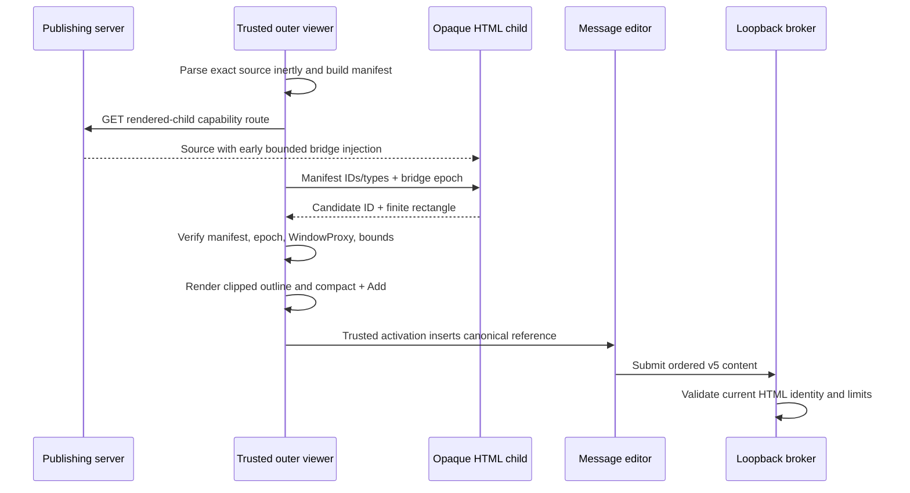
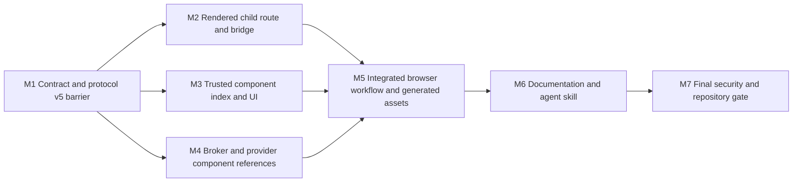

# HTML Component Selection Plan

## Outcome

Readers can point at a meaningful component inside a trusted standalone HTML whiteboard and add that component to a Page Agent message. On fine-pointer layouts, hovering a selectable component exposes one compact parent-owned **`+ Add`** button over the component. Activating it inserts an ordered inline component reference at the saved composer caret, matching the existing Markdown reference workflow without allowing sandboxed HTML to inspect or control Page Agent.

Selection uses semantic source analysis first and explicit author overrides only for ambiguous markup. Generated HTML therefore receives useful selection behavior from ordinary accessible `<section>`, `<article>`, `<figure>`, image, chart, table, code, and quote markup rather than requiring `data-*` attributes on every element. Video and audio are excluded.

The existing exact submitted document remains retrievable at `/whiteboards/html/{id}/content`. When Page Agent is enabled, the trusted outer viewer instead displays a separate rendered-child response that inserts a bounded hover bridge before publisher scripts. The bridge remains inside the current credentialless opaque sandbox and may only propose a source-declared component ID and clipped geometry. The trusted parent validates every proposal against its inert index of the exact source and requires a real parent-control activation before adding anything to the message.

## Requirements

### Selection and interaction

- **R1 — Direct pointing:** A fine-pointer reader can hover a valid HTML component and see its boundary plus one compact, content-sized **`+ Add`** action. The visible label never expands to `Add section`, `Add table`, or another long type-specific phrase.
- **R2 — Trusted activation:** The outline and button are rendered by trusted parent chrome over the iframe. Child messages may change only the current candidate presentation; they cannot add a reference, change a draft, submit a turn, select a provider, or receive broker authority.
- **R3 — Accessible identity:** The compact button has a type- and label-specific accessible name, such as `Add table: Quarterly revenue to message`, while keeping the visible copy `+ Add`. Focus, hover, added, error, disabled, and stale states follow the existing viewer/Page Agent visual language.
- **R4 — Ordered references:** Activation inserts one atomic reference at the saved composer caret, opens Page Agent when needed, focuses after the token, permits text before/between/after repeated references, and preserves ordering through submit, Pi queue edits, Codex busy drafts, replay, history, archives, and provider restoration.
- **R5 — Feedback and navigation:** Successful activation gives restrained `Added` feedback and a short source outline pulse. Activating a sent token for the current revision asks the rendered child to scroll the corresponding source-declared element into view. A stale-revision token remains readable but does not navigate the current document.
- **R6 — Keyboard and touch:** Keyboard and coarse-pointer users receive a parent-owned component chooser built from the same canonical manifest; normal HTML controls remain usable and touch does not depend on hover. Candidate focus or pointer events may also show the compact overlay when the child can report them without changing element focusability.
- **R7 — No ordinary text-selection parity:** Native copy/selection inside standalone HTML remains untouched. This feature adds component references, not arbitrary HTML text ranges.

### Detection and component kinds

- **R8 — Canonical source index:** The trusted parent parses `payload.source` inertly and is the sole authority for component ID, type, label, source excerpt, ordering, and resource revision. Runtime-only child DOM, child-provided labels, HTML snippets, types, or pixels cannot create canonical components.
- **R9 — Automatic kinds:** The index supports these kinds in the same implementation:
  - `section`: `<section>`, `<article>`, and accessible `[role="region"]`;
  - `image`: meaningful standalone `` and `<figure>` containing a meaningful image;
  - `chart`: accessible `<svg>`, `<canvas>`, and `<figure>` whose primary visual is SVG or canvas;
  - `table`: `<table>`;
  - `code`: `<pre>` containing `<code>`;
  - `quote`: `<blockquote>`, `[role="note"]`, and `[role="alert"]`;
  - `component`: an explicitly declared custom component.
- **R10 — Type precedence:** Explicit valid declarations win. Otherwise a visual `<figure>` is classified from its primary image/SVG/canvas; image and chart candidates win over their containing generic section; table, code, and quote elements keep their specific kinds; remaining semantic regions become sections. An automatically selected ancestor does not replace a more specific hovered descendant.
- **R11 — Stable identity:** Every candidate requires a non-empty unique source `id`. Automatically detected elements without a stable unique ID are ignored. Generated-HTML guidance requires stable IDs on intended selectable regions.
- **R12 — Labels:** The source index resolves labels in this order: valid `aria-labelledby`, valid `aria-label`, then the kind-specific source fallback—first heading for sections/regions, `figcaption` or `alt` for figures/images/charts, `caption` for tables, an explicit/code-language label for code, and a bounded visible-text preview for quotes. A custom component requires an explicit accessible label. Empty or excessive labels exclude the candidate.
- **R13 — Explicit overrides:** `data-agent-select="section|image|chart|table|code|quote|component"` forces a supported kind when identity and label rules pass. Boolean `data-agent-section` remains a shorthand for `section`. `data-agent-section-ignore` and `data-agent-select="none"` exclude the marked subtree from automatic selection. A language-neutral contract fixture freezes explicit value, unique-ID, label-resolution, exclusion, and error cases for both the Go mutation validator and browser index. Malformed explicit values, duplicate explicit IDs, or invalid explicit labels fail create/update validation with a stable safe error; merely unqualified automatic candidates remain valid HTML and are ignored by selection.
- **R14 — Exclusions:** Navigation, page headers/footers, forms and form controls, hidden/`inert`/`aria-hidden` content, decorative images with empty alt text, script/style/template/noscript content, video, and audio are never automatic candidates. They cannot be forced except that an explicitly declared custom component may contain non-sensitive ordinary controls; current entered form values are never captured.
- **R15 — Nested components:** All valid nested source components remain in the canonical manifest. The deepest valid component under the child pointer/focus wins the direct overlay; parent components remain available through uncovered area and the accessible parent chooser.
- **R16 — Bounds:** A page exposes at most 128 canonical components. IDs, tags, labels, excerpts, bridge frames, geometry, and total message content receive explicit limits. A component whose bounded source excerpt cannot fit the existing message budget is not truncated into a misleading reference; activation leaves the draft unchanged and asks the reader to choose a smaller component.

### Reference content and visuals

- **R17 — HTML component reference:** Add a provider-neutral `component` reference containing the component kind, canonical source ID/tag/ordinal, bounded normalized source excerpt, and the existing resource kind/ID/update/digest identity. The reference is untrusted reader content and supplements rather than replaces complete HTML page context.
- **R18 — Source anchors:** Reference sources become a strict union of the existing Markdown anchor and an HTML component anchor. Exactly one anchor matches `resource_kind`. Existing Markdown text, section, and image semantics remain unchanged.
- **R19 — Source excerpt:** The trusted parent derives the component excerpt from its inert source DOM, never from the runtime child. Embedded binary-valued URLs are represented by bounded media descriptors rather than copied into the excerpt; scripts and all other excerpt content remain clearly framed as untrusted source. The complete exact HTML remains in page context.
- **R20 — Raster images:** For a source-declared embedded PNG, JPEG, GIF, or WebP, an `image` component may additionally stage validated pixels through the existing private inline-image path when the connected model supports images. Runtime `blob:` images, dynamically replaced sources, SVG, and canvas never send child-supplied pixels; they remain semantic component references. A figure stages pixels only when it has one unambiguous eligible source raster.
- **R21 — Non-raster kinds:** Sections, charts, tables, code, quotes, and custom components carry their canonical source reference/excerpt but no synthetic screenshot. SVG/canvas charts remain useful pointers into complete HTML and its scripts without claiming to reproduce live runtime state.
- **R22 — Revision safety:** Broker admission requires the component reference resource kind, ID, update time, and context digest to match the conversation’s current observed HTML. Page updates invalidate unsent candidates and stale source navigation exactly as Markdown revisions do.

### Render bridge and security

- **R23 — Exact and rendered routes:** `/whiteboards/html/{id}/content` continues returning the exact submitted bytes and current independent opaque-origin CSP. Add a distinct rendered-child route used only by the Page-Agent-enabled outer HTML viewer. Non-Page-Agent standalone wrappers continue loading exact `/content` and gain no bridge.
- **R24 — Early bounded injection:** The rendered-child response inserts the hash-pinned/bundled bridge immediately after the source `<head>` start, before publisher scripts, while preserving the remaining submitted bytes. It receives the same credentialless `sandbox="allow-scripts"`, no-referrer, restrictive permissions, no-connection, no-form, no-frame, no-popup/download/top-navigation boundary as exact content.
- **R25 — One narrow channel:** The parent sends only the bounded canonical manifest projection needed to associate IDs with runtime elements and optional locate requests. The child sends only versioned exact-shape ready/candidate/clear messages containing declared IDs and finite rectangles. No source, creator context, capability, digest, resource metadata, preferences, client/conversation/provider IDs, model catalog, broker events, MessagePort, credentials, or local URLs cross into the child.
- **R26 — Untrusted hints:** The parent accepts frames only from the current iframe `WindowProxy`, validates exact schema/version/size, verifies the candidate against the current canonical manifest, clips geometry to the current iframe viewport, coalesces high-frequency changes, and resets state on load, navigation, revision, drawer teardown, or malformed behavior. `event.source` identifies the browsing context but does not attest genuine user hover or semantic runtime truth.
- **R27 — Parent confirmation:** A forged child candidate can at most propose a canonical source-declared component and move/hide bounded transient presentation. Only activation of the trusted parent button or chooser adds the parent-built reference. No child message can trigger that activation or submission.
- **R28 — Publisher interference:** Publisher code may hide, move, imitate, or disable selection because it shares the opaque child realm. Failure remains contained to selection presentation and never relaxes broker/CSP/origin authority. The parent must visually distinguish its overlay from publisher content.

### Compatibility, documentation, and scope

- **R29 — Protocol compatibility:** Increment the local browser API/WebSocket protocol from v4 to v5 because strict message/reference schemas change. Mixed viewer/broker versions fail closed. New provider turns use native envelope v4 for the nested source-anchor union. Native v1/v2/v3 decoders remain immutable compatibility paths; a native-only legacy decoder normalizes their flat Markdown `heading_path`/`start`/`end` source into the new internal Markdown anchor before validation. Document the disposable Page Agent state reset required for coordinated v5 deployment; public whiteboards and provider-native histories are not deleted.
- **R30 — Skill synchronization:** Update `skills/agent-whiteboard/SKILL.md` and its relevant references so agents generate semantic accessible HTML with stable IDs, use explicit overrides only for ambiguous cards/widgets, omit video/audio selection claims, keep `+ Add` parent-owned, and understand that complete HTML plus creator context remains the authority. The skill must not tell publishers to embed bridge code because the rendered route owns injection.
- **R31 — Documentation:** Update README and HTTP/security/configuration/hosted-smoke documentation for automatic kinds, overrides, exact versus rendered routes, reference semantics, protocol v5, bridge limitations, image behavior, deployment reset, and authoring guidance.
- **R32 — Existing behavior:** Markdown selection, exact HTML storage/retrieval, ordinary standalone HTML rendering without Page Agent, theme, providers, images, skills, compaction, queues, archives, interactions, and current sandbox restrictions remain intact except for the explicitly versioned reference/bridge additions.

**Non-goals:** arbitrary HTML text references; video/audio selection or byte transport; live form-value capture; authoritative runtime-DOM snapshots; HTML screenshots; child-supplied source or raster bytes; automatic inference from unlabeled wrapper `<div>` geometry or CSS classes; `allow-same-origin`; child broker access; replacing complete page context with selected-only context.

## Design

### Approach

The feature combines a trusted source manifest with an untrusted runtime geometry bridge:

1. The outer viewer parses exact HTML inertly, detects and labels bounded source components, and owns all reference metadata.
2. The Page-Agent-enabled wrapper loads a separate rendered-child route. The server injects a minimal bridge before publisher scripts but keeps the child opaque and network-isolated.
3. The parent gives the bridge only component IDs/types. Runtime hover/focus produces ID/rectangle hints.
4. The parent validates and overlays the compact `+ Add` control. Parent activation constructs and inserts the reference.
5. Existing strict browser, broker, provider, queue, replay, and archive paths carry the new component reference.

This approach was chosen over a parent-only picker because it delivers direct pointing, and over a new sanitized HTML mode because it preserves active standalone HTML. Exact `/content` remains available as a separate route so selection does not redefine exact storage or retrieval.

### Contracts and boundaries

#### Canonical component manifest

The trusted parent owns an ordered map keyed by unique source ID. Each entry contains:

- `type`: `section|image|chart|table|code|quote|component`;
- bounded source ID, tag, accessible label, and parse ordinal;
- normalized bounded source excerpt;
- optional single embedded-raster descriptor derived from source;
- current resource identity and digest.

The bridge receives only ID and type. It does not receive labels, excerpts, resource identity, or digest. Runtime nodes without manifest IDs are ineligible.

#### Explicit-declaration mutation validation

Create and update validate only the author-controlled explicit selection contract on the server: supported values, shorthand/ignore conflicts, unique explicit IDs, and source-resolvable accessible labels. The Go validator and browser index consume the same immutable input/expected-result fixtures, but they have distinct responsibilities: Go rejects malformed explicit declarations before persistence, while the browser performs the complete automatic-kind index and omits unqualified candidates. Full automatic discovery does not become a server publishing requirement.

#### Reference schema

The v5 source shape is a discriminated union with common resource identity and exactly one format anchor:

```text
ReferenceSource
├── resource_kind, resource_id, resource_updated_at, context_digest
└── anchor
    ├── markdown: heading_path + start/end block anchors
    └── html: element_id + tag + source ordinal

ContextReference(kind = component)
├── id, label, source
├── component
│   ├── type
│   └── source_excerpt
└── visual?  # eligible embedded raster only
```

Browser v5 and native envelope v4 emit the nested source union. Native v1/v2/v3 parsing remains separate and accepts the historical flat Markdown source shape only inside those historical envelopes, normalizing it before current validation. Component type is presentation/context metadata, not authority. The broker validates identity and limits but does not execute or trust component HTML.

#### Bridge protocol

Bridge frames use a separate fixed internal version from the loopback WebSocket API. Messages are exact-shape structured-clone objects, never strings interpreted as HTML or script. The parent-to-child surface is limited to manifest replacement and locate-by-ID; the child-to-parent surface is limited to ready, candidate, and clear. Every navigation/load creates a new parent bridge epoch, and stale-epoch frames are ignored.

No bridge frame directly maps to a broker command. The `+ Add` control invokes the same parent-owned message-editor insertion boundary used by Markdown references.

### Important flows



### Failure handling

- No valid candidates: the page remains fully usable; the parent chooser explains that no labeled source components were detected.
- Bridge missing, blocked, navigated, malformed, or noisy: dismiss the overlay and retain the parent chooser; do not reload the document or alter the draft.
- Candidate removed/moved: the next clear/candidate update removes or repositions the overlay; activation rechecks manifest and current bridge epoch.
- Oversized reference/draft: retain selection state and report the exact bounded reason without truncation or partial image staging.
- Image capability/staging failure: preserve the semantic component option where valid, but do not create a fake visual reference or silently downgrade an action already presented as visual.
- Revision mismatch: broker returns the existing stale/reload guidance and claims no new images.

## Execution Map

The source/reference and bridge schemas plus immutable explicit-declaration contract fixtures are a sequential barrier because browser, child, server mutation validation, broker, provider, and tests consume them. After that barrier, the rendered-route/Go-validation work, trusted parent UI work, and broker/provider work may proceed concurrently because their source writes and focused checks are disjoint. Generated browser assets, end-to-end fixtures, documentation, and final integration are reserved to the integration milestone so parallel lanes never rebuild or overwrite the same manifest/dist files.



| Lane | Outcome | Depends on | Exclusive ownership | Reserved/shared surfaces | Focused validation | Parallel with |
| --- | --- | --- | --- | --- | --- | --- |
| M1 | Frozen v5 browser/v4 native source-component/bridge contracts, limits, and explicit-declaration fixtures | Approved plan | `internal/agent/protocol/**`, contract portions of `internal/agent/provider/message.go`, browser validator contract in `internal/whiteboard/assets/src/viewer.js`, and new immutable explicit-declaration fixtures under `internal/whiteboard/testdata/` | No generated assets; later lanes consume but do not renegotiate schemas or fixtures | Protocol/provider content tests, legacy-envelope fixtures, viewer validator tests, and fixture consistency | None; barrier |
| M2 | Exact `/content`, secure rendered-child route/bridge, and Go explicit-declaration mutation validation | M1 | `internal/whiteboard/html.go`, HTML service validation tests, routes/handlers/CSP/rendering files under `internal/whiteboard/`, and new bridge source/unit tests; consumes but does not edit M1 fixtures | Must not run asset build or edit parent UI modules/dist/manifest | HTML create/update validation, handler/viewer tests, and isolated bridge DOM tests | M3, M4 |
| M3 | Canonical inert index, automatic detection/overrides, compact parent overlay/chooser, composer insertion, raster preparation | M1 | New HTML context controller/index module and its tests, parent UI/CSS portions of viewer source; consumes but does not edit M1 fixtures | Must not edit Go validation/protocol/provider code, rendered route, generated dist/manifest, or shared browser E2E fixture | JS fixture parity plus unit tests for detection, geometry, accessibility, insertion, stale/reset, and raster eligibility | M2, M4 |
| M4 | Broker/provider/queue/history acceptance and native projection of HTML component references | M1 | `internal/agent/broker/**`, remaining `internal/agent/provider/**`, Pi/Codex focused adaptation tests | Must not edit browser source, rendered route, generated assets, or shared E2E fixtures | Protocol-to-provider conversion, broker identity/queue/history, envelope, and adapter tests | M2, M3 |
| M5 | One integrated real-browser feature with pinned assets | M2, M3, M4 | Viewer integration glue, shared browser fixtures/specs, `internal/whiteboard/assets/dist/**`, asset manifest/build/check outputs | Exclusive owner of generated outputs and cross-lane browser integration surfaces; exclusive test ports | Affected JS suite, asset check, HTML browser specs, selected integration tests | None |
| M6 | Accurate user, API, security, deployment, smoke, and agent-authoring guidance | M5 | README, `docs/**`, `skills/agent-whiteboard/**` | Behavior and names frozen by M5; no executable-source changes | Targeted documentation review plus skill command/example verification | None |
| M7 | Integrated review and broad verification | M6 | Corrective changes only under controller ownership | Repository-wide commands and real-browser visual inspection run exclusively | Full required project gate | None |

## Milestones

### Milestone 1: Freeze component and v5 protocol contracts

**Covers:** R13, R16–R19, R22, R25–R27, R29

**Deliverable**

Strict browser/Go/provider models represent HTML component references and the bounded bridge protocol without enabling UI or broker admission. Existing Markdown references retain their behavior, and v4/v5 mismatch fails closed.

**Implementation**

1. Define the supported component enum, common reference identity, Markdown/HTML anchor union, component descriptor, optional eligible visual, semantic-byte accounting, cloning, exact JSON shapes, and all bounds.
2. Increment local API and WebSocket subprotocol to v5 and update version contract tests. Introduce native envelope v4 for newly encoded nested anchors.
3. Retain native v1/v2/v3 decoding as a legacy-only boundary that accepts their flat Markdown source shape and normalizes it into the current anchor union before validation. Add immutable pre-v5 v2/v3 fixtures containing Markdown text, section, and image references, plus current component and mixed-content v4 round trips.
4. Generalize inline-visual collection so an eligible image component participates in the existing atomic image path without allowing visuals on invalid component kinds.
5. Freeze language-neutral explicit-declaration fixtures covering supported/invalid values, shorthand and ignore conflicts, duplicate IDs, label resolution, and automatic unqualified omission. Later Go and browser lanes consume these fixtures without editing them.
6. Define bridge direction, frame shapes, epoch semantics, finite/clipped geometry, and manifest projection in testable browser modules.

**Validation**

```sh
go test ./internal/agent/protocol ./internal/agent/provider
node --no-experimental-webstorage ./node_modules/vitest/vitest.mjs run --environment jsdom internal/whiteboard/assets/src/viewer.test.js
```

Review this milestone as the early high-risk contract boundary before parallel work starts.

### Milestone 2: Serve the opaque rendered child and bounded bridge

**Covers:** R13, R23–R28, R32
**Depends on:** Milestone 1
**Parallel with:** Milestones 3 and 4

**Deliverable**

Page-Agent-enabled HTML wrappers load a rendered-child route with the early bridge, while ordinary standalone wrappers and exact `/content` retain current bytes and policy. The child can exchange only the frozen bounded selection messages.

**Implementation**

1. Extend HTML create/update validation with the explicit-declaration subset frozen in M1. Use the shared fixtures in service/HTTP tests to prove malformed values, duplicate explicit IDs, invalid labels, and shorthand/ignore conflicts fail safely, while unlabeled or ID-less automatic semantic candidates remain publishable and are simply omitted from selection.
2. Add the rendered-child route, security headers, indistinguishable error behavior, HEAD behavior, and wrapper routing. Keep `/content` exact and keep non-agent wrappers unchanged.
3. Add a separately built/hash-pinned bridge asset and deterministic insertion immediately after the source head opens. Fail closed before writing a partial success response when structural insertion cannot be established.
4. Capture required platform functions before publisher scripts, install pointer/focus/scroll/resize/load lifecycle handling, resolve only parent-supplied manifest IDs, and coalesce candidate geometry updates.
5. Support bounded locate-by-ID without exposing parent context or authority.
6. Prove malicious scripts, forged frames, self-navigation, malformed documents, and CSP restrictions cannot gain same-origin, network, broker, parent DOM, storage, form, popup, download, framing, or top-navigation authority.

**Validation**

```sh
go test ./internal/whiteboard
node --no-experimental-webstorage ./node_modules/vitest/vitest.mjs run --environment jsdom internal/whiteboard/assets/src/html-bridge.test.js
```

### Milestone 3: Detect components and provide compact trusted selection UI

**Covers:** R1–R21
**Depends on:** Milestone 1
**Parallel with:** Milestones 2 and 4

**Deliverable**

The trusted parent builds the canonical source manifest, supports every approved automatic kind and override, displays the compact `+ Add` overlay/chooser, and creates bounded component references at the editor caret.

**Implementation**

1. Build the complete inert browser source index for precedence, stable-ID, labeling, exclusion, nesting, cap, override, and excerpt rules. Consume the M1 fixtures to prove explicit-declaration parity with Go validation while retaining browser-only automatic discovery; manifest projection to the child contains only ID/type.
2. Implement bridge event validation and lifecycle reset in the parent, clip rectangles to the iframe and viewport, and render a parent-owned outline plus content-sized `+ Add` control using established CSS variables, radii, focus treatment, and spacing.
3. Give the visible button only `+ Add`; supply full type/label through its accessible name and status announcements. Add restrained confirmation and failure states without permanent content badges.
4. Add the accessible parent chooser for keyboard/coarse pointer and pages whose bridge is unavailable, drawing from the same manifest.
5. Build component references from canonical parent metadata, insert them through the existing message editor, and support current-revision token navigation.
6. For eligible source-declared embedded rasters, reuse current private staging/capability behavior; keep all other kinds semantic-only and release failed/removed staging under existing rules.
7. Ensure HTML controls, theme, drawer layout, normal selection/copy, scrolling, narrow viewports, and reduced motion remain usable.

**Validation**

```sh
node --no-experimental-webstorage ./node_modules/vitest/vitest.mjs run --environment jsdom internal/whiteboard/assets/src/html-context.test.js internal/whiteboard/assets/src/message-editor.test.js internal/whiteboard/assets/src/viewer.test.js
```

Perform interactive desktop/narrow and light/dark inspection against the real viewer before milestone handoff; unit geometry assertions do not replace visual review.

### Milestone 4: Admit, preserve, and project HTML component references

**Covers:** R4, R16–R22, R29, R32
**Depends on:** Milestone 1
**Parallel with:** Milestones 2 and 3

**Deliverable**

The broker and providers safely accept current-revision HTML component references, preserve them through every conversation lifecycle, and expose them to Pi/Codex as ordered untrusted reader content.

**Implementation**

1. Accept HTML anchors/component descriptors under strict limits and reject kind/anchor/resource mismatches, stale observations, invalid visuals, duplicates, excess references, and partial claims.
2. Generalize current-page matching from Markdown-only to the reference source kind while retaining exact resource ID/update/digest checks.
3. Preserve immutable component references through queue edits, busy drafts, replay, history, archive restore/delete, provider conversion, and browser event projection.
4. Emit canonical native v4 component content and reconstruct it safely. Keep v1/v2/v3 decoding on the legacy normalization boundary from M1, including flat Markdown anchors and image ordinal consistency.
5. Test Pi and Codex history/replay with immutable pre-v5 v2/v3 Markdown text, section, and image reference fixtures, plus v4 component-only and mixed text/Markdown-reference/HTML-component turns, without changing provider authentication, models, tools, approvals, or sandbox policy.

**Validation**

```sh
go test ./internal/agent/broker ./internal/agent/provider ./internal/agent/pi ./internal/agent/codex
```

Use focused test selection during development; do not apply high repeat counts to whole packages.

### Milestone 5: Integrate the complete browser workflow

**Covers:** R1–R29, R32
**Depends on:** Milestones 2, 3, and 4

**Deliverable**

A real published HTML whiteboard supports automatic and explicit component selection from hover through provider-visible ordered content, with current security and ordinary Page Agent workflows intact.

**Implementation**

1. Integrate wrapper, manifest, bridge, parent overlay/chooser, editor, transport, and timeline behavior; remove the unconditional browser rejection of HTML references.
2. Rebuild and pin viewer/bridge distribution assets and manifest only after source integration stabilizes.
3. Add browser workflows covering every component kind, override/ignore behavior, server create/update rejection of malformed explicit declarations, omission of unqualified automatic candidates, nested/deepest selection, compact button presentation, multiple inline references, pre-connect semantic drafts, embedded raster capability gates, source navigation, update/stale behavior, queues/busy drafts, replay/history, bridge failure fallback, dark/light, docked/modal, narrow/touch, keyboard, and reduced motion.
4. Add hostile-child coverage for forged IDs/labels/HTML/rectangles, frame floods, navigation, source/runtime mismatch, attempted broker access, MessagePort transfer, duplicate IDs, malformed declarations, and no unauthorized draft or submit mutation.
5. Compare the real rendered UI with adjacent viewer/Page Agent controls; verify pointer, keyboard, loading, added, error, disabled, interruption, and stale states.

**Validation**

```sh
pnpm test
pnpm run check:assets
pnpm run test:browser -- tests/browser/html-page-agent.spec.js tests/browser/standalone-html-security.spec.js tests/browser/local-agent-sidebar.spec.js
go test ./internal/whiteboard ./tests/integration
```

### Milestone 6: Synchronize documentation and the Agent Whiteboard skill

**Covers:** R30–R31
**Depends on:** Milestone 5

**Deliverable**

Readers, API consumers, operators, hosted-smoke testers, and publishing agents receive accurate authoring and security guidance for the shipped behavior.

**Implementation**

1. Update README and detailed HTTP/security/configuration documents with the exact/rendered route distinction, automatic kinds, overrides, reference fields/limits, v5 deployment reset, bridge trust model, and exclusions.
2. Update hosted-provider smoke coverage for each kind, multiple references, embedded raster behavior, provider switching, bridge failure, and proof that child selection never submits automatically.
3. Update `skills/agent-whiteboard/SKILL.md` and relevant skill references to require semantic accessible structure and stable IDs in generated HTML, describe automatic discovery and explicit overrides, prohibit embedded bridge code, and state the video/audio/live-state limits.
4. Update standalone HTML examples to model semantic IDs, labels, figures, tables, code, quotes, and ambiguous custom-card overrides without adding prose solely for tests.

**Validation**

Review rendered examples and execute every changed command/example that can run locally. Use existing documentation checks if present; do not add brittle tests that assert prose wording.

### Milestone 7: Final security, compatibility, and repository gate

**Covers:** all requirements
**Depends on:** Milestone 6

**Deliverable**

The integrated change is independently reviewed and supported by current focused, affected-area, broad, race, asset, and browser evidence.

**Validation**

```sh
go test ./...
go test -race ./...
go vet ./...
pnpm test
pnpm run check:assets
pnpm run test:browser
```

Repeat only a narrow named race-sensitive test if evidence exposes nondeterminism. Reinspect desktop/narrow, light/dark, hover/focus/touch, added/error/disabled/stale, and bridge-failure states in the real browser after the final asset build.

## Validation Strategy

### During implementation

- Use behavior-first tests at the stable boundary for source detection, strict protocol decoding, bridge validation, reference admission, queue/history persistence, and rendered route security.
- Run the smallest package or named browser spec that can disprove the current slice.
- Treat generated assets as integration outputs; parallel lanes do not rebuild them.
- Reuse valid evidence while relevant source, dependencies, fixtures, generated outputs, or environment remain unchanged.

### Milestone gates

- M1: strict reference/bridge schema and mixed-version failure.
- M2: exact-versus-rendered HTTP and opaque child security.
- M3: automatic/explicit detection and compact accessible UI.
- M4: broker/provider lifecycle and image atomicity.
- M5: real browser end-to-end behavior and hostile-child boundary.
- M6: documentation, examples, and skill accuracy.

### Final gate

The commands in Milestone 7 are required because the work changes bundled browser assets, public HTTP behavior, strict local protocol, provider content, security boundaries, documentation, and real user workflows. CI may additionally establish platform-specific race and browser coverage, but local completion does not rely on assumed CI results.

## Assumptions and Risks

- **Publisher realm is not trustworthy:** Injection before publisher scripts improves bridge reliability but cannot make the bridge authoritative. Parent validation and activation are the security boundary.
- **Exactness is route-specific:** Stored source, machine retrieval, and `/content` remain exact. The rendered-child route is intentionally enriched and must never be represented as exact submitted bytes.
- **Runtime divergence:** A source-declared ID may move, disappear, or display script-generated state. The feature points to canonical source and does not promise a live DOM snapshot.
- **Visual spoofing:** Child HTML can imitate the appearance of an add button. The real overlay must remain visually tied to trusted outer chrome and require parent activation.
- **Parser consistency:** Server structural insertion, parent inert parsing, and browser runtime DOM can recover malformed-but-accepted HTML differently. Explicit declarations that cannot be indexed unambiguously fail validation; automatic ambiguity fails closed by omission.
- **Protocol deployment:** v5 viewer and broker must deploy together with the documented disposable Page Agent state reset. Public resources and native provider histories remain outside that reset.
- **Image limits:** Only source-derived embedded raster bytes use the existing validated image path. No child-originated bytes, SVG rasterization, canvas capture, remote fetch, or blob extraction enters scope.
- **Plan adjustment:** If implementation proves early bridge insertion cannot preserve all accepted remaining source bytes or maintain current CSP guarantees, stop for renewed design approval rather than silently embedding bridge code in publisher source or relaxing the sandbox.

## Deferred Work

- Arbitrary selected HTML text ranges.
- Video and audio references or byte transport.
- Live form/control state, runtime DOM snapshots, canvas/SVG screenshots, OCR, and child-originated visual bytes.
- Automatic component inference from CSS layout, dimensions, classes, or unlabeled wrapper `<div>` elements.
- A sanitized selectable-HTML resource kind or same-origin active child.
